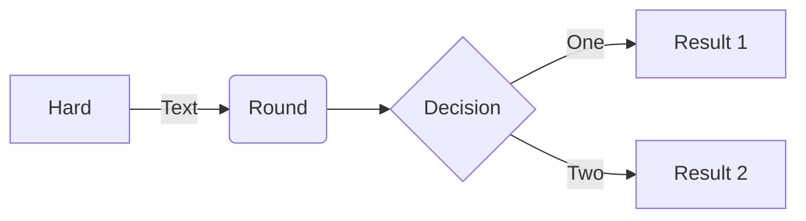
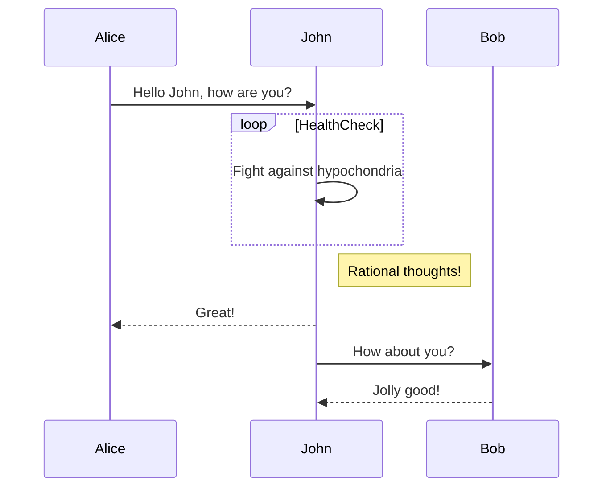
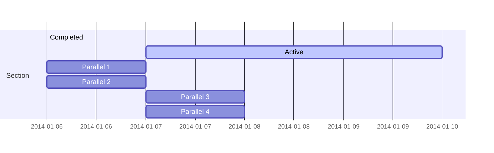
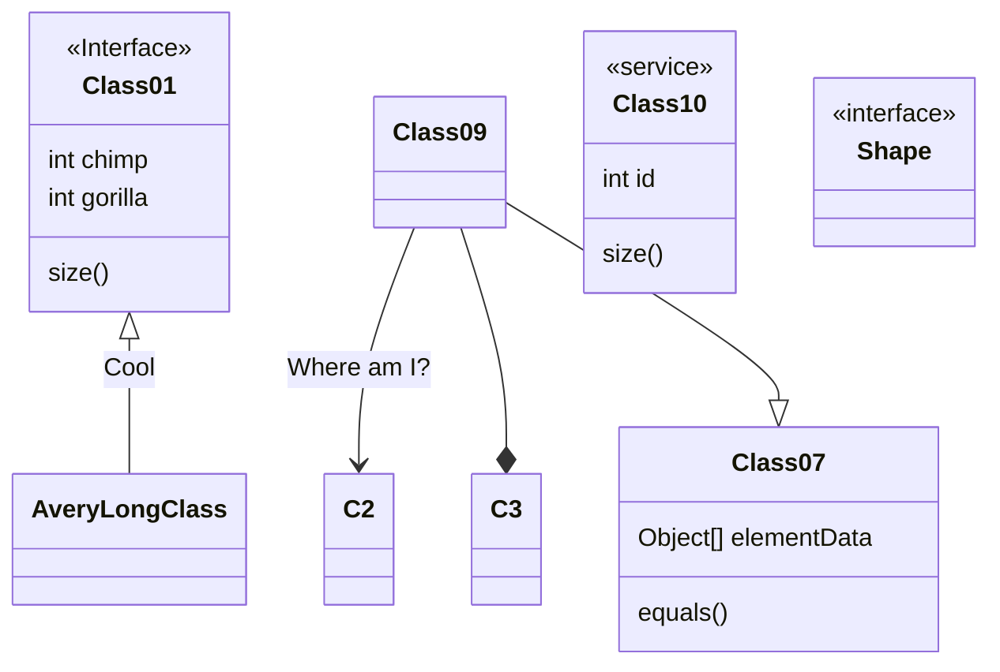
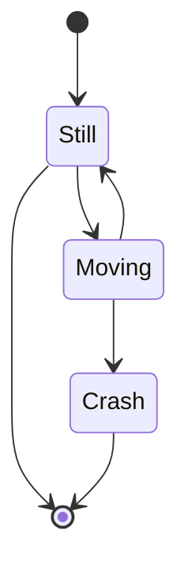
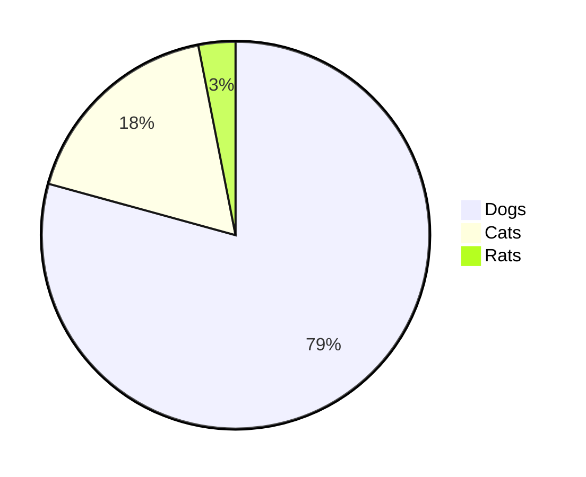
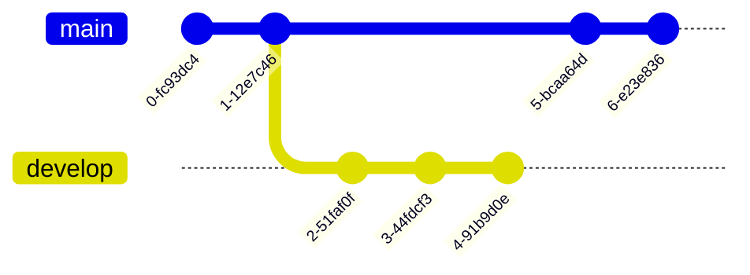
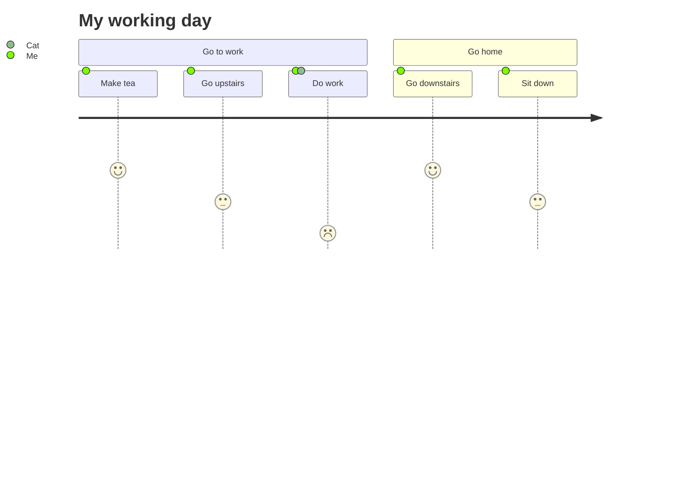
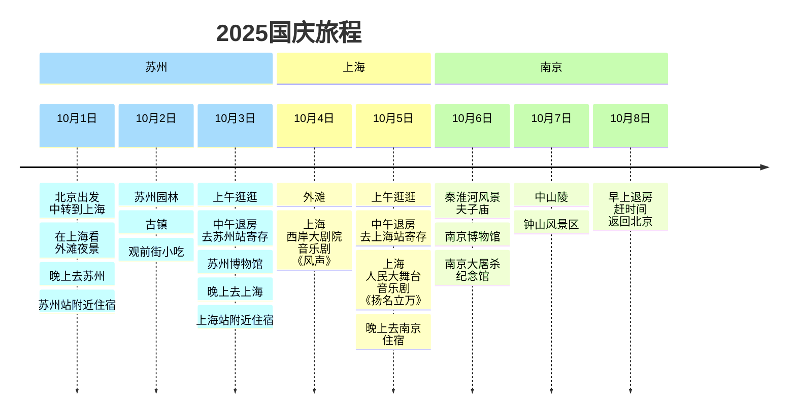

# SW-Markdown文档阅读工具

---
### 介绍
`Markdown`文件是一个简单的文本型文档, 后缀为`.md`，用`Markdown工具`可以渲染和格式化内容。
这是一个Markdown工具，打开一个Markdown文本文件，可以预览渲染后`Markdown`文件内容，也支持`LaTex数学公式`和`mermaid图形`的渲染。

### 工具安装
拷贝下面的文件和目录到一个安装目标路径下，即可完成，开始使用。比如D:\md_tool\ 目录下。

```
markdown_katex_tool.html
sw_mdtool.js
marked.min.js
katex.min.css
katex.min.js
katex-auto-render.min.js
js-yaml.min.js
highlight.min.js
highlight-lang-latex.js
panda-syntax-light.min.css
mermaid.min.js
fonts/
```

这个工具是一个本地网页工具，用浏览器打开 `markdown_katex_tool.html` 这个web工具页面。然后在页面上点击按钮，打开电脑上的一个`.md`文件，进行预览查看。

**快捷键**
`Ctrl`+`P` 打印预览区内容，（Windows系统）在打印对话框的`更多设置`里，可以选择带有预览`背景`打印,另外可以选择打印到打印机，或者打印到一个PDF文件（Windows默认支持打印到PDF文件）；
`Ctrl`+`S` 打开一个新的页面显示预览区内容。

点击`打印按钮`，也可以打印预览区内容，等效与快捷键`Ctrl`+`P`。


`Markdown`文件的例子：
`markdown_katex_tool.md`

# 编写一个简单的Markdown文件

<br>
<br>
<br>

***

### 编写Markdown文件的软件工具

用任何一个纯文本编辑工具，就可以写`Markdown`文件，比如 `记事本`，`notepad` 等。不推荐用格式化的编辑软件（word/WPS），因为它的文件内容格式不是纯文本，markdown工具无法识别它的内容。保存文件名的后缀用`.md`，预览可以用本工具(`SW-Markdown文档阅读工具`)进行渲染查看。

如果想边写边看效果，实时看效果，推荐用代码编辑软件 `VSCode` + 插件 `Markdown Preview Enhanced` 。

### Markdown简单语法

`标题`(以#,##,...,######开头+空格+标题名称且支持六个级并且要独占一行), `围栏`(放在两个三联反引号\`\`\`之内)，`关键字`(放在两个单联反引号\`之内)，`加粗`（放在两个双联星号\*\*之内），`斜体`（放在两个单联星号\*之内），`分割线`（空行开头放一个三联短线---），`段落`（前后各有一个空行分割），`缩进围栏`（前后各有一个空行分割并且内容每行都缩进4个空格），`表格`（用竖线|表示列并用它有规则地围起来就表示表格），`引用`（用每行开头加`>`和`空格`），等等。

块级`围栏`内可以放各种`文本`，`代码`，以及要解析和渲染的`LaTex/katex数学公式`或者`mermaid图形语句`，等等。

Markdown文件的文本内容可读性强，简单语法并不影响文本阅读，而且它可以被markdown工具渲染成有格式的文档，也很容易将渲染后的HTML的效果转换为PDF文档。

### 围栏
一般用两个三联反引号\`\`\`，中间方内容。围栏前后要有空行。或者用缩进围栏方式，将内容的每行缩进4个空格。

Markdown语法如下：

    [此行为空行]
    ```
    一个例子
    ```
    [此行为空行]


渲染效果：

```
一个例子
```

如果内容为编程语言代码或特殊语言，在第一个三联反引号\`\`\`后面可以跟一个语言名称，比如html。常用的编程语言（html/javascript/c/c++/perl/python等）都可以做语法加亮(highlight)。

Markdown语法如下：

    [此行为空行]
    ```html
    <html>
    <body>
        一个例子
        <br>
        <a href="https://markdown.cn/docs/intro"> Markdown帮助文档 </a>
    </body>
    </html>
    ```
    [此行为空行]


渲染效果：

```html
<html>
<body>
    一个例子
    <br>
    <a href="https://markdown.cn/docs/intro"> Markdown帮助文档 </a>
</body>
</html>
```


### Markdown的表格用法
用`|`围成表格。每行为表格一行；每列用一个`|`，行头以`|`开始，行尾以`|`结束。2列每行有三个`|`，3列每行有四个`|`，以此类推。第一行为表格头。第二行为表格对齐格式，用三联短线-表示普通格式表头居中且其他行左对齐，例如`---`；用冒号+三联短线表示左对齐，例如`:---`；用三联短线+冒号表示右对齐，例如`---:`；用冒号+三联短线+冒号表示居中对齐，例如`:---:`；

Markdown语法如下：

    | Markdown	| HTML	| 呈现的输出| 
    |---|---|---|
    | `# 一级标题`	| `<h1>一级标题</h1>`	| # 一级标题 |
    | `## 二级标题`	| `<h2>二级标题</h2>`	| ## 二级标题 |
    | `### 三级标题`	| `<h3>三级标题</h3>`	| ### 三级标题 |
    | `#### 四级标题`	| `<h4>四级标题</h4>`	| #### 四级标题 |
    | `##### 五级标题`	| `<h5>五级标题</h5>`	| #####五级标题 |
    | `###### 六级标题`	| `<h6>六级标题</h6>`	| ###### 六级标题 |


渲染效果：

| Markdown	| HTML	| 呈现的输出| 
|---|---|---|
| `# 一级标题`	| `<h1>一级标题</h1>`	| <p style="font-size:2.0rem; font-weight: bold;">一级标题</p> |
| `## 二级标题`	| `<h2>二级标题</h2>`	| <p style="font-size:1.8rem; font-weight: bold;">二级标题</p> |
| `### 三级标题`	| `<h3>三级标题</h3>`	| <p style="font-size:1.6rem; font-weight: bold;">三级标题</p> |
| `#### 四级标题`	| `<h4>四级标题</h4>`	| <p style="font-size:1.4rem; font-weight: bold;">四级标题</p> |
| `##### 五级标题`	| `<h5>五级标题</h5>`	| <p style="font-size:1.2rem; font-weight: bold;">五级标题</p> |
| `###### 六级标题`	| `<h6>六级标题</h6>`	| <p style="font-size:1.0rem; font-weight: bold;">六级标题</p> |

**右对齐**

Markdown语法如下：

    | 名称	| 内容	|
    | ---: | ---: |
    | 短名	| md	|
    | Markdown文件名 | markdown_katex_tool.html |

渲染效果：

| 名称 | 内容 |
| ---: | ---: |
| 短名 | md |
| Markdown文件名 | markdown_katex_tool.html	|


**居中对齐**

Markdown语法如下：

    | 名称	| 文件名 |
    | :---: | :---: |
    | 短名	| t.md	|
    | Markdown文件名 | markdown_katex_tool.html |

渲染效果：

| 名称	| 内容	|
| :---: | :---: |
| 短名	| md	|
| Markdown文件名 | markdown_katex_tool.html	|


### 引用用法
每行用`< `开头。示例：

Markdown语法如下：

```
> 更多数学公式用法参考LaTex或katex官方相关文档。
> [katex.org](https://katex.org)
> [latex-project.org](https://www.latex-project.org/)

```

渲染效果：

> 更多数学公式用法参考LaTex或katex官方相关文档。
> [katex.org](https://katex.org)
> [latex-project.org](https://www.latex-project.org/)


> 更多帮助，请查看`Markdown`帮助文档：https://markdown.cn/docs/intro 。
> 基本语法文档： https://markdown.cn/docs/tutorial-basics/basic-syntax 。


***
> MARKDOWN 中文教程 - markdown.cn [基本语法](https://markdown.cn/docs/tutorial-basics/basic-syntax)  |  [扩展语法](https://markdown.cn/docs/tutorial-basics/extended-syntax) 

***

<br>
标题

|Markdown	|HTML	|呈现的输出|
|--|--|--|
|# 一级标题	|`<h1>` 一级标题`</h1>`	|<h1> 一级标题</h1>|
|## 二级标题	|`<h2>`二级标题`</h2>`|<h2>二级标题</h2>|
|### 三级标题	|`<h3>`三级标题`</h3>`	|<h3>三级标题</h3>|
|#### 四级标题	|`<h4>`四级标题`</h4>`	|<h4>四级标题</h4>|
|##### 五级标题	|`<h5>`五级标题`</h5>`	|<h5>五级标题</h5>|
|###### 六级标题	|`<h6>`六级标题`</h6>`	|<h6>六级标题</h6>|


<br>
段落

要创建段落，请使用空行分隔一行或多行文本。

|Markdown	|HTML	|呈现的输出|
|--|--|--|
|我真的很喜欢使用<br>Markdown。<br><br>想从现在开始使用它来格式<br>化我所有的文档。	|`<p>`我真的很喜欢使用<br>Markdown。`</p>`<br><br>`<p>`我想从现在开始使用它来格式<br>化我所有的文档。`</p>`	|<p>我真的很喜欢使用<br>Markdown。</p><br><p>我想从现在开始使用它来格式<br>化我所有的文档。</p>|


<br>
换行

要创建换行或新行 (`<br>`)，请使用两个或更多空格结束一行，然后键入回车。

|Markdown	|HTML	|呈现的输出|
|--|--|--|
|这是第一行。&nbsp;&nbsp;<br>这是第二行。	|`<p>`这是第一行。`<br>`<br>这是第二行。`</p>`	|<p>这是第一行。<br>这是第二行。</p>|


<br>
强调

你可以通过加粗或斜体文本来添加强调。

<br>
加粗

要加粗文本，请在单词或短语前和后添加两个星号或下划线。要加粗单词中间的内容以示强调，请在字母周围添加两个星号，中间不要有空格。

|Markdown	|HTML	|呈现的输出|
|--|--|--|
|我非常喜欢 \*\*加粗文本\*\*。	|我非常喜欢 `<strong>`加粗文本`</strong>`。	|我非常喜欢 <strong>加粗文本</strong>。|
|我非常喜欢 \_\_加粗文本\_\_。	|我非常喜欢 `<strong>`加粗文本`</strong>`。	|我非常喜欢 <strong>加粗文本</strong>。|
|Love\*\*is\*\*bold	|Love`<strong>`is`</strong>`bold|Love<strong>is</strong>bold|


<br>
斜体

要将文本斜体化，请在单词或短语前和后添加一个星号或下划线。要斜体化单词中间的内容以示强调，请在字母周围添加一个星号，中间不要有空格。

|Markdown	|HTML	|呈现的输出|
|--|--|--|
|斜体文本是 \*cat's meow\*。	|斜体文本是 `<em>`cat's meow`</em>`。	|斜体文本是 <em>cat's meow</em>。|
|斜体文本是 \_cat's meow\_。	|斜体文本是 `<em>`cat's meow`</em>`。	|斜体文本是 <em>cat's meow</em>。|
|A\*cat\*meow	|A`<em>`cat`</em>`meow	|A<em>cat</em>meow|


<br>
加粗和斜体

要同时使用加粗和斜体来强调文本，请在单词或短语前和后添加三个星号或下划线。要加粗和斜体化单词中间的内容以示强调，请在字母周围添加三个星号，中间不要有空格。

|Markdown	|HTML	|呈现的输出|
|--|--|--|
|此文本是 \*\*\*非常重要\*\*\*。	|此文本是 <em><strong>非常重要</strong></em>。	|此文本是 <em><strong>非常重要</strong></em>。|
|此文本是 \_\_\_非常重要\_\_\_。	|此文本是 <em><strong>非常重要</strong></em>。	|此文本是 <em><strong>非常重要</strong></em>。|
|此文本是 \_\_\*非常重要\*\_\_。	|此文本是 <em><strong>非常重要</strong></em>。	|此文本是 <em><strong>非常重要</strong></em>。|
|此文本是 \*\*\_非常重要\_\*\*。	|此文本是 <em><strong>非常重要</strong></em>。	|此文本是 <em><strong>非常重要</strong></em>。|
|这是非常\*\*\*非常\*\*\*重要的文本。	|这是非常<em><strong>非常</strong></em>重要的文本。	|这是非常<em><strong>非常</strong></em>重要的文本。|


<br>
引用块

要创建引用块，请在段落前添加 `>`。


    > Dorothy followed her through many of the beautiful rooms in her castle.

呈现的输出如下所示

> Dorothy followed her through many of the beautiful rooms in her castle.


<br>
列表

你可以将项目组织成有序列表和无序列表。


<br>
有序列表

要创建有序列表，请添加带有数字和句号的行项目。数字不必按数字顺序排列，但列表应从数字一开头。


|Markdown	|HTML	|呈现的输出|
|--|--|--|
|1. 第一项<br>2. 第二项<br>3. 第三项<br>4. 第四项|`<ol>`<br>&nbsp;&nbsp;`<li>`第一项`</li>`<br>&nbsp;&nbsp;`<li>`第二项`</li>`<br>&nbsp;&nbsp;`<li>`第三项`</li>`<br>&nbsp;&nbsp;`<li>`第四项`</li>`<br>`</ol>`|<ol>  <li>第一项</li>  <li>第二项</li>  <li>第三项</li>  <li>第四项</li></ol>|
|1. 第一项<br>2. 第二项<br>3. 第三项<br>&nbsp;&nbsp;1. 缩进项<br>&nbsp;&nbsp;2. 缩进项<br>4. 第四项|`<ol>`<br>&nbsp;&nbsp;`<li>`第一项`</li>`<br>&nbsp;&nbsp;`<li>`第二项`</li>`<br>&nbsp;&nbsp;`<li>`第三项<br> &nbsp;&nbsp;&nbsp;&nbsp;`<ol>`<br>&nbsp;&nbsp;&nbsp;&nbsp;&nbsp;&nbsp;`<li>`缩进项`</li>`<br>&nbsp;&nbsp;&nbsp;&nbsp;&nbsp;&nbsp;`<li>`缩进项`</li>`<br>&nbsp;&nbsp;&nbsp;&nbsp;`</ol>`<br>&nbsp;&nbsp;`</li>`<br>&nbsp;&nbsp;`<li>`第四项`</li>`<br>`</ol>`|<ol>  <li>第一项</li>  <li>第二项</li>  <li>第三项    <ol>      <li>缩进项</li>      <li>缩进项</li>    </ol>  </li>  <li>第四项</li></ol>|


<br>
无序列表

要创建无序列表，请在行项目前添加破折号 (-)、星号 (*) 或加号 (+)。缩进一个或多个项目以创建嵌套列表。


|Markdown	|HTML	|呈现的输出|
|--|--|--|
|- 第一项<br>- 第二项<br>- 第三项<br>- 第四项|`<ul>`<br>&nbsp;&nbsp;`<li>`第一项`</li>`<br>&nbsp;&nbsp;`<li>`第二项`</li>`<br>&nbsp;&nbsp;`<li>`第三项`</li>`<br>&nbsp;&nbsp;`<li>`第四项`</li>`<br>`</ul>`|<ul>  <li>第一项</li>  <li>第二项</li>  <li>第三项</li>  <li>第四项</li></ul>|
|* 第一项<br>* 第二项<br>* 第三项<br>* 第四项|`<ul>`<br>&nbsp;&nbsp;`<li>`第一项`</li>`<br>&nbsp;&nbsp;`<li>`第二项`</li>`<br>&nbsp;&nbsp;`<li>`第三项`</li>`<br>&nbsp;&nbsp;`<li>`第四项`</li>`<br>`</ul>`|<ul>  <li>第一项</li>  <li>第二项</li>  <li>第三项</li>  <li>第四项</li></ul>|
|+ 第一项<br>+ 第二项<br>+ 第三项<br>+ 第四项|`<ul>`<br>&nbsp;&nbsp;`<li>`第一项`</li>`<br>&nbsp;&nbsp;`<li>`第二项`</li>`<br>&nbsp;&nbsp;`<li>`第三项`</li>`<br>&nbsp;&nbsp;`<li>`第四项`</li>`<br>`</ul>`|<ul>  <li>第一项</li>  <li>第二项</li>  <li>第三项</li>  <li>第四项</li></ul>|
|- 第一项<br>- 第二项<br>- 第三项<br>&nbsp;&nbsp;&nbsp;&nbsp;- 缩进项<br>&nbsp;&nbsp;&nbsp;&nbsp;- 缩进项<br>- 第四项|`<ul>`<br>&nbsp;&nbsp;`<li>`第一项`</li>`<br>&nbsp;&nbsp;`<li>`第二项`</li>`<br>&nbsp;&nbsp;`<li>`第三项<br>&nbsp;&nbsp;&nbsp;&nbsp;`<ul>`<br>&nbsp;&nbsp;&nbsp;&nbsp;&nbsp;&nbsp;`<li>`缩进项`</li>`<br>&nbsp;&nbsp;&nbsp;&nbsp;&nbsp;&nbsp;`<li>`缩进项`</li>`<br>&nbsp;&nbsp;&nbsp;&nbsp;`</ul>`<br>&nbsp;&nbsp;`</li>`<br>&nbsp;&nbsp;`<li>`第四项`</li>`<br>`</ul>`|<ul>  <li>第一项</li>  <li>第二项</li>  <li>第三项    <ul>      <li>缩进项</li>      <li>缩进项</li>    </ul>  </li>  <li>第四项</li></ul>|


<br>
在列表中添加元素

要在列表中添加另一个元素，同时保留列表的连续性，请将元素缩进四个空格或一个制表符，如下例所示。

> 提示
如果事情没有按预期出现，请仔细检查你是否已将列表中的元素缩进了四个空格或一个制表符。

段落

```
* This is the first list item.
* Here's the second list item.

    I need to add another paragraph below the second list item.

* And here's the third list item.
```

呈现的输出如下所示

* This is the first list item.
* Here's the second list item.

    I need to add another paragraph below the second list item.

* And here's the third list item.


<br>
<br>

代码块

代码块 通常缩进四个空格或一个制表符。当它们在列表中时，将它们缩进八个空格或两个制表符。


```javascript
function renderMarkdown(markdown) {
  try {
    let html;
    if (typeof marked.parse === 'function') {
      html = marked.parse(markdown); // v4+ 版本用法
    } else if (typeof marked === 'function') {
      html = marked(markdown); // 旧版本用法
    } else {
      throw new Error('marked库版本不兼容');
    }
    return html;
  } catch (error) {
    console.error('Markdown渲染错误:', error);
    return '<div class="error">解析失败</div>';
  }
}
```

<br>
<br>
<br>

***


**Markdown文档例子**
比如，新建一个文件`t.md`，它的内容如下。


    # 数学公式示例

    > 查看katex的文档：https://katex.org/docs/supported  。

    
    **LaTex数学公式**

    如果两个单`$`内或两个双`$$`的`LaTex公式`解析不出来，检查公式格式是否正确。对于两个双`$$`的`LaTex公式`解析，可以在开始的`$$`前面一行多加一个回车换行后，再看看是否解决问题。

    > 关于`latex数学公式`的,请查看`katex`的文档：https://katex.org/docs/supported  。

    ### 行内公式
    牛顿第二定律：$F = ma$，其中 $a$ 是加速度。
    这些公式可以写在两个`$`内部，比如`$F = ma$`，`$a$` 。

    ### 块级公式
    还有比较复杂的公式，可以写在两个`$$`内部。
    比如：

    ```
    $$
    x = \frac{-b \pm \sqrt{b^2 - 4ac}}{2a}
    $$
    ```
    效果：

    $$
    x = \frac{-b \pm \sqrt{b^2 - 4ac}}{2a}
    $$

    也可以将公式放在围栏块标志符\`\`\`，加上katex指出语言类型。
    比如，
    二次方程求根公式：


        ```katex
        $$
        x = \frac{-b \pm \sqrt{b^2 - 4ac}}{2a}
        $$
        ```


    效果：
    ```katex
    $$
    x = \frac{-b \pm \sqrt{b^2 - 4ac}}{2a}
    $$
    ```

    ### 矩阵乘法

        ```katex
        $$
            \begin{pmatrix}
            1 & 2 \\
            3 & 4
            \end{pmatrix}
            \times
            \begin{pmatrix}
            5 & 6 \\
            7 & 8
            \end{pmatrix}
            =
            \begin{pmatrix}
            19 & 22 \\
            43 & 50
            \end{pmatrix}
        $$
        ```

    效果：

    ```katex
    $$
        \begin{pmatrix}
        1 & 2 \\
        3 & 4
        \end{pmatrix}
        \times
        \begin{pmatrix}
        5 & 6 \\
        7 & 8
        \end{pmatrix}
        =
        \begin{pmatrix}
        19 & 22 \\
        43 & 50
        \end{pmatrix}
    $$
    ```

    ### 表格中的数学公式

    Markdown的表格

        | 符号       | 公式          |
        |------------|---------------|
        | 平均值     | $\bar{x}$     |
        | 方差       | $\sigma^2$    |


    效果：

    | 符号       | 公式          |
    |------------|---------------|
    | 平均值     | $\bar{x}$     |
    | 方差       | $\sigma^2$    |


    ### 其它例子
    1.  `$A = \{1,2,3\}$，$B = \{x|(x - 1)(x - 2)(x - 3)=0\}$`；
    效果：$A = \{1,2,3\}$，$B = \{x|(x - 1)(x - 2)(x - 3)=0\}$


    2.  `$A = \{x|0\lt 2x - 1\lt 1\}$，$B = \{x|1\lt 3x + 1\lt 4\}$`；
    效果：$A = \{x|0\lt 2x - 1\lt 1\}$，$B = \{x|1\lt 3x + 1\lt 4\}$

    3.  `$M=\left\{x|x = m+\frac{1}{6},m\in \mathbf{Z}\right\}$`，`$N=\left\{x|x=\frac{n}{2}-\frac{1}{3},n\in \mathbf{Z}\right\}$`，`$P=\left\{x|x=\frac{k}{2}+\frac{1}{6},k\in \mathbf{Z}\right\}$` 。

    效果：

    $M=\left\{x|x = m+\frac{1}{6},m\in \mathbf{Z}\right\}$ ，

    $N=\left\{x|x=\frac{n}{2}-\frac{1}{3},n\in \mathbf{Z}\right\}$ ，

    $P=\left\{x|x=\frac{k}{2}+\frac{1}{6},k\in \mathbf{Z}\right\}$


    4. `$M=\left\{x|x = m+\frac{1}{6},m\in \mathbf{Z}\right\}$`

    效果：

    $M=\left\{x|x = m+\frac{1}{6},m\in \mathbf{Z}\right\}$


预览效果，如下：

<br>
<br>
<br>

---

# LaTex数学公式示例

**LaTex数学公式**

如果两个单`$`内或两个双`$$`的`LaTex公式`解析不出来，检查公式格式是否正确。对于两个双`$$`的`LaTex公式`解析，可以在开始的`$$`前面一行多加一个回车换行后，再看看是否解决问题。

> 关于`latex数学公式`的,请查看`katex`的文档：https://katex.org/docs/supported ，https://katex.org/docs/support_table  。


### 行内公式
牛顿第二定律：$F = ma$，其中 $a$ 是加速度。
这些公式可以写在两个`$`内部，比如`$F = ma$`，`$a$` 。

### 块级公式
还有比较复杂的公式，可以写在两个`$$`内部。
比如：

```
$$
x = \frac{-b \pm \sqrt{b^2 - 4ac}}{2a}
$$
```
效果：

$$
x = \frac{-b \pm \sqrt{b^2 - 4ac}}{2a}
$$

也可以将公式放在围栏块标志符\`\`\`，加上katex指出语言类型。
比如，
二次方程求根公式：


    ```katex
    $$
    x = \frac{-b \pm \sqrt{b^2 - 4ac}}{2a}
    $$
    ```


效果：
```katex
$$
x = \frac{-b \pm \sqrt{b^2 - 4ac}}{2a}
$$
```

### 矩阵乘法

    ```katex
    $$
        \begin{pmatrix}
        1 & 2 \\
        3 & 4
        \end{pmatrix}
        \times
        \begin{pmatrix}
        5 & 6 \\
        7 & 8
        \end{pmatrix}
        =
        \begin{pmatrix}
        19 & 22 \\
        43 & 50
        \end{pmatrix}
    $$
    ```

效果：

```katex
$$
    \begin{pmatrix}
    1 & 2 \\
    3 & 4
    \end{pmatrix}
    \times
    \begin{pmatrix}
    5 & 6 \\
    7 & 8
    \end{pmatrix}
    =
    \begin{pmatrix}
    19 & 22 \\
    43 & 50
    \end{pmatrix}
$$
```

### 表格中的数学公式

Markdown的表格

    | 符号       | 公式          |
    |------------|---------------|
    | 平均值     | $\bar{x}$     |
    | 方差       | $\sigma^2$    |


效果：

| 符号       | 公式          |
|------------|---------------|
| 平均值     | $\bar{x}$     |
| 方差       | $\sigma^2$    |


### 其它例子
1.  `$A = \{1,2,3\}$，$B = \{x|(x - 1)(x - 2)(x - 3)=0\}$`；
效果：$A = \{1,2,3\}$，$B = \{x|(x - 1)(x - 2)(x - 3)=0\}$


2.  `$A = \{x|0\lt 2x - 1\lt 1\}$，$B = \{x|1\lt 3x + 1\lt 4\}$`；
效果：$A = \{x|0\lt 2x - 1\lt 1\}$，$B = \{x|1\lt 3x + 1\lt 4\}$

3.  `$M=\left\{x|x = m+\frac{1}{6},m\in \mathbf{Z}\right\}$`，`$N=\left\{x|x=\frac{n}{2}-\frac{1}{3},n\in \mathbf{Z}\right\}$`，`$P=\left\{x|x=\frac{k}{2}+\frac{1}{6},k\in \mathbf{Z}\right\}$` 。

效果：

$M=\left\{x|x = m+\frac{1}{6},m\in \mathbf{Z}\right\}$ ，

$N=\left\{x|x=\frac{n}{2}-\frac{1}{3},n\in \mathbf{Z}\right\}$ ，

$P=\left\{x|x=\frac{k}{2}+\frac{1}{6},k\in \mathbf{Z}\right\}$


4. `$M=\left\{x|x = m+\frac{1}{6},m\in \mathbf{Z}\right\}$`

效果：

$M=\left\{x|x = m+\frac{1}{6},m\in \mathbf{Z}\right\}$

<br>
<br>
<br>

---

# 数学图像的用法

### 函数图像

#### 函数图-例1

画一个指数函数图像 $y=a^x, (0<a<1)$，再画一条直线 $y=1$，相交于点 (0,1)，画出交点 。
Markdown的数学图像语法， 如下。<br>
`boundingbox: [-3, 5, 3, -1]`: 定义显示区范围，[left,top,right,bottom] 的坐标的范围。
`functiongraphs: [...]`: 定义一个或多个函数，放在一个数组[]中 。属性`f`的值是一个数组，[0]定义数学函数，[1]和[2]是函数定义域范围，函数只显示定义域范围内（或者显示区范围内）的函数图像。属性`a`的值是一个字典对象，'name' 可以指定显示函数名称或文本；'label' 可以对'name' 的显示相对位置等进行设置；'dash' 设置函数曲线为虚线，`dash:1` 表示线粗为1。 
`points: [...]`: 定义一个或多个坐标点，放在一个数组[]中 。 每个点由一个数组[]来定义，[0],[1] 参数是点的x,y坐标；[2] 参数是点的名称；[3] 是一个字典对象，属性'pos'定义点名称显示的相对位置。
`texts: [...]`: 定义一个或多个文本字串，放在一个数组[]中 。 每个文本字串由一个数组[]来定义，[0],[1] 参数是文本字串显示起始位置的x,y坐标；[2] 参数是文本字串的内容；[3] 是一个字典对象，属性`useKatex:true`定义文本字串的样式用Katex方式显示，Katex方式可以显示数学公式。

<br>

    ```swmathgraph-svg
    {
        boundingbox: [-3, 5, 3, -1],
        drawO: true,
        functiongraphs: [
            {f:[function (t){return JXG.Math.pow(1/2, t);}, -2.0, 2.5], a:{name:"y=a^x", label:{position:"top",}}},
            {f:['1'], a:{dash:1, name:"y=1", label:{position:"lt",}}},
        ],
        points: [
            [0,1,'(0,1)',{pos:'rightTop'}],
        ],
        texts: [
            [1.0, 4.5, "(0<a<1)", {useKatex:true}]
        ],
    }
    ```

<br>
图像显示， 如下。

```swmathgraph-svg
{
    boundingbox: [-3, 5, 3, -1],
    drawO: true,
    functiongraphs: [
        {f:[function (t){return JXG.Math.pow(1/2, t);}, -2.0, 2.5], a:{name:"y=a^x", label:{position:"top",}}},
        {f:['1'], a:{dash:1, name:"y=1", label:{position:"lt",}}},
    ],
    points: [
        [0,1,'(0,1)',{pos:'rightTop'}],
    ],
    texts: [
        [1.0, 4.5, "(0<a<1)", {useKatex:true}]
    ],
}
```

<br>
<br>

#### 函数图-例2

画一个指数函数图像 $y=(\frac{1}{2})^x$ 代表 指数函数 $y=a^x, (0<b<a<1)$ ；
画一个指数函数图像 $y=(\frac{1}{3})^x$ 代表 指数函数 $y=b^x, (0<b<a<1)$ ；
画一个指数函数图像 $y=3^x$ 代表 指数函数 $y=c^x, (1<d<c)$ ；
画一个指数函数图像 $y=2^x$ 代表 指数函数 $y=d^x, (1<d<c)$ ；
再画一条直线 $x=1$ 。


Markdown的数学图像语法， 如下。<br>

    ```swmathgraph-svg
    {
        boundingbox: [-3, 5, 3, -1],
        drawO: true,
        functiongraphs: [
            {f:[function (t){return JXG.Math.pow(1/2, t);}, -1.9, 2.5], a:{name:"y=a^x", label:{position:"top",offset:[-15,8]}}},
            {f:[function (t){return JXG.Math.pow(1/3, t);}, -1.3, 2.3], a:{name:"y=b^x", label:{position:"top",offset:[-15,8]}}},
            {f:[function (t){return JXG.Math.pow(3, t);}, -2.3, 1.3], a:{name:"y=c^x", label:{position:"top",offset:[-15,8]}}},
            {f:[function (t){return JXG.Math.pow(2, t);}, -2.5, 1.9], a:{name:"y=d^x", label:{position:"top",offset:[-15,8]}}},
        ],
        lines: [
            [[1,0],[1,1],{dash:1, name:"x=1"}],
        ]
    }
    ```

<br>
图像显示， 如下。

```swmathgraph-svg
{
    boundingbox: [-3, 5, 3, -1],
    drawO: true,
    functiongraphs: [
        {f:[function (t){return JXG.Math.pow(1/2, t);}, -1.9, 2.5], a:{name:"y=a^x", label:{position:"top",offset:[-15,8]}}},
        {f:[function (t){return JXG.Math.pow(1/3, t);}, -1.3, 2.3], a:{name:"y=b^x", label:{position:"top",offset:[-15,8]}}},
        {f:[function (t){return JXG.Math.pow(3, t);}, -2.3, 1.3], a:{name:"y=c^x", label:{position:"top",offset:[-15,8]}}},
        {f:[function (t){return JXG.Math.pow(2, t);}, -2.5, 1.9], a:{name:"y=d^x", label:{position:"top",offset:[-15,8]}}},
    ],
    lines: [
        [[1,0],[1,1],{dash:1, name:"x=1"}],
    ]
}
```

<br>
<br>

#### 函数图-例3

Markdown的数学图像语法， 如下。<br>

    ```swmathgraph-svg
    {
        boundingbox: [-3, 5, 3, -1],
        drawO: true,
        functiongraphs: [
            {f:[function (t){return JXG.Math.pow(2, t);}, -2.5, 2.0], a:{name:"y=a^x",}},
            {f:['1'], a:{dash:1, name:"y=1", label:{position:"lt",}}},
            // {f:['f(x)=x^2'], a:{}},
            {f:[function (x) {return 2*x;}], a:{"color":'black'}},
        ],
        points: [
            [0,1,'(0,1)',{pos:'rightTop'}],
        ],
        texts: [
            [-2.5, 4.5, "(a>1)", {useKatex:true}]
        ],

    }
    ```


<br>
图像显示， 如下。

```swmathgraph-svg
{
    boundingbox: [-3, 5, 3, -1],
    drawO: true,
    functiongraphs: [
        {f:[function (t){return JXG.Math.pow(2, t);}, -2.5, 2.0], a:{name:"y=a^x",}},
        {f:['1'], a:{dash:1, name:"y=1", label:{position:"lt",}}},
        // {f:['f(x)=x^2'], a:{}},
        {f:[function (x) {return 2*x;}], a:{"color":'black'}},
    ],
    points: [
        [0,1,'(0,1)',{pos:'rightTop'}],
    ],
    texts: [
        [-2.5, 4.5, "(a>1)", {useKatex:true}]
    ],

}
```

<br>
<br>

#### 函数图-例4

Markdown的数学图像语法， 如下。<br>


    
    ```swmathgraph-svg
    {
          debug: false,
          boundingbox: [-5, 5, 5, -5],
          define: [
            // "p.A","p.B",
          ],
          axis: false,
          // title:{content:"图①"},
          // drawO: true,
          // drawO: {name:"O_1",pos:"rightBottom"},
          // drawO: {pos:"rightBottom"},
          functiongraphs: [
            // {f:[function (t){return JXG.Math.pow(1/2, t);}, -1.9, 2.5], a:{name:"y=a^x", label:{position:"top",offset:[-15,8]}}},
          ],
          points:[
            // {p:[-JXG.Math.nthroot(3,2), -1.0,"A"],vn:"A",},
            // {p:[-1.0, JXG.Math.nthroot(3,2),"B"],vn:"B"},
            // {p:[1.0, 1.0],vn:"-"},
            // {p:[1.0, JXG.Math.nthroot(3,2)],vn:"C"},
          ],
          lines: [
            // [[1,0],[1,1],{dash:1, name:"x=1"}],
            // [0,1,-1],
            // [ref("p.C"),ref("p.O")],
            // [ref("p.B"),ref("p.O")],
            // {l:[[1,0],[1,1]],vn:"l1", a:{dash:1, name:"x=1"}},
            // {l:[ref("p.C"),ref("p.O")],vn:"l2",},
          ],
          segments: [
            // [[-JXG.Math.nthroot(3,2), -1.0], [-1.0, JXG.Math.nthroot(3,2)]],
            // [ref("p.A"),ref("p.B")],
            // [ref("p.A"),ref("p.O")],
            // [ref("p.B"),ref("p.O")],
            // [ref("p.B"),ref("p.O")],
            // [[-JXG.Math.nthroot(3,2)-0.5, -1.0-0.5], [0,0], {name:"A", label:{position:'-25px right'}}],
            // [[-1.0-0.5, JXG.Math.nthroot(3,2)+0.5], [0,0], {name:"B", label:{position:'-5px right'}}],
          ],
          angles: [
            // [[-JXG.Math.nthroot(3,2), -1.0],[0,0],[0,-1],{ radius:0.5, name:"60"+'°' }],
            // [[0,1],[0,0],[-1.0, JXG.Math.nthroot(3,2)],{ radius:0.7, name:"30"+'°' }],
            // [ref("p.A"),ref("p.O"),[0,-1],{ radius:0.5, name:"60"+'°' }],
            // [[0,1],ref("p.O"),ref("p.B"),{ radius:0.7, name:"30"+'°' }],
            // [ref("l.l2"),ref("l.l1"),[2,4],[0,3]],
          ],
          polygons: [
            // [[-4,2], [-4,-2], [4,-2], [4,2], {withLines:true, fillOpacity:0}],
            // [[0,0], [-JXG.Math.nthroot(3,2), -1.0], [JXG.Math.nthroot(3,2),-1], [JXG.Math.nthroot(3,2),JXG.Math.nthroot(3,2)], [-1.0, JXG.Math.nthroot(3,2)] ],

            // [[0,0],[-JXG.Math.nthroot(3,2), -1.0],[JXG.Math.nthroot(3,2),-1],[JXG.Math.nthroot(3,2),JXG.Math.nthroot(3,2)],[-1.0, JXG.Math.nthroot(3,2)],{withLines:false,fillColor:"#C0D966",vertices: {withLabel: false} }],
            // [ref("p.O"),ref("p.A"),[JXG.Math.nthroot(3,2),-1],[JXG.Math.nthroot(3,2),JXG.Math.nthroot(3,2)],ref("p.B"),{withLines:false,fillColor:"#C0D966",vertices: {withLabel: false} }],
            // [[0,1],ref("p.O"),ref("p.B"),{ radius:0.7, name:"30"+'°' }],
            // [ref("l.l2"),ref("l.l1"),[2,4],[0,3]],
          ],
          ellipses: [
            // [[4,0], [2,0], [-1,0], {fillColor:"green",fillOpacity:0.5}],
            // [[-4,0], [-2,0], [1,0], {fillColor:"red",fillOpacity:0.5}],
            // [[-1,4], [-1,-4], [1,1],{strokeColor:"red"}],
            // [[-1,2], [1,2], [0,3],0,Math.PI,{lastArrow:{type:7}}],
          ],
          venns: [
            // [[[0,0], 0.25,0.5,{fillColor:"red",fillOpacity:0.5}],  [[1,1], 0.5,0.35,{fillColor:"green",fillOpacity:0.5}]],

            {
              U:[[0,0], 1.0, 0.5, {name:"U", label:{offset:[-85,-35]}}], // default fillOpacity:0, default fillColor:"#C0D966"
              sets:[
                [[-1.5,0 ], 0.6,0.7,{name:"A", label:{offset:[45,5]}, fillColor:"#C0D966",fillOpacity:1}],  
                [[2.0,0], 0.4,0.8, {name:"B", label:{offset:[45,5]}, fillColor:"white",fillOpacity:1}],
                [[-1.5,0], 0.6,0.7,{fillOpacity:0}], // draw line of set A again
              ]
            },
          ],
          texts: [
            // [1.0, 4.5, "(0<a<1)", {useKatex:true}]
          ],
        }
    ```


<br>
图像显示， 如下。

```swmathgraph-svg
{
      debug: false,
      boundingbox: [-5, 5, 5, -5],
      define: [
        // "p.A","p.B",
      ],
      axis: false,
      // title:{content:"图①"},
      // drawO: true,
      // drawO: {name:"O_1",pos:"rightBottom"},
      // drawO: {pos:"rightBottom"},
      functiongraphs: [
        // {f:[function (t){return JXG.Math.pow(1/2, t);}, -1.9, 2.5], a:{name:"y=a^x", label:{position:"top",offset:[-15,8]}}},
      ],
      points:[
        // {p:[-JXG.Math.nthroot(3,2), -1.0,"A"],vn:"A",},
        // {p:[-1.0, JXG.Math.nthroot(3,2),"B"],vn:"B"},
        // {p:[1.0, 1.0],vn:"-"},
        // {p:[1.0, JXG.Math.nthroot(3,2)],vn:"C"},
      ],
      lines: [
        // [[1,0],[1,1],{dash:1, name:"x=1"}],
        // [0,1,-1],
        // [ref("p.C"),ref("p.O")],
        // [ref("p.B"),ref("p.O")],
        // {l:[[1,0],[1,1]],vn:"l1", a:{dash:1, name:"x=1"}},
        // {l:[ref("p.C"),ref("p.O")],vn:"l2",},
      ],
      segments: [
        // [[-JXG.Math.nthroot(3,2), -1.0], [-1.0, JXG.Math.nthroot(3,2)]],
        // [ref("p.A"),ref("p.B")],
        // [ref("p.A"),ref("p.O")],
        // [ref("p.B"),ref("p.O")],
        // [ref("p.B"),ref("p.O")],
        // [[-JXG.Math.nthroot(3,2)-0.5, -1.0-0.5], [0,0], {name:"A", label:{position:'-25px right'}}],
        // [[-1.0-0.5, JXG.Math.nthroot(3,2)+0.5], [0,0], {name:"B", label:{position:'-5px right'}}],
      ],
      angles: [
        // [[-JXG.Math.nthroot(3,2), -1.0],[0,0],[0,-1],{ radius:0.5, name:"60"+'°' }],
        // [[0,1],[0,0],[-1.0, JXG.Math.nthroot(3,2)],{ radius:0.7, name:"30"+'°' }],
        // [ref("p.A"),ref("p.O"),[0,-1],{ radius:0.5, name:"60"+'°' }],
        // [[0,1],ref("p.O"),ref("p.B"),{ radius:0.7, name:"30"+'°' }],
        // [ref("l.l2"),ref("l.l1"),[2,4],[0,3]],
      ],
      polygons: [
        // [[-4,2], [-4,-2], [4,-2], [4,2], {withLines:true, fillOpacity:0}],
        // [[0,0], [-JXG.Math.nthroot(3,2), -1.0], [JXG.Math.nthroot(3,2),-1], [JXG.Math.nthroot(3,2),JXG.Math.nthroot(3,2)], [-1.0, JXG.Math.nthroot(3,2)] ],

        // [[0,0],[-JXG.Math.nthroot(3,2), -1.0],[JXG.Math.nthroot(3,2),-1],[JXG.Math.nthroot(3,2),JXG.Math.nthroot(3,2)],[-1.0, JXG.Math.nthroot(3,2)],{withLines:false,fillColor:"#C0D966",vertices: {withLabel: false} }],
        // [ref("p.O"),ref("p.A"),[JXG.Math.nthroot(3,2),-1],[JXG.Math.nthroot(3,2),JXG.Math.nthroot(3,2)],ref("p.B"),{withLines:false,fillColor:"#C0D966",vertices: {withLabel: false} }],
        // [[0,1],ref("p.O"),ref("p.B"),{ radius:0.7, name:"30"+'°' }],
        // [ref("l.l2"),ref("l.l1"),[2,4],[0,3]],
      ],
      ellipses: [
        // [[4,0], [2,0], [-1,0], {fillColor:"green",fillOpacity:0.5}],
        // [[-4,0], [-2,0], [1,0], {fillColor:"red",fillOpacity:0.5}],
        // [[-1,4], [-1,-4], [1,1],{strokeColor:"red"}],
        // [[-1,2], [1,2], [0,3],0,Math.PI,{lastArrow:{type:7}}],
      ],
      venns: [
        // [[[0,0], 0.25,0.5,{fillColor:"red",fillOpacity:0.5}],  [[1,1], 0.5,0.35,{fillColor:"green",fillOpacity:0.5}]],

        {
          U:[[0,0], 1.0, 0.5, {name:"U", label:{offset:[-85,-35]}}], // default fillOpacity:0, default fillColor:"#C0D966"
          sets:[
            [[-1.5,0 ], 0.6,0.7,{name:"A", label:{offset:[45,5]}, fillColor:"#C0D966",fillOpacity:1}],  
            [[2.0,0], 0.4,0.8, {name:"B", label:{offset:[45,5]}, fillColor:"white",fillOpacity:1}],
            [[-1.5,0], 0.6,0.7,{fillOpacity:0}], // draw line of set A again
          ]
        },
      ],
      texts: [
        // [1.0, 4.5, "(0<a<1)", {useKatex:true}]
      ],
    }
```


<br>
<br>

#### 函数图-例5

Markdown的数学图像语法， 如下。<br>


    ```swmathgraph-svg
    {
          boundingbox: [-3, 5, 3, -1],
          drawO: true,
          functiongraphs: [
            {f:[function (t){return JXG.Math.pow(2, t);}, -2.5, 2.0], a:{name:"y=a^x",}},
            {f:['1'], a:{dash:1, name:"y=1", label:{position:"lt",}}},
          ],
          points: [
            [0,1,'(0,1)',{pos:'rightTop'}],
          ],
          texts: [
            [-2.5, 4.5, "(a>1)", {useKatex:true}]
          ],

        }
    ```


<br>
图像显示， 如下。

```swmathgraph-svg
{
      boundingbox: [-3, 5, 3, -1],
      drawO: true,
      functiongraphs: [
        {f:[function (t){return JXG.Math.pow(2, t);}, -2.5, 2.0], a:{name:"y=a^x",}},
        {f:['1'], a:{dash:1, name:"y=1", label:{position:"lt",}}},
      ],
      points: [
        [0,1,'(0,1)',{pos:'rightTop'}],
      ],
      texts: [
        [-2.5, 4.5, "(a>1)", {useKatex:true}]
      ],

    }
```


<br>
<br>

#### 函数图-例6

Markdown的数学图像语法， 如下。<br>


    ```swmathgraph-svg
    {
          boundingbox: [-3, 5, 3, -1],
          drawO: true,
          functiongraphs: [
            {f:[function (t){return JXG.Math.pow(1/2, t);}, -2.0, 2.5], a:{name:"y=a^x", label:{position:"top",}}},
            {f:['1'], a:{dash:1, name:"y=1", label:{position:"lt",}}},
          ],
          points: [
            [0,1,'(0,1)',{pos:'rightTop'}],
          ],
          texts: [
            [1.0, 4.5, "(0<a<1)", {useKatex:true}]
          ],
        }
    ```


<br>
图像显示， 如下。

```swmathgraph-svg
{
      boundingbox: [-3, 5, 3, -1],
      drawO: true,
      functiongraphs: [
        {f:[function (t){return JXG.Math.pow(1/2, t);}, -2.0, 2.5], a:{name:"y=a^x", label:{position:"top",}}},
        {f:['1'], a:{dash:1, name:"y=1", label:{position:"lt",}}},
      ],
      points: [
        [0,1,'(0,1)',{pos:'rightTop'}],
      ],
      texts: [
        [1.0, 4.5, "(0<a<1)", {useKatex:true}]
      ],
    }
```


<br>
<br>

#### 函数图-例7

Markdown的数学图像语法， 如下。<br>


    ```swmathgraph-svg
    {
          boundingbox: [-3, 5, 3, -1],
          drawO: true,
          functiongraphs: [
            {f:[function (t){return JXG.Math.pow(1/2, t);}, -1.9, 2.5], a:{name:"y=a^x", label:{position:"top",offset:[-15,8]}}},
            {f:[function (t){return JXG.Math.pow(1/3, t);}, -1.3, 2.3], a:{name:"y=b^x", label:{position:"top",offset:[-15,8]}}},
            {f:[function (t){return JXG.Math.pow(3, t);}, -2.3, 1.3], a:{name:"y=c^x", label:{position:"top",offset:[-15,8]}}},
            {f:[function (t){return JXG.Math.pow(2, t);}, -2.5, 1.9], a:{name:"y=d^x", label:{position:"top",offset:[-15,8]}}},
          ],
          lines: [
            [[1,0],[1,1],{dash:1, name:"x=1"}],
          ]
        }
    ```

<br>
图像显示， 如下。

```swmathgraph-svg
 {
      boundingbox: [-3, 5, 3, -1],
      drawO: true,
      functiongraphs: [
        {f:[function (t){return JXG.Math.pow(1/2, t);}, -1.9, 2.5], a:{name:"y=a^x", label:{position:"top",offset:[-15,8]}}},
        {f:[function (t){return JXG.Math.pow(1/3, t);}, -1.3, 2.3], a:{name:"y=b^x", label:{position:"top",offset:[-15,8]}}},
        {f:[function (t){return JXG.Math.pow(3, t);}, -2.3, 1.3], a:{name:"y=c^x", label:{position:"top",offset:[-15,8]}}},
        {f:[function (t){return JXG.Math.pow(2, t);}, -2.5, 1.9], a:{name:"y=d^x", label:{position:"top",offset:[-15,8]}}},
      ],
      lines: [
        [[1,0],[1,1],{dash:1, name:"x=1"}],
      ]
    }
```

<br>
<br>

#### 函数图-例8

Markdown的数学图像语法， 如下。<br>


    ```swmathgraph-svg
    {
          debug: true,
          boundingbox: [-2, 2, 4, -4],
          title: {content:"图①", fontSize:12,},
          ticks: {
            xPts: [2],
            yPts: [-2,-3],
          },
          drawO: true,
          functiongraphs: [
            [
              function (t){return JXG.Math.pow(Math.sqrt(3), t) -3;}
            ],
            {f:['-3'], a:{dash:1}},
          ],

        }
    ```


<br>
图像显示， 如下。

```swmathgraph-svg
{
      debug: true,
      boundingbox: [-2, 2, 4, -4],
      title: {content:"图①", fontSize:12,},
      ticks: {
        xPts: [2],
        yPts: [-2,-3],
      },
      drawO: true,
      functiongraphs: [
        [
          function (t){return JXG.Math.pow(Math.sqrt(3), t) -3;}
        ],
        {f:['-3'], a:{dash:1}},
      ],

    }
```

<br>
<br>

#### 函数图-例9

Markdown的数学图像语法， 如下。<br>


    ```swmathgraph-svg
    {
          boundingbox: [-2, 2, 4, -4],
          title: {content:"图②", fontSize:12,},
          drawO: true,
          functiongraphs: [
            [
              function (t){return JXG.Math.pow(Math.sqrt(0.1), t) -3;}
            ]
          ],

        }
    ```


<br>
图像显示， 如下。

```swmathgraph-svg
{
      boundingbox: [-2, 2, 4, -4],
      title: {content:"图②", fontSize:12,},
      drawO: true,
      functiongraphs: [
        [
          function (t){return JXG.Math.pow(Math.sqrt(0.1), t) -3;}
        ]
      ],

    }
```

<br>
<br>

#### 函数图-例10

Markdown的数学图像语法， 如下。<br>


    ```swmathgraph-svg
    {
          boundingbox: [-1.9, 1.9, 1.9, -1.9],
          title: {content:"A", fontSize:15,},
          ticks: {
            xPts: [1],
            yPts: [1],
          },
          drawO: true,
          functiongraphs: [
            [
              function (t){return JXG.Math.pow(Math.sqrt(0.1), t);}, -0.45, 1.5 // function(x) + x domain [-1,1]
            ],
            [
              function (t){return JXG.Math.log( t);} , 0.3, 1.7 // function(x) + x domain [-1,1]
            ],
          ],

        }
    ```


<br>
图像显示， 如下。

```swmathgraph-svg
{
      boundingbox: [-1.9, 1.9, 1.9, -1.9],
      title: {content:"A", fontSize:15,},
      ticks: {
        xPts: [1],
        yPts: [1],
      },
      drawO: true,
      functiongraphs: [
        [
          function (t){return JXG.Math.pow(Math.sqrt(0.1), t);}, -0.45, 1.5 // function(x) + x domain [-1,1]
        ],
        [
          function (t){return JXG.Math.log( t);} , 0.3, 1.7 // function(x) + x domain [-1,1]
        ],
      ],

    }
```

<br>
<br>

#### 函数图-例11

Markdown的数学图像语法， 如下。<br>


    ```swmathgraph-svg
    {
          boundingbox: [-1.9, 1.9, 1.9, -1.9],
          title: {content:"B", fontSize:15,},
          ticks: {
            xPts: [-1],
            yPts: [1],
          },
          drawO: true,
          functiongraphs: [
            [
              function (t){return JXG.Math.pow(Math.sqrt(5), t);}, -1.65, 1.0 // function(x) + x domain [-1,1]
            ],
            [
              function (t){return JXG.Math.log( -t);} , -1.7, -0.3 // function(x) + x domain [-1,1]
            ],
          ],

        }
    ```


<br>
图像显示， 如下。

```swmathgraph-svg
{
      boundingbox: [-1.9, 1.9, 1.9, -1.9],
      title: {content:"B", fontSize:15,},
      ticks: {
        xPts: [-1],
        yPts: [1],
      },
      drawO: true,
      functiongraphs: [
        [
          function (t){return JXG.Math.pow(Math.sqrt(5), t);}, -1.65, 1.0 // function(x) + x domain [-1,1]
        ],
        [
          function (t){return JXG.Math.log( -t);} , -1.7, -0.3 // function(x) + x domain [-1,1]
        ],
      ],

    }
```

<br>
<br>

#### 函数图-例12

Markdown的数学图像语法， 如下。<br>


    ```swmathgraph-svg
    {
          boundingbox: [-1.9, 1.9, 1.9, -1.9],
          title: {content:"C", fontSize:15,},
          ticks: {
            xPts: [1],
            yPts: [1],
          },
          drawO: true,
          functiongraphs: [
            [
              function (t){return JXG.Math.pow(Math.sqrt(5), t);}, -1.65, 1.0 // function(x) + x domain [-1,1]
            ],
            [
              function (t){return -JXG.Math.log(t);} , 0.2, 1.7 // function(x) + x domain [-1,1]
            ],
          ],

        }
    ```


<br>
图像显示， 如下。

```swmathgraph-svg
{
      boundingbox: [-1.9, 1.9, 1.9, -1.9],
      title: {content:"C", fontSize:15,},
      ticks: {
        xPts: [1],
        yPts: [1],
      },
      drawO: true,
      functiongraphs: [
        [
          function (t){return JXG.Math.pow(Math.sqrt(5), t);}, -1.65, 1.0 // function(x) + x domain [-1,1]
        ],
        [
          function (t){return -JXG.Math.log(t);} , 0.2, 1.7 // function(x) + x domain [-1,1]
        ],
      ],

    }
```

<br>
<br>

#### 函数图-例13

Markdown的数学图像语法， 如下。<br>


    ```swmathgraph-svg
    {
          boundingbox: [-1.9, 1.9, 1.9, -1.9],
          title: {content:"D", fontSize:15,},
          ticks: {
            xPts: [-1],
            yPts: [1],
          },
          drawO: true,
          functiongraphs: [
            [
              function (t){return JXG.Math.pow(Math.sqrt(0.1), t);}, -0.45, 1.5 // function(x) + x domain [-1,1]
            ],
            [
              function (t){return JXG.Math.log( -t);} , -1.7, -0.3 // function(x) + x domain [-1,1]
            ],
          ],

        }
    ```


<br>
图像显示， 如下。

```swmathgraph-svg
{
      boundingbox: [-1.9, 1.9, 1.9, -1.9],
      title: {content:"D", fontSize:15,},
      ticks: {
        xPts: [-1],
        yPts: [1],
      },
      drawO: true,
      functiongraphs: [
        [
          function (t){return JXG.Math.pow(Math.sqrt(0.1), t);}, -0.45, 1.5 // function(x) + x domain [-1,1]
        ],
        [
          function (t){return JXG.Math.log( -t);} , -1.7, -0.3 // function(x) + x domain [-1,1]
        ],
      ],

    }
```

<br>
<br>

#### 函数图-例14

Markdown的数学图像语法， 如下。<br>


    ```swmathgraph-svg
    {
          boundingbox: [-5, 5, 5, -5],
          define: [
            // "p.A","p.B",
          ],
          title:{content:"图①"},
          // drawO: true,
          // drawO: {name:"O_1",pos:"rightBottom"},
          drawO: {pos:"rightBottom"},
          functiongraphs: [
            // {f:[function (t){return JXG.Math.pow(1/2, t);}, -1.9, 2.5], a:{name:"y=a^x", label:{position:"top",offset:[-15,8]}}},
          ],
          points:[
            // {p:[-JXG.Math.nthroot(3,2), -1.0,"A"],vn:"A",},
            // {p:[-1.0, JXG.Math.nthroot(3,2),"B"],vn:"B"},
            // {p:[1.0, 1.0],vn:"-"},
            // {p:[1.0, JXG.Math.nthroot(3,2)],vn:"C"},
          ],
          lines: [
            // [[1,0],[1,1],{dash:1, name:"x=1"}],
            // [0,1,-1],
            // [ref("p.C"),ref("p.O")],
            // [ref("p.B"),ref("p.O")],
            // {l:[[1,0],[1,1]],vn:"l1", a:{dash:1, name:"x=1"}},
            // {l:[ref("p.C"),ref("p.O")],vn:"l2",},
          ],
          segments: [
            // [[-JXG.Math.nthroot(3,2), -1.0], [-1.0, JXG.Math.nthroot(3,2)]],
            // [ref("p.A"),ref("p.B")],
            // [ref("p.A"),ref("p.O")],
            // [ref("p.B"),ref("p.O")],
            // [ref("p.B"),ref("p.O")],
            [[-JXG.Math.nthroot(3,2)-0.5, -1.0-0.5], [0,0], {name:"A", label:{position:'-25px right'}}],
            [[-1.0-0.5, JXG.Math.nthroot(3,2)+0.5], [0,0], {name:"B", label:{position:'-5px right'}}],
          ],
          angles: [
            [[-JXG.Math.nthroot(3,2), -1.0],[0,0],[0,-1],{ radius:0.5, name:"60"+'°' }],
            [[0,1],[0,0],[-1.0, JXG.Math.nthroot(3,2)],{ radius:0.7, name:"30"+'°' }],
            // [ref("p.A"),ref("p.O"),[0,-1],{ radius:0.5, name:"60"+'°' }],
            // [[0,1],ref("p.O"),ref("p.B"),{ radius:0.7, name:"30"+'°' }],
            // [ref("l.l2"),ref("l.l1"),[2,4],[0,3]],
          ],
          polygons: [
            [[0,0], [-JXG.Math.nthroot(3,2), -1.0], [JXG.Math.nthroot(3,2),-1], [JXG.Math.nthroot(3,2),JXG.Math.nthroot(3,2)], [-1.0, JXG.Math.nthroot(3,2)] ],

            // [[0,0],[-JXG.Math.nthroot(3,2), -1.0],[JXG.Math.nthroot(3,2),-1],[JXG.Math.nthroot(3,2),JXG.Math.nthroot(3,2)],[-1.0, JXG.Math.nthroot(3,2)],{withLines:false,fillColor:"#C0D966",vertices: {withLabel: false} }],
            // [ref("p.O"),ref("p.A"),[JXG.Math.nthroot(3,2),-1],[JXG.Math.nthroot(3,2),JXG.Math.nthroot(3,2)],ref("p.B"),{withLines:false,fillColor:"#C0D966",vertices: {withLabel: false} }],
            // [[0,1],ref("p.O"),ref("p.B"),{ radius:0.7, name:"30"+'°' }],
            // [ref("l.l2"),ref("l.l1"),[2,4],[0,3]],
          ],
          texts: [
            // [1.0, 4.5, "(0<a<1)", {useKatex:true}]
          ],
        }
    ```


<br>
图像显示， 如下。

```swmathgraph-svg
{
      boundingbox: [-5, 5, 5, -5],
      define: [
        // "p.A","p.B",
      ],
      title:{content:"图①"},
      // drawO: true,
      // drawO: {name:"O_1",pos:"rightBottom"},
      drawO: {pos:"rightBottom"},
      functiongraphs: [
        // {f:[function (t){return JXG.Math.pow(1/2, t);}, -1.9, 2.5], a:{name:"y=a^x", label:{position:"top",offset:[-15,8]}}},
      ],
      points:[
        // {p:[-JXG.Math.nthroot(3,2), -1.0,"A"],vn:"A",},
        // {p:[-1.0, JXG.Math.nthroot(3,2),"B"],vn:"B"},
        // {p:[1.0, 1.0],vn:"-"},
        // {p:[1.0, JXG.Math.nthroot(3,2)],vn:"C"},
      ],
      lines: [
        // [[1,0],[1,1],{dash:1, name:"x=1"}],
        // [0,1,-1],
        // [ref("p.C"),ref("p.O")],
        // [ref("p.B"),ref("p.O")],
        // {l:[[1,0],[1,1]],vn:"l1", a:{dash:1, name:"x=1"}},
        // {l:[ref("p.C"),ref("p.O")],vn:"l2",},
      ],
      segments: [
        // [[-JXG.Math.nthroot(3,2), -1.0], [-1.0, JXG.Math.nthroot(3,2)]],
        // [ref("p.A"),ref("p.B")],
        // [ref("p.A"),ref("p.O")],
        // [ref("p.B"),ref("p.O")],
        // [ref("p.B"),ref("p.O")],
        [[-JXG.Math.nthroot(3,2)-0.5, -1.0-0.5], [0,0], {name:"A", label:{position:'-25px right'}}],
        [[-1.0-0.5, JXG.Math.nthroot(3,2)+0.5], [0,0], {name:"B", label:{position:'-5px right'}}],
      ],
      angles: [
        [[-JXG.Math.nthroot(3,2), -1.0],[0,0],[0,-1],{ radius:0.5, name:"60"+'°' }],
        [[0,1],[0,0],[-1.0, JXG.Math.nthroot(3,2)],{ radius:0.7, name:"30"+'°' }],
        // [ref("p.A"),ref("p.O"),[0,-1],{ radius:0.5, name:"60"+'°' }],
        // [[0,1],ref("p.O"),ref("p.B"),{ radius:0.7, name:"30"+'°' }],
        // [ref("l.l2"),ref("l.l1"),[2,4],[0,3]],
      ],
      polygons: [
        [[0,0], [-JXG.Math.nthroot(3,2), -1.0], [JXG.Math.nthroot(3,2),-1], [JXG.Math.nthroot(3,2),JXG.Math.nthroot(3,2)], [-1.0, JXG.Math.nthroot(3,2)] ],

        // [[0,0],[-JXG.Math.nthroot(3,2), -1.0],[JXG.Math.nthroot(3,2),-1],[JXG.Math.nthroot(3,2),JXG.Math.nthroot(3,2)],[-1.0, JXG.Math.nthroot(3,2)],{withLines:false,fillColor:"#C0D966",vertices: {withLabel: false} }],
        // [ref("p.O"),ref("p.A"),[JXG.Math.nthroot(3,2),-1],[JXG.Math.nthroot(3,2),JXG.Math.nthroot(3,2)],ref("p.B"),{withLines:false,fillColor:"#C0D966",vertices: {withLabel: false} }],
        // [[0,1],ref("p.O"),ref("p.B"),{ radius:0.7, name:"30"+'°' }],
        // [ref("l.l2"),ref("l.l1"),[2,4],[0,3]],
      ],
      texts: [
        // [1.0, 4.5, "(0<a<1)", {useKatex:true}]
      ],
    }
```

<br>
<br>

#### 函数图-例15

Markdown的数学图像语法， 如下。<br>


    ```swmathgraph-svg
    {
          boundingbox: [-5, 5, 5, -5],
          define: [
            // "p.A","p.B",
          ],
          title:{content:"图②"},
          // drawO: true,
          // drawO: {name:"O_2",pos:"leftBottom"},
          drawO: {pos:"leftBottom"},
          functiongraphs: [
            // {f:[function (t){return JXG.Math.pow(1/2, t);}, -1.9, 2.5], a:{name:"y=a^x", label:{position:"top",offset:[-15,8]}}},
          ],
          points:[
            // {p:[-JXG.Math.nthroot(3,2), -1.0,"A"],vn:"A",},
            // {p:[-1.0, JXG.Math.nthroot(3,2),"B"],vn:"B"},
            // {p:[1.0, 1.0],vn:"-"},
            // {p:[1.0, JXG.Math.nthroot(3,2)],vn:"C"},
          ],
          lines: [
            [[0,0], [-1,1], {name:"y=-x", margin:'-30', label:{position:'70px left'}}],
            // [[1,0],[1,1],{dash:1, name:"x=1"}],
            // [0,1,-1],
            // [ref("p.C"),ref("p.O")],
            // [ref("p.B"),ref("p.O")],
            // {l:[[1,0],[1,1]],vn:"l1", a:{dash:1, name:"x=1"}},
            // {l:[ref("p.C"),ref("p.O")],vn:"l2",},
          ],
          segments: [
            // [[-JXG.Math.nthroot(3,2), -1.0], [-1.0, JXG.Math.nthroot(3,2)]],
            // [ref("p.A"),ref("p.B")],
            // [ref("p.A"),ref("p.O")],
            // [ref("p.B"),ref("p.O")],
            // [ref("p.B"),ref("p.O")],
            // [[-JXG.Math.nthroot(3,2)-0.5, -1.0-0.5], [0,0], {name:"A", label:{position:'-25px right'}}],
            // [[-1.0-0.5, JXG.Math.nthroot(3,2)+0.5], [0,0], {name:"B", label:{position:'-5px right'}}],
          ],
          angles: [
            [[-1,1], [0,0], [-1,0],{ name:"45"+'°' }],
            // [[-JXG.Math.nthroot(3,2), -1.0],[0,0],[0,-1],{ radius:0.5, name:"60"+'°' }],
            // [[0,1],[0,0],[-1.0, JXG.Math.nthroot(3,2)],{ radius:0.7, name:"30"+'°' }],
            // [ref("p.A"),ref("p.O"),[0,-1],{ radius:0.5, name:"60"+'°' }],
            // [[0,1],ref("p.O"),ref("p.B"),{ radius:0.7, name:"30"+'°' }],
            // [ref("l.l2"),ref("l.l1"),[2,4],[0,3]],
          ],
          polygons: [
            [[0,2], [-2,2], [2,-2], [0,-2]],
            // [[0,0],[-JXG.Math.nthroot(3,2), -1.0],[JXG.Math.nthroot(3,2),-1],[JXG.Math.nthroot(3,2),JXG.Math.nthroot(3,2)],[-1.0, JXG.Math.nthroot(3,2)],{withLines:false,fillColor:"#C0D966",vertices: {withLabel: false} }],
            // [ref("p.O"),ref("p.A"),[JXG.Math.nthroot(3,2),-1],[JXG.Math.nthroot(3,2),JXG.Math.nthroot(3,2)],ref("p.B"),{withLines:false,fillColor:"#C0D966",vertices: {withLabel: false} }],
            // [[0,1],ref("p.O"),ref("p.B"),{ radius:0.7, name:"30"+'°' }],
            // [ref("l.l2"),ref("l.l1"),[2,4],[0,3]],
          ],
          texts: [
            // [1.0, 4.5, "(0<a<1)", {useKatex:true}]
          ],
        }
    ```


<br>
图像显示， 如下。

```swmathgraph-svg
{
      boundingbox: [-5, 5, 5, -5],
      define: [
        // "p.A","p.B",
      ],
      title:{content:"图②"},
      // drawO: true,
      // drawO: {name:"O_2",pos:"leftBottom"},
      drawO: {pos:"leftBottom"},
      functiongraphs: [
        // {f:[function (t){return JXG.Math.pow(1/2, t);}, -1.9, 2.5], a:{name:"y=a^x", label:{position:"top",offset:[-15,8]}}},
      ],
      points:[
        // {p:[-JXG.Math.nthroot(3,2), -1.0,"A"],vn:"A",},
        // {p:[-1.0, JXG.Math.nthroot(3,2),"B"],vn:"B"},
        // {p:[1.0, 1.0],vn:"-"},
        // {p:[1.0, JXG.Math.nthroot(3,2)],vn:"C"},
      ],
      lines: [
        [[0,0], [-1,1], {name:"y=-x", margin:'-30', label:{position:'70px left'}}],
        // [[1,0],[1,1],{dash:1, name:"x=1"}],
        // [0,1,-1],
        // [ref("p.C"),ref("p.O")],
        // [ref("p.B"),ref("p.O")],
        // {l:[[1,0],[1,1]],vn:"l1", a:{dash:1, name:"x=1"}},
        // {l:[ref("p.C"),ref("p.O")],vn:"l2",},
      ],
      segments: [
        // [[-JXG.Math.nthroot(3,2), -1.0], [-1.0, JXG.Math.nthroot(3,2)]],
        // [ref("p.A"),ref("p.B")],
        // [ref("p.A"),ref("p.O")],
        // [ref("p.B"),ref("p.O")],
        // [ref("p.B"),ref("p.O")],
        // [[-JXG.Math.nthroot(3,2)-0.5, -1.0-0.5], [0,0], {name:"A", label:{position:'-25px right'}}],
        // [[-1.0-0.5, JXG.Math.nthroot(3,2)+0.5], [0,0], {name:"B", label:{position:'-5px right'}}],
      ],
      angles: [
        [[-1,1], [0,0], [-1,0],{ name:"45"+'°' }],
        // [[-JXG.Math.nthroot(3,2), -1.0],[0,0],[0,-1],{ radius:0.5, name:"60"+'°' }],
        // [[0,1],[0,0],[-1.0, JXG.Math.nthroot(3,2)],{ radius:0.7, name:"30"+'°' }],
        // [ref("p.A"),ref("p.O"),[0,-1],{ radius:0.5, name:"60"+'°' }],
        // [[0,1],ref("p.O"),ref("p.B"),{ radius:0.7, name:"30"+'°' }],
        // [ref("l.l2"),ref("l.l1"),[2,4],[0,3]],
      ],
      polygons: [
        [[0,2], [-2,2], [2,-2], [0,-2]],
        // [[0,0],[-JXG.Math.nthroot(3,2), -1.0],[JXG.Math.nthroot(3,2),-1],[JXG.Math.nthroot(3,2),JXG.Math.nthroot(3,2)],[-1.0, JXG.Math.nthroot(3,2)],{withLines:false,fillColor:"#C0D966",vertices: {withLabel: false} }],
        // [ref("p.O"),ref("p.A"),[JXG.Math.nthroot(3,2),-1],[JXG.Math.nthroot(3,2),JXG.Math.nthroot(3,2)],ref("p.B"),{withLines:false,fillColor:"#C0D966",vertices: {withLabel: false} }],
        // [[0,1],ref("p.O"),ref("p.B"),{ radius:0.7, name:"30"+'°' }],
        // [ref("l.l2"),ref("l.l1"),[2,4],[0,3]],
      ],
      texts: [
        // [1.0, 4.5, "(0<a<1)", {useKatex:true}]
      ],
    }
```

<br>
<br>

#### 函数图-例16

Markdown的数学图像语法， 如下。<br>


    ```swmathgraph-svg
    {
          debug: true,
          boundingbox: [-5, 5, 5, -5],
          define: [
            // "p.A","p.B",
          ],
          // title:{content:"图②"},
          // drawO: true,
          drawO: {pos:"leftBottom"},
          functiongraphs: [
            // {f:[function (t){return JXG.Math.pow(1/2, t);}, -1.9, 2.5], a:{name:"y=a^x", label:{position:"top",offset:[-15,8]}}},
          ],
          points:[
            // {p:[-JXG.Math.nthroot(3,2), -1.0,"A"],vn:"A",},
            // {p:[-1.0, JXG.Math.nthroot(3,2),"B"],vn:"B"},
            // {p:[1.0, 1.0],vn:"-"},
            // {p:[1.0, JXG.Math.nthroot(3,2)],vn:"C"},
          ],
          lines: [
            // [[0,0], [1,JXG.Math.nthroot(3,2)], { margin:'-30', label:{position:'70px left'}}],
            // [[1,0],[1,1],{dash:1, name:"x=1"}],
            // [0,1,-1],
            // [ref("p.C"),ref("p.O")],
            // [ref("p.B"),ref("p.O")],
            // {l:[[1,0],[1,1]],vn:"l1", a:{dash:1, name:"x=1"}},
            // {l:[ref("p.C"),ref("p.O")],vn:"l2",},
          ],
          segments: [
            [[0,0], [2,2*JXG.Math.nthroot(3,2)], {dash:1}],
            [[0,0], [2,-2*JXG.Math.nthroot(3,2)/3], {dash:1}],
            // [[-JXG.Math.nthroot(3,2), -1.0], [-1.0, JXG.Math.nthroot(3,2)]],
            // [ref("p.A"),ref("p.B")],
            // [ref("p.A"),ref("p.O")],
            // [ref("p.B"),ref("p.O")],
            // [ref("p.B"),ref("p.O")],
            // [[-JXG.Math.nthroot(3,2)-0.5, -1.0-0.5], [0,0], {name:"A", label:{position:'-25px right'}}],
            // [[-1.0-0.5, JXG.Math.nthroot(3,2)+0.5], [0,0], {name:"B", label:{position:'-5px right'}}],
          ],
          angles: [
            [[1,0], [0,0], [1,JXG.Math.nthroot(3,2)],{arcLastArrow:true, radius:1.1, name:"60"+'°' }],
            [[1,0], [0,0], [1,-JXG.Math.nthroot(3,2)/3],{arcLastArrow:true, name:"330"+'°' }],
            // [[-JXG.Math.nthroot(3,2), -1.0],[0,0],[0,-1],{ radius:0.5, name:"60"+'°' }],
            // [[0,1],[0,0],[-1.0, JXG.Math.nthroot(3,2)],{ radius:0.7, name:"30"+'°' }],
            // [ref("p.A"),ref("p.O"),[0,-1],{ radius:0.5, name:"60"+'°' }],
            // [[0,1],ref("p.O"),ref("p.B"),{ radius:0.7, name:"30"+'°' }],
            // [ref("l.l2"),ref("l.l1"),[2,4],[0,3]],
          ],
          polygons: [
            [[0,0], [2,2*JXG.Math.nthroot(3,2)], [2,-2*JXG.Math.nthroot(3,2)/3]],
            // [[0,0],[-JXG.Math.nthroot(3,2), -1.0],[JXG.Math.nthroot(3,2),-1],[JXG.Math.nthroot(3,2),JXG.Math.nthroot(3,2)],[-1.0, JXG.Math.nthroot(3,2)],{withLines:false,fillColor:"#C0D966",vertices: {withLabel: false} }],
            // [ref("p.O"),ref("p.A"),[JXG.Math.nthroot(3,2),-1],[JXG.Math.nthroot(3,2),JXG.Math.nthroot(3,2)],ref("p.B"),{withLines:false,fillColor:"#C0D966",vertices: {withLabel: false} }],
            // [[0,1],ref("p.O"),ref("p.B"),{ radius:0.7, name:"30"+'°' }],
            // [ref("l.l2"),ref("l.l1"),[2,4],[0,3]],
          ],
          texts: [
            // [1.0, 4.5, "(0<a<1)", {useKatex:true}]
          ],
        }
    ```


<br>
图像显示， 如下。

```swmathgraph-svg
{
      debug: true,
      boundingbox: [-5, 5, 5, -5],
      define: [
        // "p.A","p.B",
      ],
      // title:{content:"图②"},
      // drawO: true,
      drawO: {pos:"leftBottom"},
      functiongraphs: [
        // {f:[function (t){return JXG.Math.pow(1/2, t);}, -1.9, 2.5], a:{name:"y=a^x", label:{position:"top",offset:[-15,8]}}},
      ],
      points:[
        // {p:[-JXG.Math.nthroot(3,2), -1.0,"A"],vn:"A",},
        // {p:[-1.0, JXG.Math.nthroot(3,2),"B"],vn:"B"},
        // {p:[1.0, 1.0],vn:"-"},
        // {p:[1.0, JXG.Math.nthroot(3,2)],vn:"C"},
      ],
      lines: [
        // [[0,0], [1,JXG.Math.nthroot(3,2)], { margin:'-30', label:{position:'70px left'}}],
        // [[1,0],[1,1],{dash:1, name:"x=1"}],
        // [0,1,-1],
        // [ref("p.C"),ref("p.O")],
        // [ref("p.B"),ref("p.O")],
        // {l:[[1,0],[1,1]],vn:"l1", a:{dash:1, name:"x=1"}},
        // {l:[ref("p.C"),ref("p.O")],vn:"l2",},
      ],
      segments: [
        [[0,0], [2,2*JXG.Math.nthroot(3,2)], {dash:1}],
        [[0,0], [2,-2*JXG.Math.nthroot(3,2)/3], {dash:1}],
        // [[-JXG.Math.nthroot(3,2), -1.0], [-1.0, JXG.Math.nthroot(3,2)]],
        // [ref("p.A"),ref("p.B")],
        // [ref("p.A"),ref("p.O")],
        // [ref("p.B"),ref("p.O")],
        // [ref("p.B"),ref("p.O")],
        // [[-JXG.Math.nthroot(3,2)-0.5, -1.0-0.5], [0,0], {name:"A", label:{position:'-25px right'}}],
        // [[-1.0-0.5, JXG.Math.nthroot(3,2)+0.5], [0,0], {name:"B", label:{position:'-5px right'}}],
      ],
      angles: [
        [[1,0], [0,0], [1,JXG.Math.nthroot(3,2)],{arcLastArrow:true, radius:1.1, name:"60"+'°' }],
        [[1,0], [0,0], [1,-JXG.Math.nthroot(3,2)/3],{arcLastArrow:true, name:"330"+'°' }],
        // [[-JXG.Math.nthroot(3,2), -1.0],[0,0],[0,-1],{ radius:0.5, name:"60"+'°' }],
        // [[0,1],[0,0],[-1.0, JXG.Math.nthroot(3,2)],{ radius:0.7, name:"30"+'°' }],
        // [ref("p.A"),ref("p.O"),[0,-1],{ radius:0.5, name:"60"+'°' }],
        // [[0,1],ref("p.O"),ref("p.B"),{ radius:0.7, name:"30"+'°' }],
        // [ref("l.l2"),ref("l.l1"),[2,4],[0,3]],
      ],
      polygons: [
        [[0,0], [2,2*JXG.Math.nthroot(3,2)], [2,-2*JXG.Math.nthroot(3,2)/3]],
        // [[0,0],[-JXG.Math.nthroot(3,2), -1.0],[JXG.Math.nthroot(3,2),-1],[JXG.Math.nthroot(3,2),JXG.Math.nthroot(3,2)],[-1.0, JXG.Math.nthroot(3,2)],{withLines:false,fillColor:"#C0D966",vertices: {withLabel: false} }],
        // [ref("p.O"),ref("p.A"),[JXG.Math.nthroot(3,2),-1],[JXG.Math.nthroot(3,2),JXG.Math.nthroot(3,2)],ref("p.B"),{withLines:false,fillColor:"#C0D966",vertices: {withLabel: false} }],
        // [[0,1],ref("p.O"),ref("p.B"),{ radius:0.7, name:"30"+'°' }],
        // [ref("l.l2"),ref("l.l1"),[2,4],[0,3]],
      ],
      texts: [
        // [1.0, 4.5, "(0<a<1)", {useKatex:true}]
      ],
    }
```

<br>
<br>

#### 函数图-例17

Markdown的数学图像语法， 如下。<br>


    ```swmathgraph-svg
    {
          boundingbox: [-1.0, 2.5, 2.5, -2.5],
          // title: {content:"D", fontSize:15,},
          ticks: {
            // xPts: [-Math.PI/6, Math.PI/3, {scale: Math.PI,scaleSymbol: 'π',}],
            xPts: [-Math.PI/6, Math.PI/3, {labels:["-\\frac π6","\\frac π3"]}],
            // xPts: [-Math.PI/6, Math.PI/3,],
            yPts: [-2, 2],
          },
          drawO: true,
          functiongraphs: [
            [
              function (t){return 2*Math.sin(2*t + Math.PI/3);} , -2.7, 4.3 // function(x) + x domain [-1,1]
            ],

          ],
          lines: [
            [[0,-2],[1,-2],{dash:1}],
          ],

        }
    ```


<br>
图像显示， 如下。

```swmathgraph-svg
{
      boundingbox: [-1.0, 2.5, 2.5, -2.5],
      // title: {content:"D", fontSize:15,},
      ticks: {
        // xPts: [-Math.PI/6, Math.PI/3, {scale: Math.PI,scaleSymbol: 'π',}],
        xPts: [-Math.PI/6, Math.PI/3, {labels:["-\\frac π6","\\frac π3"]}],
        // xPts: [-Math.PI/6, Math.PI/3,],
        yPts: [-2, 2],
      },
      drawO: true,
      functiongraphs: [
        [
          function (t){return 2*Math.sin(2*t + Math.PI/3);} , -2.7, 4.3 // function(x) + x domain [-1,1]
        ],

      ],
      lines: [
        [[0,-2],[1,-2],{dash:1}],
      ],

    }
```

<br>
<br>

#### 函数图-例18

Markdown的数学图像语法， 如下。<br>


    ```swmathgraph-svg
    {
          boundingbox: [-1.0, 2.5, 2.5, -2.5],
          // title: {content:"D", fontSize:15,},
          defaultAxes: {
            x: {name:"t/s",label:{fontSize:10, offset:[-10,15]}},
            y: {name:"I/A",label:{fontSize:10, offset:[5,5]}},
          },
          ticks: {
            // xPts: [-Math.PI/6, Math.PI/3, {scale: Math.PI,scaleSymbol: 'π',}],
            xPts: [2/9*Math.PI, 5/9*Math.PI, {labels:["\\frac {1}{150}","\\frac {1}{60}"]}],
            // xPts: [-Math.PI/6, Math.PI/3,],
            yPts: [-1.8, 1.8, {labels:["-300","300"]}],
          },
          drawO: true,
          functiongraphs: [
            [
              function (t){return 1.8*Math.sin(3*t + Math.PI/3);} , 0, 5/9*Math.PI // function(x) + x domain [-1,1]
            ],

          ],
          lines: [
            [[0,-1.8],[1,-1.8],{dash:1}],
          ],

        }
    ```


<br>
图像显示， 如下。

```swmathgraph-svg
{
      boundingbox: [-1.0, 2.5, 2.5, -2.5],
      // title: {content:"D", fontSize:15,},
      defaultAxes: {
        x: {name:"t/s",label:{fontSize:10, offset:[-10,15]}},
        y: {name:"I/A",label:{fontSize:10, offset:[5,5]}},
      },
      ticks: {
        // xPts: [-Math.PI/6, Math.PI/3, {scale: Math.PI,scaleSymbol: 'π',}],
        xPts: [2/9*Math.PI, 5/9*Math.PI, {labels:["\\frac {1}{150}","\\frac {1}{60}"]}],
        // xPts: [-Math.PI/6, Math.PI/3,],
        yPts: [-1.8, 1.8, {labels:["-300","300"]}],
      },
      drawO: true,
      functiongraphs: [
        [
          function (t){return 1.8*Math.sin(3*t + Math.PI/3);} , 0, 5/9*Math.PI // function(x) + x domain [-1,1]
        ],

      ],
      lines: [
        [[0,-1.8],[1,-1.8],{dash:1}],
      ],

    }
```

<br>
<br>
<br>

### Venn图


<br>

#### Venn图-例1


Markdown的数学图像语法， 如下。<br>


    ```swmathgraph-jsxgraph
    {   boundingbox: [-5, 5, 5, -5], axis: false, panelSize:{w:"200px", h:"200px"}, zoom:{wscale:1.5, hscale:1.0},
        venns: [{
            U:[[0,0], 1.0, 0.5, {name:"U", label:{offset:[-85,-35]}}], // default fillOpacity:0, default fillColor:"#C0D966"
            sets:[
                [[-1.5,0 ], 0.6,0.7,{name:"A", label:{offset:[45,5]}},{vn:"A"}],  
                [[2.0,0], 0.4,0.8, {name:"B", label:{offset:[45,5]}},{vn:"B"}],
            ],
            ops: [ 
                ['c',[ref('set.B')],{},{vn:"o_cB"}],
                ['i',[ref('set.A'), ref('op.o_cB')],{fillColor:"#C0D966"},{vn:"oA_n_cB"}],
            ],
        },],
    }
    ```

<br>
图像显示， 如下。

```swmathgraph-jsxgraph
{   boundingbox: [-5, 5, 5, -5], axis: false, panelSize:{w:"200px", h:"200px"}, zoom:{wscale:1.5, hscale:1.0},
    venns: [{
        U:[[0,0], 1.0, 0.5, {name:"U", label:{offset:[-85,-35]}}], // default fillOpacity:0, default fillColor:"#C0D966"
        sets:[
            [[-1.5,0 ], 0.6,0.7,{name:"A", label:{offset:[45,5]}},{vn:"A"}],  
            [[2.0,0], 0.4,0.8, {name:"B", label:{offset:[45,5]}},{vn:"B"}],
        ],
        ops: [ 
            ['c',[ref('set.B')],{},{vn:"o_cB"}],
            ['i',[ref('set.A'), ref('op.o_cB')],{fillColor:"#C0D966"},{vn:"oA_n_cB"}],
        ],
    },],
}
```

<br>
<br>

#### Venn图-例2

Markdown的数学图像语法， 如下。<br>

    ```swmathgraph-png
    {   boundingbox: [-5, 5, 5, -5], axis: false, panelSize:{w:"200px", h:"200px"}, zoom:{wscale:1.5, hscale:1.0},
        venns: [{
            U:[[0,0], 1.0, 0.5, {name:"U", label:{offset:[-85,-35]}}], // default fillOpacity:0, default fillColor:"#C0D966"
            sets:[
                [[-1.5,0 ], 0.6,0.7,{name:"A", label:{offset:[45,5]}},{vn:"A"}],  
                [[2.0,0], 0.4,0.8, {name:"B", label:{offset:[45,5]}},{vn:"B"}],
            ],
            ops: [ 
                ['c',[ref('set.B')],{},{vn:"o_cB"}],
                ['i',[ref('set.A'), ref('op.o_cB')],{fillColor:"#C0D966"},{vn:"oA_n_cB"}],
            ],
        },],
    }
    ```

<br>
图像显示， 如下。

```swmathgraph-png
{   boundingbox: [-5, 5, 5, -5], axis: false, panelSize:{w:"200px", h:"200px"}, zoom:{wscale:1.5, hscale:1.0},
    venns: [{
        U:[[0,0], 1.0, 0.5, {name:"U", label:{offset:[-85,-35]}}], // default fillOpacity:0, default fillColor:"#C0D966"
        sets:[
            [[-1.5,0 ], 0.6,0.7,{name:"A", label:{offset:[45,5]}},{vn:"A"}],  
            [[2.0,0], 0.4,0.8, {name:"B", label:{offset:[45,5]}},{vn:"B"}],
        ],
        ops: [ 
            ['c',[ref('set.B')],{},{vn:"o_cB"}],
            ['i',[ref('set.A'), ref('op.o_cB')],{fillColor:"#C0D966"},{vn:"oA_n_cB"}],
        ],
    },],
}
```

<br>
<br>

#### Venn图-例3

Markdown的数学图像语法， 如下。<br>

    ```swmathgraph-svg
    {   boundingbox: [-5, 5, 5, -5], axis: false, panelSize:{w:"200px", h:"200px"}, zoom:{wscale:1.5, hscale:1.0},
        venns: [{
            U:[[0,0], 1.0, 0.5, {name:"U", label:{offset:[-85,-35]}}], // default fillOpacity:0, default fillColor:"#C0D966"
            sets:[
                [[-1.5,0 ], 0.6,0.7,{name:"A", label:{offset:[45,5]}},{vn:"A"}],  
                [[2.0,0], 0.4,0.8, {name:"B", label:{offset:[45,5]}},{vn:"B"}],
            ],
            ops: [ 
                ['c',[ref('set.B')],{},{vn:"o_cB"}],
                ['i',[ref('set.A'), ref('op.o_cB')],{fillColor:"#C0D966"},{vn:"oA_n_cB"}],
            ],
        },],
    }
    ```

<br>
图像显示， 如下。

```swmathgraph-svg
{   boundingbox: [-5, 5, 5, -5], axis: false, panelSize:{w:"200px", h:"200px"}, zoom:{wscale:1.5, hscale:1.0},
    venns: [{
        U:[[0,0], 1.0, 0.5, {name:"U", label:{offset:[-85,-35]}}], // default fillOpacity:0, default fillColor:"#C0D966"
        sets:[
            [[-1.5,0 ], 0.6,0.7,{name:"A", label:{offset:[45,5]}},{vn:"A"}],  
            [[2.0,0], 0.4,0.8, {name:"B", label:{offset:[45,5]}},{vn:"B"}],
        ],
        ops: [ 
            ['c',[ref('set.B')],{},{vn:"o_cB"}],
            ['i',[ref('set.A'), ref('op.o_cB')],{fillColor:"#C0D966"},{vn:"oA_n_cB"}],
        ],
    },],
}
```

<br>
<br>

#### Venn图-例4

Markdown的数学图像语法， 如下。<br>


    ```swmathgraph-svg
    {
        panelSize:{w:"200px", h:"200px"}, zoom:{wscale:1.0, hscale:1.0},
        debug: true,
        boundingbox: [-5, 5, 5, -5],
        define: [
        // "p.A","p.B",
        ],
        axis: false,
        venns: [
        // [[[0,0], 0.25,0.5,{fillColor:"red",fillOpacity:0.5}],  [[1,1], 0.5,0.35,{fillColor:"green",fillOpacity:0.5}]],

        {
            // vn:"v1",
            U:[[0,0], 1.0, 0.5, {name:"U", label:{offset:[-85,-35]}}], // default fillOpacity:0, default fillColor:"#C0D966"
            sets:[
            {set:[[-0.5,0 ], 0.3,0.35], vn:"A", a:{name:"A", label:{offset:[20,5]}},},  
            [[1.0,0], 0.2,0.4, {name:"B", label:{offset:[25,5]},}, {vn:"B"}],
            [[0.5,-1.5 ], 0.2,0.35,{name:"C", label:{offset:[20,-15]},}, {vn:"C"}],

            // [[-0.5,0 ], 0.3,0.35,{name:"A", label:{offset:[20,5]}, fillColor:"#C0D966",fillOpacity:1}],  
            // [[1.0,0], 0.2,0.4, {name:"B", label:{offset:[25,5]}, fillColor:"white",fillOpacity:1}],
            // [[0.5,-1.5 ], 0.2,0.35,{name:"C", label:{offset:[20,-15]}, fillColor:"white",fillOpacity:1}], 
            //   [[-0.5,0], 0.3,0.35,{fillOpacity:0}], // draw border again
            //   [[1.0,0], 0.2,0.4,{fillOpacity:0}], // draw border again
            ],
            ops: [
            // i:intersection, u:union, c:complement
            ['i',[ref('set.A'),ref('set.B')],{vn:"j_AB"}],
            ['i',[ref('set.B'),ref('set.C')],{vn:"j_BC"}],
            ['i',[ref('set.A'),ref('set.C')],{vn:"j_AC"}],
            ['u',[ref('op.j_AB'),ref('op.j_BC'),ref('op.j_AC')],{fillColor:"#C0D966",fillOpacity:0.8}],

            // ['i',[ref('set.A'),ref('set.B'),ref('set.C')],{fillColor:"yellow",fillOpacity:0.8}],
            // ['u',[ref('set.A'),ref('set.B'),ref('set.C')],{fillColor:"yellow",fillOpacity:0.8}],
            // ['c',[ref('set.A'),ref('set.B'),ref('set.C')],{fillColor:"yellow",fillOpacity:0.8}],

            // ['i',[ref('set.A'),ref('set.B')],{fillColor:"yellow",fillOpacity:0.8}],
            // ['u',[ref('set.A'),ref('set.B')],{fillColor:"yellow",fillOpacity:0.8}],
            // ['c',[ref('set.C')],{fillColor:"yellow",fillOpacity:0.8}],
            // ['c',[ref('set.C'), ref('set.B')],{fillColor:"yellow",fillOpacity:0.8}],
            ]
        },
        ],
    }
    ```


<br>
图像显示， 如下。

```swmathgraph-svg
{
    panelSize:{w:"200px", h:"200px"}, zoom:{wscale:1.0, hscale:1.0},
    debug: true,
    boundingbox: [-5, 5, 5, -5],
    define: [
    // "p.A","p.B",
    ],
    axis: false,
    venns: [
    // [[[0,0], 0.25,0.5,{fillColor:"red",fillOpacity:0.5}],  [[1,1], 0.5,0.35,{fillColor:"green",fillOpacity:0.5}]],

    {
        // vn:"v1",
        U:[[0,0], 1.0, 0.5, {name:"U", label:{offset:[-85,-35]}}], // default fillOpacity:0, default fillColor:"#C0D966"
        sets:[
        {set:[[-0.5,0 ], 0.3,0.35], vn:"A", a:{name:"A", label:{offset:[20,5]}},},  
        [[1.0,0], 0.2,0.4, {name:"B", label:{offset:[25,5]},}, {vn:"B"}],
        [[0.5,-1.5 ], 0.2,0.35,{name:"C", label:{offset:[20,-15]},}, {vn:"C"}],

        // [[-0.5,0 ], 0.3,0.35,{name:"A", label:{offset:[20,5]}, fillColor:"#C0D966",fillOpacity:1}],  
        // [[1.0,0], 0.2,0.4, {name:"B", label:{offset:[25,5]}, fillColor:"white",fillOpacity:1}],
        // [[0.5,-1.5 ], 0.2,0.35,{name:"C", label:{offset:[20,-15]}, fillColor:"white",fillOpacity:1}], 
        //   [[-0.5,0], 0.3,0.35,{fillOpacity:0}], // draw border again
        //   [[1.0,0], 0.2,0.4,{fillOpacity:0}], // draw border again
        ],
        ops: [
        // i:intersection, u:union, c:complement
        ['i',[ref('set.A'),ref('set.B')],{vn:"j_AB"}],
        ['i',[ref('set.B'),ref('set.C')],{vn:"j_BC"}],
        ['i',[ref('set.A'),ref('set.C')],{vn:"j_AC"}],
        ['u',[ref('op.j_AB'),ref('op.j_BC'),ref('op.j_AC')],{fillColor:"#C0D966",fillOpacity:0.8}],

        // ['i',[ref('set.A'),ref('set.B'),ref('set.C')],{fillColor:"yellow",fillOpacity:0.8}],
        // ['u',[ref('set.A'),ref('set.B'),ref('set.C')],{fillColor:"yellow",fillOpacity:0.8}],
        // ['c',[ref('set.A'),ref('set.B'),ref('set.C')],{fillColor:"yellow",fillOpacity:0.8}],

        // ['i',[ref('set.A'),ref('set.B')],{fillColor:"yellow",fillOpacity:0.8}],
        // ['u',[ref('set.A'),ref('set.B')],{fillColor:"yellow",fillOpacity:0.8}],
        // ['c',[ref('set.C')],{fillColor:"yellow",fillOpacity:0.8}],
        // ['c',[ref('set.C'), ref('set.B')],{fillColor:"yellow",fillOpacity:0.8}],
        ]
    },
    ],
}
```

<br>
<br>

#### Venn图-例5

Markdown的数学图像语法， 如下。<br>

    ```swmathgraph-svg
    {
          panelSize:{w:"200px", h:"200px"}, zoom:{wscale:1.0, hscale:1.0},
          // debug: true,
          boundingbox: [-5, 5, 5, -5],
          axis: false,
          venns: [
            {
              U:[[0,0], 1.0, 0.5, {name:"U", label:{offset:[-85,-35]}}], // default fillOpacity:0, default fillColor:"#C0D966"
              sets:[
                [[-1.5,0 ], 0.6,0.7,{name:"A", label:{offset:[45,5]}},{vn:"A"}],  
                [[2.0,0], 0.4,0.8, {name:"B", label:{offset:[45,5]}},{vn:"B"}],
              ],
              ops: [ 
                //// set ops includes i:intersection, u:union, c:complement, and the set elements must be a ref function.
                // ['c',[ref('set.B')],{},{vn:"o_cB"}],
                // ['i',[ref('set.A'), ref('op.o_cB')],{fillColor:"#C0D966"},{vn:"oA_n_cB"}],

                ['补',[ref('set.B')],{},{vn:"o_cB"}],
                ['交',[ref('set.A'), ref('op.o_cB')],{fillColor:"#C0D966"},{vn:"oA_n_cB"}],
              ],
            },
          ],
        }
    ```


<br>
图像显示， 如下。

```swmathgraph-svg
{
      panelSize:{w:"200px", h:"200px"}, zoom:{wscale:1.0, hscale:1.0},
      // debug: true,
      boundingbox: [-5, 5, 5, -5],
      axis: false,
      venns: [
        {
          U:[[0,0], 1.0, 0.5, {name:"U", label:{offset:[-85,-35]}}], // default fillOpacity:0, default fillColor:"#C0D966"
          sets:[
            [[-1.5,0 ], 0.6,0.7,{name:"A", label:{offset:[45,5]}},{vn:"A"}],  
            [[2.0,0], 0.4,0.8, {name:"B", label:{offset:[45,5]}},{vn:"B"}],
          ],
          ops: [ 
            //// set ops includes i:intersection, u:union, c:complement, and the set elements must be a ref function.
            // ['c',[ref('set.B')],{},{vn:"o_cB"}],
            // ['i',[ref('set.A'), ref('op.o_cB')],{fillColor:"#C0D966"},{vn:"oA_n_cB"}],

            ['补',[ref('set.B')],{},{vn:"o_cB"}],
            ['交',[ref('set.A'), ref('op.o_cB')],{fillColor:"#C0D966"},{vn:"oA_n_cB"}],
          ],
        },
      ],
    }
```


<br>
<br>
<br>

---
# mermaid图形的用法

> 查看mermaid的文档：https://mermaid.js.org/intro/ 。

**mermaid图形**

`mermaid`插件支持多种图形，包括
`Flowchart Diagram`, 
`Sequence Diagram`, 
`Class Diagram`, 
`State Diagram`, 
`Entity Relationship Diagram`, 
`User Journey Diagram`, 
`Gantt Diagram`, 
`Pie Chart Diagram`, 
`Quadrant Chart`, 
`Requirement Diagram`, 
`GitGraph Diagram`, 
`C4 Diagram`, 
等等。

> 关于`mermaid`的图形语法，请查看`mermaid`的文档：https://mermaid.js.org/intro/ 。

### Flowchart

    ```mermaid
    flowchart LR

    A[Hard] -->|Text| B(Round)
    B --> C{Decision}
    C -->|One| D[Result 1]
    C -->|Two| E[Result 2]
    ```

效果：




### Sequence diagram

    ```mermaid
    sequenceDiagram
    Alice->>John: Hello John, how are you?
    loop HealthCheck
        John->>John: Fight against hypochondria
    end
    Note right of John: Rational thoughts!
    John-->>Alice: Great!
    John->>Bob: How about you?
    Bob-->>John: Jolly good!
    ```

效果：



### Gantt chart

    ```mermaid
    gantt
        section Section
        Completed :done,    des1, 2014-01-06,2014-01-08
        Active        :active,  des2, 2014-01-07, 3d
        Parallel 1   :         des3, after des1, 1d
        Parallel 2   :         des4, after des1, 1d
        Parallel 3   :         des5, after des3, 1d
        Parallel 4   :         des6, after des4, 1d
    ```

效果：



### Class diagram

    ```mermaid
    classDiagram
        Class01 <|-- AveryLongClass : Cool
        <<Interface>> Class01
        Class09 --> C2 : Where am I?
        Class09 --* C3
        Class09 --|> Class07
        Class07 : equals()
        Class07 : Object[] elementData
        Class01 : size()
        Class01 : int chimp
        Class01 : int gorilla
        class Class10 {
            <<service>>
            int id
            size()
        }
        class Shape
        <<interface>> Shape
    ```


效果：



### State diagram

    ```mermaid
    stateDiagram-v2
    [*] --> Still
    Still --> [*]
    Still --> Moving
    Moving --> Still
    Moving --> Crash
    Crash --> [*]
    ```

效果：



### Pie chart

    ```mermaid
    pie
    "Dogs" : 386
    "Cats" : 85.9
    "Rats" : 15
    ```

效果：



### Git graph


    ```mermaid
    gitGraph
        commit
        commit
        branch develop
        commit
        commit
        commit
        checkout main
        commit
        commit
    ```

效果：




    ```mermaid
    gantt
        title Git Issues - days since last update
        dateFormat  X
        axisFormat %s

        section Issue19062
        71   : 0, 71
        section Issue19401
        36   : 0, 36
        section Issue193
        34   : 0, 34
        section Issue7441
        9    : 0, 9
        section Issue1300
        5    : 0, 5
    ```

效果：



```mermaid
gantt
    title Git Issues - days since last update
    dateFormat  X
    axisFormat %s

    section Issue19062
    71   : 0, 71
    section Issue19401
    36   : 0, 36
    section Issue193
    34   : 0, 34
    section Issue7441
    9    : 0, 9
    section Issue1300
    5    : 0, 5
```

### User Journey diagram

    ```mermaid
    journey
        title My working day
        section Go to work
        Make tea: 5: Me
        Go upstairs: 3: Me
        Do work: 1: Me, Cat
        section Go home
        Go downstairs: 5: Me
        Sit down: 3: Me
    ```

效果：




### Timeline diagram

yaml语法配置参数

可以用三联短线内包含配置参数，遵循yaml语法。
中文文本的标签，两个标签之间要用英文或半角的冒号:分隔，不能用中文冒号作为分隔符。如果一行内显示不下，可以在中文中间加空格，它会自动回行。调整空格的位置，让它显示符合你的审美。
这里，cScale0 可以设置第一组(section)方框背景色，cScaleLabel0 可以设置该组的文字颜色。
fontSize 可以设置 title的字体大小，方框里的字体大小也会随之相应调大或调小。这是缺省显示的字体大小。当显示去扩大或缩小时，文字大小会作等比例缩放。
字体类型可以用fontFamily参数设置。

代码：

    ```mermaid
    ---
    config:
    theme: 'default'
    themeVariables:
        cScale0: '#a7dcfdff'
        cScaleLabel0: '#000'
        cScale1: '#ffffa5ff'
        cScale2: '#c8fdb1ff'
        fontSize: '28px'
    ---
    timeline
        title 2025国庆旅程
        section 苏州
            10月1日: 北京出发 中转到上海: 在上海看 外滩夜景: 晚上去苏州: 苏州站附近住宿
            10月2日: 苏州园林: 古镇: 观前街小吃
            10月3日: 上午逛逛: 中午退房 去苏州站寄存: 苏州博物馆: 晚上去上海: 上海站附近住宿
        section 上海
            10月4日: 外滩: 上海 西岸大剧院 音乐剧 《风声》
            10月5日: 上午逛逛: 中午退房 去上海站寄存: 上海 人民大舞台 音乐剧 《扬名立万》: 晚上去南京 住宿
        section 南京
            10月6日: 秦淮河风景 夫子庙: 南京博物馆: 南京大屠杀 纪念馆
            10月7日: 中山陵: 钟山风景区
            10月8日: 早上退房 赶时间 返回北京
    ```

效果：




<br>
<br>
<br>

***

# 页面属性和自定义变量 (Customized variables)
Put the customized variables into in the middle of `{{` and `}}` to get their values. Use it as the below. `page` is a globe object which stores all attributes in the page head. `page.mdfilepath` is an implicit variable and you can use it without defining it in the page head (front matter) in advance.

### 使用页面属性值
在markdown文章中，可以通过变量来引用属性值。

```
`page.mdfilepath`: {{page.mdfilepath}}
`page.title`: {{page.title}}
`page.food`: {{page.food}}
`page.colors`: {{page.colors}}
`page.colors[0]`: {{page.colors[0]}}
`page.output.word_document`: {{page.output.word_document}}
`page.output.word_document.path`: {{page.output.word_document.path}}
`page.unknown`: {{page.unknown}}

```

效果：
`page.mdfilepath`: markdown_katex_tool.md
`page.title`: {{page.title}}
`page.food`: {{page.food}}
`page.colors`: {{page.colors}}
`page.colors[0]`: {{page.colors[0]}}
`page.output.word_document`: {{page.output.word_document}}
`page.output.word_document.path`: {{page.output.word_document.path}}
`page.unknown`: {{page.unknown}}


### 定义页面属性
Markdown文件页面属性由一种普遍的采用的front matter方式来设置。
front matter放在文件头部，采用Yaml语法。front matter部分不会被很多Markdown工具渲染（有些工具不支持），它只是会作为文章或页面page的属性被解析。它的格式是用两个三联短线---开头的单独行和中间的yaml格式内容构成，放在文件头部。

The page attributes are defined in the page head. You can write them in the front of a Markdown file, which looks like the below. Their formats follow the Yaml file format.

```yaml
---
title: Markdown文件工具
food: Pizza
colors:
  - red
  - yellow
  - green
output:
  word_document:
    path: markdown_katex_tool.docx
---
```


**Front-matter的规则**
博客文章写作时，经常会自动设置文章的front matter 的参数。

参数描述layout布局/title标题/date建立日期/updated更新日期/comments开启文章的评论功能/tags标签（不适用于分页）/categories分类（不适用于分页）/permalink覆盖文章网址，等等。

其中，分类和标签需要区别一下，分类具有顺序性和层次性，也就是说Foo，Bar不等于Bar，Foo；而标签没有顺序和层次。

注意：每个冒号后面是有一个空格的。

下面是一个常用博客文章的front matter属性。

```yaml
title: 文章的front-matter规则  # 你的博客名字
date: 2019-08-10 21:44:44     #文章创建的日期
author: longlongqin           #作者名字
tagName: article              #类型：文章
img: /medias/banner/6.jpg     #文章的显示的时候的背景
coverImg: /medias/banner/6.jpg
top: true
cover: true
toc: true
password:
mathjax: true
summary: 这是你自定义的文章摘要内容，如果这个属性有值，文章卡片摘要就显示这段文字，否则程序会自动截取文章的部分内容作为摘要
tags:
  - Hexo
  - Github
  - 博客
categories:
  - 软件安装与配置

```

|配置选项|默认值|描述|
| --- | --- | --- |
| title	| Markdown 的文件标题	| 文章标题，强烈建议填写此选项|
| date	| 文件创建时的日期时间	| 发布时间，强烈建议填写此选项，且最好保证全局唯一|
| author	| 根 _config.yml中的 author	| 文章作者|
| tagName	| 根 _config.yml中的 author	| 类型为文章，会格式化显示作者、日期、tags。|
| img	| featureImages中的某个值	| 文章特征图，推荐使用图床(腾讯云、七牛云、又拍云等)来做图片的路径.如: http://xxx.com/xxx.jpg| 
| top	| true	| 推荐文章（文章是否置顶），如果 top 值为 true，则会作为首页推荐文章| 
| cover	| false	| v1.0.2版本新增，表示该文章是否需要加入到首页轮播封面中| 
| coverImg	| 无	| v1.0.2版本新增，表示该文章在首页轮播封面需要显示的图片路径，如果没有，则默认使用文章的特色图片| 
| password	| 无	| 文章阅读密码，如果要对文章设置阅读验证密码的话，就可以设置 password 的值，该值必须是用 SHA256 加密后的密码，防止被他人识破。前提是在主题的 config.yml 中激活了 verifyPassword 选项| 
| toc	| true	| 是否开启 TOC，可以针对某篇文章单独关闭 TOC 的功能。前提是在主题的 config.yml 中激活了 toc 选项| 
| mathjax	| false	| 是否开启数学公式支持 ，本文章是否开启 mathjax，且需要在主题的 _config.yml 文件中也需要开启才行| 
| summary	| 无	| 文章摘要，自定义的文章摘要内容，如果这个属性有值，文章卡片摘要就显示这段文字，否则程序会自动截取文章的部分内容作为摘要| 
| categories	| 无	| 文章分类，本主题的分类表示宏观上大的分类，只建议一篇文章一个分类| 
| tags	| 无	| 文章标签，一篇文章可以多个标签| 
| reprintPolicy	| cc_by	| 文章转载规则， 可以是 cc_by, cc_by_nd, cc_by_sa, cc_by_nc, cc_by_nc_nd, cc_by_nc_sa, cc0, noreprint 或 pay 中的一个| 


### yaml语法
Markdown 文件头部定义有个front matter部分，这部分内容使用yaml语法。

**简单的yaml语法**

YAML 中有 3 种数据类型——对象/字典、数组和纯量，其中纯量中又包含了字符串、整数、浮点数、布尔值、空值、时间和日期。

> YAML 支持编写注释，使用 # 表示行注释，直到行末尾都是注释内容，类似于 Python 语法中的行注释。YAML 是大小写敏感的，在编写时要注意大小写。

基本由`键`和`值`构成。`键`，必须是由 `a-zA-Z0-9_` 这些`英文+数字+下划线`构成，不要用中文。`值`，可以用各种字符串，中文也可以。

YAML 中的对象（mapping）类似于 Python 中的字典，它是一个由 key 和 value 组成的键值对。其中 key 可以是字符串、整数、浮点数，value 可以是 YAML 中的任意数据类型。

书写对象时，key 不需要加双引号，且 key 后面紧跟英文冒号，冒号后面必须接一个空格。

`键-值对`(key-value)，如，

```yaml
title: Markdown文件工具
food: Pizza
```

`键-列表值`，缩进为2个空格，同层级的字段数据是左侧对齐的。如果列表值比较简单，可以将列表值放在方`[]`中间。如，

```yaml
colors:
  - red
  - yellow
  - green
```

```yaml
color: [red, yellow, green]
```

`键-字典`，子元素进行缩进，或构成嵌套。多个`键值对`，就是`字典`。如，

```yaml
output:
  word_document:
    path: markdown_katex_tool.docx
  pdf_document:
    path: markdown_katex_tool.pdf
```

**字符串**
YAML 中单行字符串的 3 种基本写法如下所示。用单引号或者双引号包裹，也可以直接写字符串内容，无须引号包裹。

```yaml
simple_str1: dev01
simple_str2: "This is dev01"
simple_str3: 'This is dev01'
```

在一些特殊的场景中，如字符串中涉及多行，可以考虑使用 `>` 或者 `|`。比如，

```
> 代表将字符串中的换行符替换为空格；
| 代表保留换行符，即使被程序加载，字符串也是多行的。
```

**日期与时间**
日期类 date 是精确到天，时间类 datetime 是精确到微秒，二者的书写格式必须遵循 ISO 8601 标准。
YAML 中日期与时间的写法如下所示。

```yaml
date: 2024-06-25    #必须遵循ISO 8601标准，yyyy-MM-dd
datetime: 2024-06-25T15:08:31+08:00    #遵循ISO 8601标准
```

> 更多Yaml语法，参考下面链接。
>
> [Yaml官网](https://yaml.org/)
> [Yaml官方文档 - 规范1.2.2](https://yaml.org/spec/1.2.2/)
> [YAML入门教程](https://www.runoob.com/w3cnote/yaml-intro.html)
> 


### css语法

css语法支持对某个MD文件部分内容的颜色、线条等格式进行修饰。因为MD文件会被转为HTML页面，所以支持CSS语法修饰内容样式。
在MD文件前面部分或者文件后面加入CSS样式定义。<br>
每一条样式类型的定义，都要加`.page `，这样就只影响自己内容的局限部分，以避免影响整个页面其他部分。<br>
比如，将文件内表格左边加空白，使表格整体向右偏移20px个像素。鼠标经过表格某行时给它着色，鼠标移走后取消着色。


```css
<style>
.page table {
    margin-left:  20px;
}

.page tr:hover {
    background-color: #e0c4c4;
}
</style>
```

<br>

> 注：
表格的标签名为 `table`，表格的行的标签为`tr`，表格的格子的标签为`td` ，
6个级别标题的标签为 `h1`, `h2`, `h3`, `h4`, `h5`, `h6` ，
代码和关键字的标签为 `code`，围栏的标签为 `pre` 或 `pre code` ，
加粗的标签为 `strong` ，或 `b` ，
斜体的标签为 `em` ，
链接的标签为 `a` ，
图片链接的标签为 `img` ，
分割线的标签为 `hr` ，
段落的标签为 `p` ，
无序列表的标签为 `ul` ， 每一个列表行的表签 `li` ，
有序列表的标签为 `ol` ， 每一个列表行的表签 `li` ，
引用的标签为 `blockquote` ，
highlight的代码块的标签为 `pre code`，它的最外层className为 `hljs`，行号的className为 `hljs-ln-numbers` 。另外，因为支持行号，所以代码块里面部分也包含 `table`, `tr`, `td` 等标签。
svg图的外层标签为 `svg` 。
更多请参考HTML文档。

<br>
如果想加一个空白行，直接用标签 <code>&lt;br&gt;</code> 。


如果有多个部分有相同的标签，但只想对其中一个的样式进行修饰，怎么办？
我们可以定义一个样式，增加一个对标签 `<tag class="c1">` 和 </tag>，将要修饰的内容放在这两个标签之间，并给样式类型起个名字 `c1`。
这样，在样式定义中，可以使用 `.page .c1 tr:hover`，表示在 类型 `page` 标签下的 类型 `c1` 下的 表格的行 `tr`的鼠标经过`hover`的样式定义，改变它的颜色。
<br>

下面举个例子。将选定的一个表格定义放在`tag`标签内，`<tag class="c1">` 和 </tag>之间，前后都加一行空行。然后我们在md文件后面加`<style>...</style>`，在里面定义一个新的样式 `c1`，将表格向右偏移50个像素50px，表格表单头背景色改为翠绿色，并且鼠标经过表格行时改变背景色为品粉色。
另外，增加一个`tag`标签，将代码块放在`<tag class="c2">` 和 </tag>之间，前后都加一行空行。然后我们在md文件后面加`<style>...</style>`，在里面定义一个新的样式 `c2`，改变代码块标签 `pre code`的背景色为翠绿色，再改变代码块的行号颜色为浅蓝色。
这两处改动，都不会影响到前面其它部分的样式，其它部分内容的样式还保持原样。代码关键字带有颜色，是因为自动判断内容为`html`语言，自动被`highlight JS`语法高亮了。
这个样式类名可以随便定义，`字母+数字`的组合，也可以包含中短线`-`，比如前面定义的样式名`c1`和`c2`，在`<style>`里用样式类名时，前面要多加一个点`.`，这表示它是样式类名或className ，它是网页 CSS 选择器的常见的一种选择器。更多请参考Web编程语言HTML和CSS文档。
<br>

这个标签和样式尽量少用，非不得已时，简单使用一些。如果一个MD文件里使用太多样式定义，就会让MD文件失去了简单易读的特性，变成了另类的HTML网页编程了。
<br>

    ### tag 测试

    hello


    **要点**

    表格

    <tag class="c1">

    |名字|内容|
    |---|---|
    |test name1|这是一个测试|

    </tag>

    代码块

    <tag class="c2">

    ```
    <tag class="cxx">
    ...
    </tag>
    ```

    </tag>

    <style>
    .page .c1 table {
        margin-left: 50px;
    }
    .page .c1 thead tr {
        background-color: #f0ffd5;
    }
    .page .c1 tbody tr:hover {
        background-color: #e0c4c4;
    }
    .page .c2 pre code {
        background-color: #f0ffd5;
    }
    .page .c2 pre code .hljs-ln-numbers {
        color: #0088ff;
    }
    </style>

效果：

<blockquote>
<p style="font-size:1.6rem;font-weight:bold;color:#000;">tag 测试</p><br>

<p>hello</p>
<p><strong>要点</strong></p>
<p>表格</p>

<tag class="c1">

<table class="altrowstable">
<thead>
<tr class="theadrowcolor">
<th>名字</th>
<th>内容</th>
</tr>
</thead>
<tbody><tr class="oddrowcolor">
<td>test name1</td>
<td>这是一个测试</td>
</tr>
</tbody></table>
</tag>

代码块
</blockquote>
<tag class="c2">

```
<tag class="cxx">
...
</tag>
```

</tag>


<style>
.page .c1 table {
    margin-left: 50px;
}
.page .c1 thead tr {
    background-color: #f0ffd5;
}
.page .c1 tbody tr:hover {
    background-color: #e0c4c4;
}
.page .c2 pre code {
    background-color: #f0ffd5;
}
.page .c2 pre code .hljs-ln-numbers {
    color: #0088ff;
}
</style>
