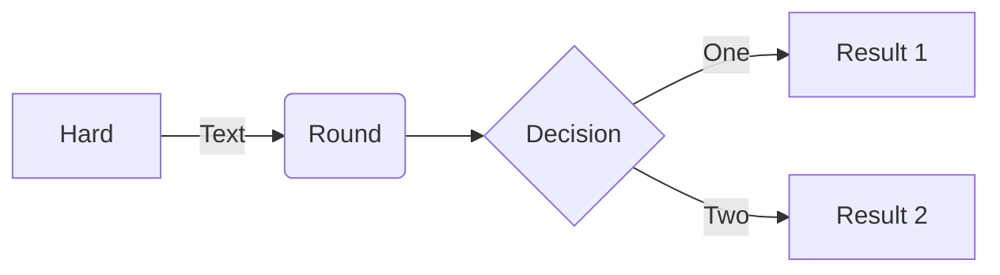
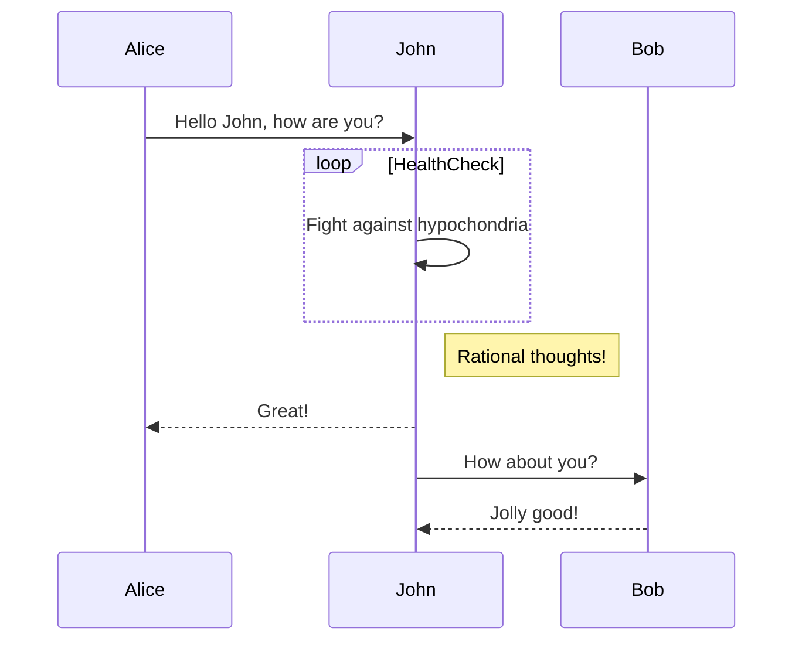
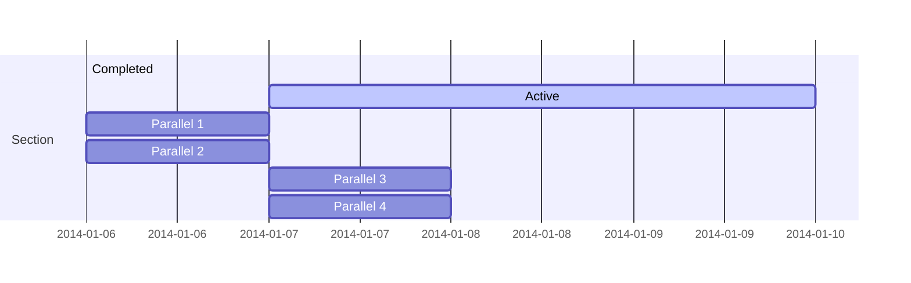
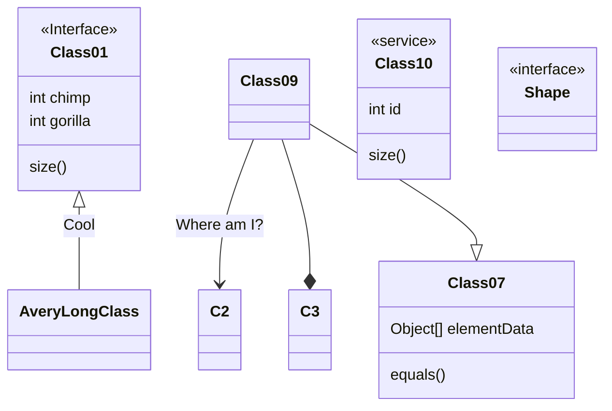
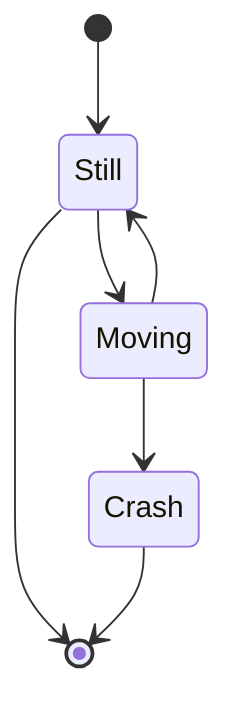
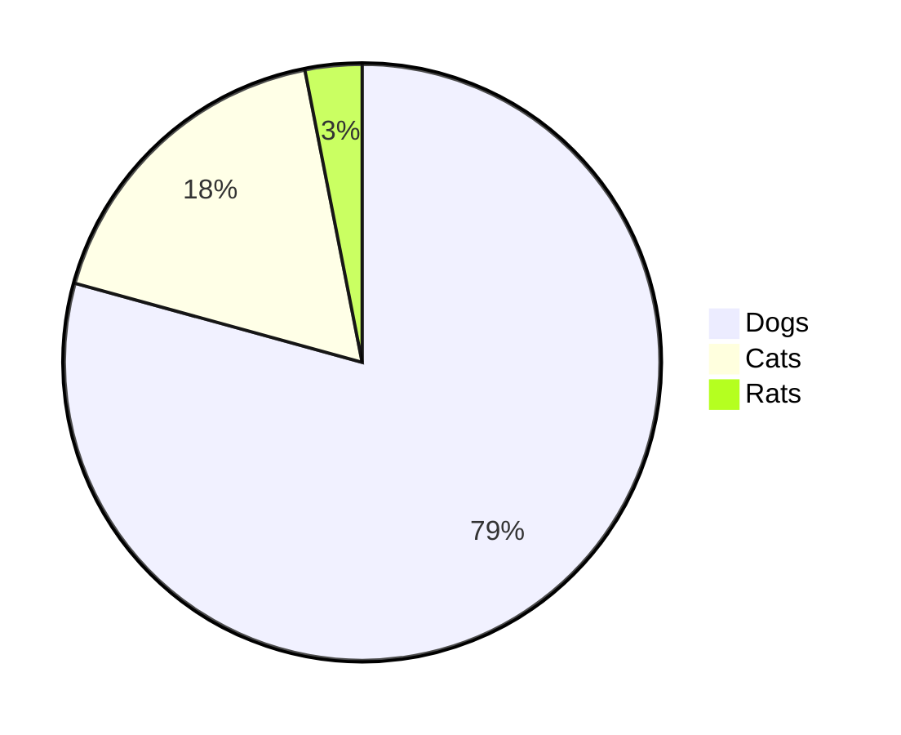
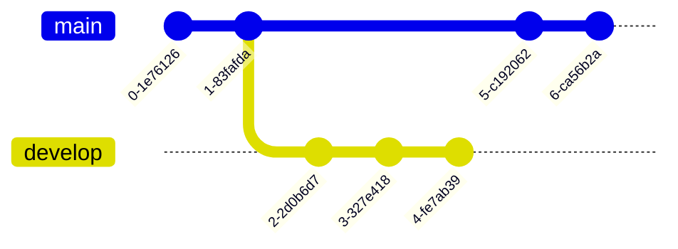
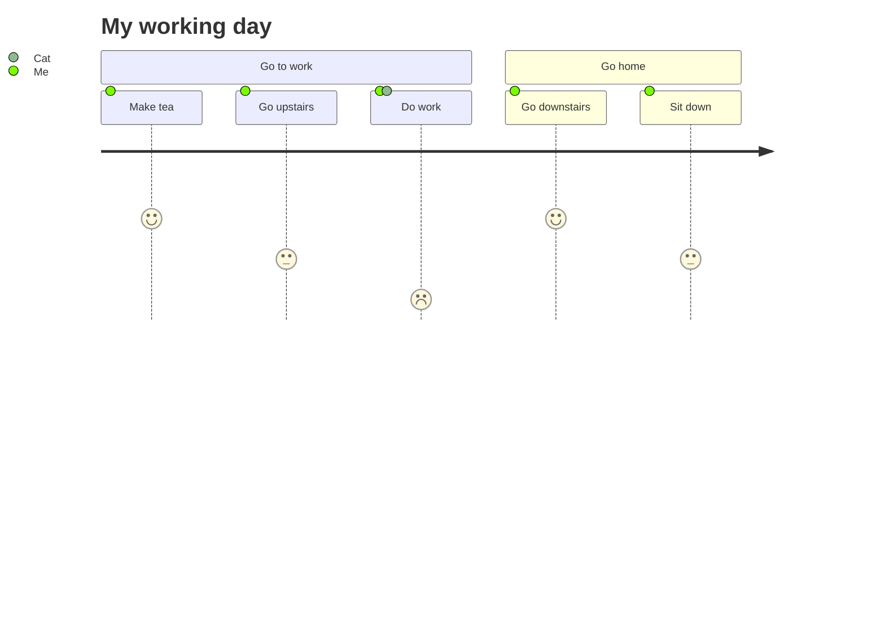
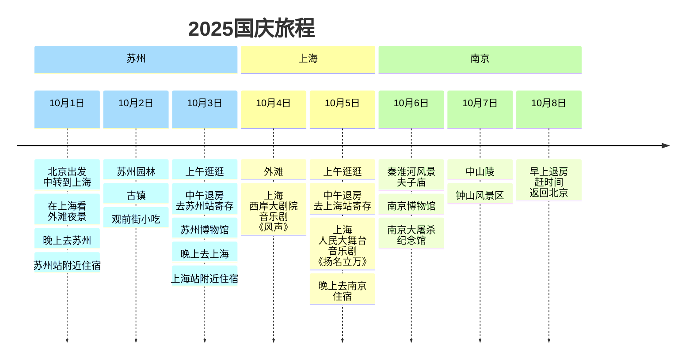

# SW-Markdown Document Reader Tool

---
### Introduction
A `Markdown` file is a simple text document with the `.md` extension; a `Markdown tool` renders and formats its content.
This is a Markdown tool: open a Markdown text file to preview the rendered content. It also renders `LaTeX math formulas` and `mermaid diagrams`.

### Installation
Copy the files and directories below to an installation target path, e.g. the `D:\md_tool\` directory, and you are ready to use it.

```
markdown_katex_tool.html
sw_mdtool.js
marked.min.js
katex.min.css
katex.min.js
katex-auto-render.min.js
js-yaml.min.js
highlight.min.js
highlight-lang-latex.js
panda-syntax-light.min.css
mermaid.min.js
fonts/
```

This tool is a local web page: open `markdown_katex_tool.html` in a browser, click the button on the page, pick a `.md` file on your computer, and preview it.

**Shortcuts**
`Ctrl`+`P` prints the preview area content. On Windows, in the `More settings` of the print dialog you can choose to print with the preview `background`, print to a printer, or print to a PDF file (Windows supports printing to PDF by default).
`Ctrl`+`S` opens a new page showing the preview area content.

Clicking the `Print button` also prints the preview area content, equivalent to `Ctrl`+`P`.


An example `Markdown` file:
`markdown_katex_tool.md`

# Writing a Simple Markdown File

<br>
<br>
<br>

***

### Tools for Writing Markdown Files

Any plain-text editor can write `Markdown` files, e.g. `Notepad`. Formatted editors (Word/WPS) are not recommended because their content is not plain text and Markdown tools cannot read it. Save files with the `.md` extension and preview them with this tool (`SW-Markdown Document Reader Tool`).

For live preview while writing, use `VSCode` with the `Markdown Preview Enhanced` extension.

### Basic Markdown Syntax

`Headings` (start a line with #, ##, …, up to ######, followed by a space and the heading text; six levels, each on its own line), `fenced blocks` (between two triple backticks \`\`\`), `inline code` (between two single backticks \`), `bold` (between two pairs of asterisks \*\*), `italic` (between single asterisks \*), `horizontal rules` (a line starting with three dashes ---), `paragraphs` (separated by blank lines), `indented fences` (surrounded by blank lines, each content line indented by 4 spaces), `tables` (use vertical bars | to define columns and surround the content with them), `blockquotes` (each line starts with `>` and a space), etc.

A block-level `fenced block` can contain various `text`, `code`, and `LaTeX/KaTeX math formulas` or `mermaid diagram statements` to be parsed and rendered, etc.

Markdown content is highly readable; the simple syntax does not interfere with reading. Markdown tools render it into formatted documents, and the rendered HTML can easily be converted to PDF.

### Fenced Blocks
Usually wrap content between two triple backticks \`\`\`, with a blank line before and after the fence. Alternatively use an indented fence by indenting each content line by 4 spaces.

The Markdown syntax is as follows:

    [此行为空行]
    ```
    一个例子
    ```
    [此行为空行]


Rendered result:

```
一个例子
```

If the content is programming code or a special language, you can put a language name right after the opening triple backtick \`\`\`, e.g. html. Common programming languages (html/javascript/c/c++/perl/python, etc.) support syntax highlighting.

The Markdown syntax is as follows:

    [此行为空行]
    ```html
    <html>
    <body>
        一个例子
        <br>
        <a href="https://markdown.cn/docs/intro"> Markdown帮助文档 </a>
    </body>
    </html>
    ```
    [此行为空行]


Rendered result:

```html
<html>
<body>
    一个例子
    <br>
    <a href="https://markdown.cn/docs/intro"> Markdown帮助文档 </a>
</body>
</html>
```


### Markdown Tables
Surround a table with `|`. Each line is a row; columns are separated by `|`, with rows starting and ending with `|`. A 2-column table has three `|` per row, a 3-column table has four, and so on. The first row is the header. The second row defines alignment: `---` means the header is centered and other rows left-aligned; `:---` left-aligned; `---:` right-aligned; `:---:` centered.

The Markdown syntax is as follows:

    | Markdown	| HTML	| 呈现的输出| 
    |---|---|---|
    | `# 一级标题`	| `<h1>一级标题</h1>`	| # 一级标题 |
    | `## 二级标题`	| `<h2>二级标题</h2>`	| ## 二级标题 |
    | `### 三级标题`	| `<h3>三级标题</h3>`	| ### 三级标题 |
    | `#### 四级标题`	| `<h4>四级标题</h4>`	| #### 四级标题 |
    | `##### 五级标题`	| `<h5>五级标题</h5>`	| #####五级标题 |
    | `###### 六级标题`	| `<h6>六级标题</h6>`	| ###### 六级标题 |


Rendered result:

| Markdown	| HTML	| Rendered Output| 
|---|---|---|
| `# Heading 1`	| `<h1>Heading 1</h1>`	| <p style="font-size:2.0rem; font-weight: bold;">Heading 1</p> |
| `## Heading 2`	| `<h2>Heading 2</h2>`	| <p style="font-size:1.8rem; font-weight: bold;">Heading 2</p> |
| `### Heading 3`	| `<h3>Heading 3</h3>`	| <p style="font-size:1.6rem; font-weight: bold;">Heading 3</p> |
| `#### Heading 4`	| `<h4>Heading 4</h4>`	| <p style="font-size:1.4rem; font-weight: bold;">Heading 4</p> |
| `##### Heading 5`	| `<h5>Heading 5</h5>`	| <p style="font-size:1.2rem; font-weight: bold;">Heading 5</p> |
| `###### Heading 6`	| `<h6>Heading 6</h6>`	| <p style="font-size:1.0rem; font-weight: bold;">Heading 6</p> |

**Right-aligned**

The Markdown syntax is as follows:

    | 名称	| 内容	|
    | ---: | ---: |
    | 短名	| md	|
    | Markdown文件名 | markdown_katex_tool.html |

Rendered result:

| Name | Content |
| ---: | ---: |
| Short name | md |
| Markdown file name | markdown_katex_tool.html	|


**Center-aligned**

The Markdown syntax is as follows:

    | 名称	| 文件名 |
    | :---: | :---: |
    | 短名	| t.md	|
    | Markdown文件名 | markdown_katex_tool.html |

Rendered result:

| Name	| Content	|
| :---: | :---: |
| Short name	| md	|
| Markdown file name | markdown_katex_tool.html	|


### Blockquotes
Start each line with `< ` (a greater-than sign and a space). Example:

The Markdown syntax is as follows:

```
> 更多数学公式用法参考LaTex或katex官方相关文档。
> [katex.org](https://katex.org)
> [latex-project.org](https://www.latex-project.org/)

```

Rendered result:

> For more math formula usage, refer to the official LaTeX or KaTeX documentation.
> [katex.org](https://katex.org)
> [latex-project.org](https://www.latex-project.org/)


> For more help, see the `Markdown` documentation: https://markdown.cn/docs/intro .
> Basic syntax documentation: https://markdown.cn/docs/tutorial-basics/basic-syntax .


***
> MARKDOWN tutorial - markdown.cn [Basic syntax](https://markdown.cn/docs/tutorial-basics/basic-syntax)  |  [Extended syntax](https://markdown.cn/docs/tutorial-basics/extended-syntax) 

***

<br>
Headings

|Markdown	|HTML	|Rendered Output|
|--|--|--|
|# Heading 1	|`<h1>` Heading 1`</h1>`	|<h1> Heading 1</h1>|
|## Heading 2	|`<h2>`Heading 2`</h2>`|<h2>Heading 2</h2>|
|### Heading 3	|`<h3>`Heading 3`</h3>`	|<h3>Heading 3</h3>|
|#### Heading 4	|`<h4>`Heading 4`</h4>`	|<h4>Heading 4</h4>|
|##### Heading 5	|`<h5>`Heading 5`</h5>`	|<h5>Heading 5</h5>|
|###### Heading 6	|`<h6>`Heading 6`</h6>`	|<h6>Heading 6</h6>|


<br>
Paragraphs

To create paragraphs, separate one or more lines of text with a blank line.

|Markdown	|HTML	|Rendered Output|
|--|--|--|
|I really like using<br>Markdown.<br><br>I think I'll use it to format<br>all of my documents from now on.	|`<p>`I really like using<br>Markdown.`</p>`<br><br>`<p>`I think I'll use it to format<br>all of my documents from now on.`</p>`	|<p>I really like using<br>Markdown.</p><br><p>I think I'll use it to format<br>all of my documents from now on.</p>|


<br>
Line Breaks

To create a line break or new line (`<br>`), end a line with two or more spaces, then press Enter.

|Markdown	|HTML	|Rendered Output|
|--|--|--|
|This is the first line.&nbsp;&nbsp;<br>This is the second line.	|`<p>`This is the first line.`<br>`<br>This is the second line.`</p>`	|<p>This is the first line.<br>This is the second line.</p>|


<br>
Emphasis

You can add emphasis by making text bold or italic.

<br>
Bold

To bold text, add two asterisks or underscores before and after a word or phrase. To bold the middle of a word for emphasis, add two asterisks around the letters with no spaces.

|Markdown	|HTML	|Rendered Output|
|--|--|--|
|I just love **bold text**.	|I just love `<strong>`bold text`</strong>`.	|I just love <strong>bold text</strong>.|
|I just love __bold text__.	|I just love `<strong>`bold text`</strong>`.	|I just love <strong>bold text</strong>.|
|Love\*\*is\*\*bold	|Love`<strong>`is`</strong>`bold|Love<strong>is</strong>bold|


<br>
Italic

To italicize text, add one asterisk or underscore before and after a word or phrase. To italicize the middle of a word, add one asterisk around the letters with no spaces.

|Markdown	|HTML	|Rendered Output|
|--|--|--|
|Italicized text is the *cat's meow*.	|Italicized text is the `<em>`cat's meow`</em>`.	|Italicized text is the <em>cat's meow</em>.|
|Italicized text is the _cat's meow_.	|Italicized text is the `<em>`cat's meow`</em>`.	|Italicized text is the <em>cat's meow</em>.|
|A\*cat\*meow	|A`<em>`cat`</em>`meow	|A<em>cat</em>meow|


<br>
Bold and Italic

To emphasize text with both bold and italic, add three asterisks or underscores before and after a word or phrase. To emphasize the middle of a word, add three asterisks around the letters with no spaces.

|Markdown	|HTML	|Rendered Output|
|--|--|--|
|This text is ***extremely important***.	|This text is <em><strong>extremely important</strong></em>.	|This text is <em><strong>extremely important</strong></em>.|
|This text is ___extremely important___.	|This text is <em><strong>extremely important</strong></em>.	|This text is <em><strong>extremely important</strong></em>.|
|This text is __*extremely important*__.	|This text is <em><strong>extremely important</strong></em>.	|This text is <em><strong>extremely important</strong></em>.|
|This text is **_extremely important_**.	|This text is <em><strong>extremely important</strong></em>.	|This text is <em><strong>extremely important</strong></em>.|
|This is really ***very*** important text.	|This is really <em><strong>very</strong></em> important text.	|This is really <em><strong>very</strong></em> important text.|


<br>
Blockquotes

To create a blockquote, add a `>` in front of a paragraph.


    > Dorothy followed her through many of the beautiful rooms in her castle.

The rendered output is shown below

> Dorothy followed her through many of the beautiful rooms in her castle.


<br>
Lists

You can organize items into ordered and unordered lists.


<br>
Ordered Lists

To create an ordered list, add line items with numbers followed by periods. The numbers do not need to be in numerical order, but the list should start with the number one.


|Markdown	|HTML	|Rendered Output|
|--|--|--|
|1. First item<br>2. Second item<br>3. Third item<br>4. Fourth item|`<ol>`<br>&nbsp;&nbsp;`<li>`First item`</li>`<br>&nbsp;&nbsp;`<li>`Second item`</li>`<br>&nbsp;&nbsp;`<li>`Third item`</li>`<br>&nbsp;&nbsp;`<li>`Fourth item`</li>`<br>`</ol>`|<ol>  <li>First item</li>  <li>Second item</li>  <li>Third item</li>  <li>Fourth item</li></ol>|
|1. First item<br>2. Second item<br>3. Third item<br>&nbsp;&nbsp;1. Indented item<br>&nbsp;&nbsp;2. Indented item<br>4. Fourth item|`<ol>`<br>&nbsp;&nbsp;`<li>`First item`</li>`<br>&nbsp;&nbsp;`<li>`Second item`</li>`<br>&nbsp;&nbsp;`<li>`Third item<br> &nbsp;&nbsp;&nbsp;&nbsp;`<ol>`<br>&nbsp;&nbsp;&nbsp;&nbsp;&nbsp;&nbsp;`<li>`Indented item`</li>`<br>&nbsp;&nbsp;&nbsp;&nbsp;&nbsp;&nbsp;`<li>`Indented item`</li>`<br>&nbsp;&nbsp;&nbsp;&nbsp;`</ol>`<br>&nbsp;&nbsp;`</li>`<br>&nbsp;&nbsp;`<li>`Fourth item`</li>`<br>`</ol>`|<ol>  <li>First item</li>  <li>Second item</li>  <li>Third item    <ol>      <li>Indented item</li>      <li>Indented item</li>    </ol>  </li>  <li>Fourth item</li></ol>|


<br>
Unordered Lists

To create an unordered list, add dashes (-), asterisks (*), or plus signs (+) in front of line items. Indent one or more items to create a nested list.


|Markdown	|HTML	|Rendered Output|
|--|--|--|
|- First item<br>- Second item<br>- Third item<br>- Fourth item|`<ul>`<br>&nbsp;&nbsp;`<li>`First item`</li>`<br>&nbsp;&nbsp;`<li>`Second item`</li>`<br>&nbsp;&nbsp;`<li>`Third item`</li>`<br>&nbsp;&nbsp;`<li>`Fourth item`</li>`<br>`</ul>`|<ul>  <li>First item</li>  <li>Second item</li>  <li>Third item</li>  <li>Fourth item</li></ul>|
|* First item<br>* Second item<br>* Third item<br>* Fourth item|`<ul>`<br>&nbsp;&nbsp;`<li>`First item`</li>`<br>&nbsp;&nbsp;`<li>`Second item`</li>`<br>&nbsp;&nbsp;`<li>`Third item`</li>`<br>&nbsp;&nbsp;`<li>`Fourth item`</li>`<br>`</ul>`|<ul>  <li>First item</li>  <li>Second item</li>  <li>Third item</li>  <li>Fourth item</li></ul>|
|+ First item<br>+ Second item<br>+ Third item<br>+ Fourth item|`<ul>`<br>&nbsp;&nbsp;`<li>`First item`</li>`<br>&nbsp;&nbsp;`<li>`Second item`</li>`<br>&nbsp;&nbsp;`<li>`Third item`</li>`<br>&nbsp;&nbsp;`<li>`Fourth item`</li>`<br>`</ul>`|<ul>  <li>First item</li>  <li>Second item</li>  <li>Third item</li>  <li>Fourth item</li></ul>|
|- First item<br>- Second item<br>- Third item<br>&nbsp;&nbsp;&nbsp;&nbsp;- Indented item<br>&nbsp;&nbsp;&nbsp;&nbsp;- Indented item<br>- Fourth item|`<ul>`<br>&nbsp;&nbsp;`<li>`First item`</li>`<br>&nbsp;&nbsp;`<li>`Second item`</li>`<br>&nbsp;&nbsp;`<li>`Third item<br>&nbsp;&nbsp;&nbsp;&nbsp;`<ul>`<br>&nbsp;&nbsp;&nbsp;&nbsp;&nbsp;&nbsp;`<li>`Indented item`</li>`<br>&nbsp;&nbsp;&nbsp;&nbsp;&nbsp;&nbsp;`<li>`Indented item`</li>`<br>&nbsp;&nbsp;&nbsp;&nbsp;`</ul>`<br>&nbsp;&nbsp;`</li>`<br>&nbsp;&nbsp;`<li>`Fourth item`</li>`<br>`</ul>`|<ul>  <li>First item</li>  <li>Second item</li>  <li>Third item    <ul>      <li>Indented item</li>      <li>Indented item</li>    </ul>  </li>  <li>Fourth item</li></ul>|


<br>
Adding Elements in Lists

To add another element in a list while keeping the list continuous, indent the element by four spaces or one tab, as in the example below.

> Tip
If things do not appear as expected, double-check that you indented the elements in the list by four spaces or one tab.

Paragraphs

```
* This is the first list item.
* Here's the second list item.

    I need to add another paragraph below the second list item.

* And here's the third list item.
```

The rendered output is shown below

* This is the first list item.
* Here's the second list item.

    I need to add another paragraph below the second list item.

* And here's the third list item.


<br>
<br>

Code Blocks

Code blocks are usually indented by four spaces or one tab. When they are inside a list, indent them by eight spaces or two tabs.


```javascript
function renderMarkdown(markdown) {
  try {
    let html;
    if (typeof marked.parse === 'function') {
      html = marked.parse(markdown); // v4+ 版本用法
    } else if (typeof marked === 'function') {
      html = marked(markdown); // 旧版本用法
    } else {
      throw new Error('marked库版本不兼容');
    }
    return html;
  } catch (error) {
    console.error('Markdown渲染错误:', error);
    return '<div class="error">解析失败</div>';
  }
}
```

<br>
<br>
<br>

***


**Markdown document example**
For example, create a file `t.md` with the following content.


    # 数学公式示例

    > 查看katex的文档：https://katex.org/docs/supported  。

    
    **LaTex数学公式**

    如果两个单`$`内或两个双`$$`的`LaTex公式`解析不出来，检查公式格式是否正确。对于两个双`$$`的`LaTex公式`解析，可以在开始的`$$`前面一行多加一个回车换行后，再看看是否解决问题。

    > 关于`latex数学公式`的,请查看`katex`的文档：https://katex.org/docs/supported  。

    ### 行内公式
    牛顿第二定律：$F = ma$，其中 $a$ 是加速度。
    这些公式可以写在两个`$`内部，比如`$F = ma$`，`$a$` 。

    ### 块级公式
    还有比较复杂的公式，可以写在两个`$$`内部。
    比如：

    ```
    $$
    x = \frac{-b \pm \sqrt{b^2 - 4ac}}{2a}
    $$
    ```
    效果：

    $$
    x = \frac{-b \pm \sqrt{b^2 - 4ac}}{2a}
    $$

    也可以将公式放在围栏块标志符\`\`\`，加上katex指出语言类型。
    比如，
    二次方程求根公式：


        ```katex
        $$
        x = \frac{-b \pm \sqrt{b^2 - 4ac}}{2a}
        $$
        ```


    效果：
    ```katex
    $$
    x = \frac{-b \pm \sqrt{b^2 - 4ac}}{2a}
    $$
    ```

    ### 矩阵乘法

        ```katex
        $$
            \begin{pmatrix}
            1 & 2 \\
            3 & 4
            \end{pmatrix}
            \times
            \begin{pmatrix}
            5 & 6 \\
            7 & 8
            \end{pmatrix}
            =
            \begin{pmatrix}
            19 & 22 \\
            43 & 50
            \end{pmatrix}
        $$
        ```

    效果：

    ```katex
    $$
        \begin{pmatrix}
        1 & 2 \\
        3 & 4
        \end{pmatrix}
        \times
        \begin{pmatrix}
        5 & 6 \\
        7 & 8
        \end{pmatrix}
        =
        \begin{pmatrix}
        19 & 22 \\
        43 & 50
        \end{pmatrix}
    $$
    ```

    ### 表格中的数学公式

    Markdown的表格

        | 符号       | 公式          |
        |------------|---------------|
        | 平均值     | $\bar{x}$     |
        | 方差       | $\sigma^2$    |


    效果：

    | 符号       | 公式          |
    |------------|---------------|
    | 平均值     | $\bar{x}$     |
    | 方差       | $\sigma^2$    |


    ### 其它例子
    1.  `$A = \{1,2,3\}$，$B = \{x|(x - 1)(x - 2)(x - 3)=0\}$`；
    效果：$A = \{1,2,3\}$，$B = \{x|(x - 1)(x - 2)(x - 3)=0\}$


    2.  `$A = \{x|0\lt 2x - 1\lt 1\}$，$B = \{x|1\lt 3x + 1\lt 4\}$`；
    效果：$A = \{x|0\lt 2x - 1\lt 1\}$，$B = \{x|1\lt 3x + 1\lt 4\}$

    3.  `$M=\left\{x|x = m+\frac{1}{6},m\in \mathbf{Z}\right\}$`，`$N=\left\{x|x=\frac{n}{2}-\frac{1}{3},n\in \mathbf{Z}\right\}$`，`$P=\left\{x|x=\frac{k}{2}+\frac{1}{6},k\in \mathbf{Z}\right\}$` 。

    效果：

    $M=\left\{x|x = m+\frac{1}{6},m\in \mathbf{Z}\right\}$ ，

    $N=\left\{x|x=\frac{n}{2}-\frac{1}{3},n\in \mathbf{Z}\right\}$ ，

    $P=\left\{x|x=\frac{k}{2}+\frac{1}{6},k\in \mathbf{Z}\right\}$


    4. `$M=\left\{x|x = m+\frac{1}{6},m\in \mathbf{Z}\right\}$`

    效果：

    $M=\left\{x|x = m+\frac{1}{6},m\in \mathbf{Z}\right\}$


Preview effect, as follows:

<br>
<br>
<br>

---

# LaTeX Math Formula Examples

**LaTeX math formulas**

If a `LaTeX formula` inside two single `$` or two double `$$` fails to parse, check that the formula format is correct. For formulas inside double `$$`, try adding an extra blank line before the opening `$$` and see whether that fixes the issue.

> For `LaTeX math formulas`, see the `KaTeX` documentation: https://katex.org/docs/supported , https://katex.org/docs/support_table .


### Inline Formulas
Newton's second law: $F = ma$, where $a$ is the acceleration.
These formulas can be written between two `$`, e.g. `$F = ma$`, `$a$`.

### Block Formulas
More complex formulas can be written between two `$$`.
For example:

```
$$
x = \frac{-b \pm \sqrt{b^2 - 4ac}}{2a}
$$
```
Result:

$$
x = \frac{-b \pm \sqrt{b^2 - 4ac}}{2a}
$$

You can also put formulas inside a fenced block \`\`\` and specify katex as the language.
For example,
Quadratic formula:


    ```katex
    $$
    x = \frac{-b \pm \sqrt{b^2 - 4ac}}{2a}
    $$
    ```


Result:
```katex
$$
x = \frac{-b \pm \sqrt{b^2 - 4ac}}{2a}
$$
```

### Matrix Multiplication

    ```katex
    $$
        \begin{pmatrix}
        1 & 2 \\
        3 & 4
        \end{pmatrix}
        \times
        \begin{pmatrix}
        5 & 6 \\
        7 & 8
        \end{pmatrix}
        =
        \begin{pmatrix}
        19 & 22 \\
        43 & 50
        \end{pmatrix}
    $$
    ```

Result:

```katex
$$
    \begin{pmatrix}
    1 & 2 \\
    3 & 4
    \end{pmatrix}
    \times
    \begin{pmatrix}
    5 & 6 \\
    7 & 8
    \end{pmatrix}
    =
    \begin{pmatrix}
    19 & 22 \\
    43 & 50
    \end{pmatrix}
$$
```

### Math Formulas in Tables

Markdown table

    | 符号       | 公式          |
    |------------|---------------|
    | 平均值     | $\bar{x}$     |
    | 方差       | $\sigma^2$    |


Result:

| Symbol       | Formula          |
|------------|---------------|
| Mean     | $\bar{x}$     |
| Variance       | $\sigma^2$    |


### More Examples
1.  `$A = \{1,2,3\}$，$B = \{x|(x - 1)(x - 2)(x - 3)=0\}$`；
Result: $A = \{1,2,3\}$, $B = \{x|(x - 1)(x - 2)(x - 3)=0\}$


2.  `$A = \{x|0\lt 2x - 1\lt 1\}$，$B = \{x|1\lt 3x + 1\lt 4\}$`；
Result: $A = \{x|0\lt 2x - 1\lt 1\}$, $B = \{x|1\lt 3x + 1\lt 4\}$

3.  `$M=\left\{x|x = m+\frac{1}{6},m\in \mathbf{Z}\right\}$`，`$N=\left\{x|x=\frac{n}{2}-\frac{1}{3},n\in \mathbf{Z}\right\}$`，`$P=\left\{x|x=\frac{k}{2}+\frac{1}{6},k\in \mathbf{Z}\right\}$` 。

Result:

$M=\left\{x|x = m+\frac{1}{6},m\in \mathbf{Z}\right\}$ ，

$N=\left\{x|x=\frac{n}{2}-\frac{1}{3},n\in \mathbf{Z}\right\}$ ，

$P=\left\{x|x=\frac{k}{2}+\frac{1}{6},k\in \mathbf{Z}\right\}$


4. `$M=\left\{x|x = m+\frac{1}{6},m\in \mathbf{Z}\right\}$`

Result:

$M=\left\{x|x = m+\frac{1}{6},m\in \mathbf{Z}\right\}$

<br>
<br>
<br>

---

# Using Math Figures

### Function Graphs

#### Function Graph - Example 1

Draw the exponential function $y=a^x, (0<a<1)$, then draw the line $y=1$, which intersects it at (0,1); mark the intersection point.
The Markdown syntax for math figures is as follows.<br>
`boundingbox: [-3, 5, 3, -1]`: defines the display area, with coordinates in the range [left, top, right, bottom].
`functiongraphs: [...]`: defines one or more functions in an array `[]`. The `f` attribute is an array: [0] defines the math function, [1] and [2] are the domain range, and only the part of the graph within the domain (or display area) is shown. The `a` attribute is a dictionary: 'name' sets the displayed function name or text; 'label' configures the relative display position of 'name'; 'dash' makes the curve dashed, with `dash:1` meaning a dash thickness of 1. 
`points: [...]`: defines one or more points in an array `[]`. Each point is defined by an array: [0] and [1] are the x, y coordinates; [2] is the point name; [3] is a dictionary whose 'pos' property sets the relative display position of the point name.
`texts: [...]`: defines one or more text strings in an array `[]`. Each text string is defined by an array: [0] and [1] are the x, y coordinates of the starting position; [2] is the text content; [3] is a dictionary whose `useKatex:true` property renders the text with KaTeX, which can display math formulas.

<br>

    ```swmathgraph-svg
    {
        boundingbox: [-3, 5, 3, -1],
        drawO: true,
        functiongraphs: [
            {f:[function (t){return JXG.Math.pow(1/2, t);}, -2.0, 2.5], a:{name:"y=a^x", label:{position:"top",}}},
            {f:['1'], a:{dash:1, name:"y=1", label:{position:"lt",}}},
        ],
        points: [
            [0,1,'(0,1)',{pos:'rightTop'}],
        ],
        texts: [
            [1.0, 4.5, "(0<a<1)", {useKatex:true}]
        ],
    }
    ```

<br>
The figure is shown below.

```swmathgraph-svg
{
    boundingbox: [-3, 5, 3, -1],
    drawO: true,
    functiongraphs: [
        {f:[function (t){return JXG.Math.pow(1/2, t);}, -2.0, 2.5], a:{name:"y=a^x", label:{position:"top",}}},
        {f:['1'], a:{dash:1, name:"y=1", label:{position:"lt",}}},
    ],
    points: [
        [0,1,'(0,1)',{pos:'rightTop'}],
    ],
    texts: [
        [1.0, 4.5, "(0<a<1)", {useKatex:true}]
    ],
}
```

<br>
<br>

#### Function Graph - Example 2

Draw the exponential function $y=(\frac{1}{2})^x$ representing $y=a^x, (0<b<a<1)$;
Draw the exponential function $y=(\frac{1}{3})^x$ representing $y=b^x, (0<b<a<1)$;
Draw the exponential function $y=3^x$ representing $y=c^x, (1<d<c)$;
Draw the exponential function $y=2^x$ representing $y=d^x, (1<d<c)$;
Then draw the vertical line $x=1$.


The Markdown syntax for math figures is as follows.<br>

    ```swmathgraph-svg
    {
        boundingbox: [-3, 5, 3, -1],
        drawO: true,
        functiongraphs: [
            {f:[function (t){return JXG.Math.pow(1/2, t);}, -1.9, 2.5], a:{name:"y=a^x", label:{position:"top",offset:[-15,8]}}},
            {f:[function (t){return JXG.Math.pow(1/3, t);}, -1.3, 2.3], a:{name:"y=b^x", label:{position:"top",offset:[-15,8]}}},
            {f:[function (t){return JXG.Math.pow(3, t);}, -2.3, 1.3], a:{name:"y=c^x", label:{position:"top",offset:[-15,8]}}},
            {f:[function (t){return JXG.Math.pow(2, t);}, -2.5, 1.9], a:{name:"y=d^x", label:{position:"top",offset:[-15,8]}}},
        ],
        lines: [
            [[1,0],[1,1],{dash:1, name:"x=1"}],
        ]
    }
    ```

<br>
The figure is shown below.

```swmathgraph-svg
{
    boundingbox: [-3, 5, 3, -1],
    drawO: true,
    functiongraphs: [
        {f:[function (t){return JXG.Math.pow(1/2, t);}, -1.9, 2.5], a:{name:"y=a^x", label:{position:"top",offset:[-15,8]}}},
        {f:[function (t){return JXG.Math.pow(1/3, t);}, -1.3, 2.3], a:{name:"y=b^x", label:{position:"top",offset:[-15,8]}}},
        {f:[function (t){return JXG.Math.pow(3, t);}, -2.3, 1.3], a:{name:"y=c^x", label:{position:"top",offset:[-15,8]}}},
        {f:[function (t){return JXG.Math.pow(2, t);}, -2.5, 1.9], a:{name:"y=d^x", label:{position:"top",offset:[-15,8]}}},
    ],
    lines: [
        [[1,0],[1,1],{dash:1, name:"x=1"}],
    ]
}
```

<br>
<br>

#### Function Graph - Example 3

The Markdown syntax for math figures is as follows.<br>

    ```swmathgraph-svg
    {
        boundingbox: [-3, 5, 3, -1],
        drawO: true,
        functiongraphs: [
            {f:[function (t){return JXG.Math.pow(2, t);}, -2.5, 2.0], a:{name:"y=a^x",}},
            {f:['1'], a:{dash:1, name:"y=1", label:{position:"lt",}}},
            // {f:['f(x)=x^2'], a:{}},
            {f:[function (x) {return 2*x;}], a:{"color":'black'}},
        ],
        points: [
            [0,1,'(0,1)',{pos:'rightTop'}],
        ],
        texts: [
            [-2.5, 4.5, "(a>1)", {useKatex:true}]
        ],

    }
    ```


<br>
The figure is shown below.

```swmathgraph-svg
{
    boundingbox: [-3, 5, 3, -1],
    drawO: true,
    functiongraphs: [
        {f:[function (t){return JXG.Math.pow(2, t);}, -2.5, 2.0], a:{name:"y=a^x",}},
        {f:['1'], a:{dash:1, name:"y=1", label:{position:"lt",}}},
        // {f:['f(x)=x^2'], a:{}},
        {f:[function (x) {return 2*x;}], a:{"color":'black'}},
    ],
    points: [
        [0,1,'(0,1)',{pos:'rightTop'}],
    ],
    texts: [
        [-2.5, 4.5, "(a>1)", {useKatex:true}]
    ],

}
```

<br>
<br>

#### Function Graph - Example 4

The Markdown syntax for math figures is as follows.<br>


    
    ```swmathgraph-svg
    {
          debug: false,
          boundingbox: [-5, 5, 5, -5],
          define: [
            // "p.A","p.B",
          ],
          axis: false,
          // title:{content:"图①"},
          // drawO: true,
          // drawO: {name:"O_1",pos:"rightBottom"},
          // drawO: {pos:"rightBottom"},
          functiongraphs: [
            // {f:[function (t){return JXG.Math.pow(1/2, t);}, -1.9, 2.5], a:{name:"y=a^x", label:{position:"top",offset:[-15,8]}}},
          ],
          points:[
            // {p:[-JXG.Math.nthroot(3,2), -1.0,"A"],vn:"A",},
            // {p:[-1.0, JXG.Math.nthroot(3,2),"B"],vn:"B"},
            // {p:[1.0, 1.0],vn:"-"},
            // {p:[1.0, JXG.Math.nthroot(3,2)],vn:"C"},
          ],
          lines: [
            // [[1,0],[1,1],{dash:1, name:"x=1"}],
            // [0,1,-1],
            // [ref("p.C"),ref("p.O")],
            // [ref("p.B"),ref("p.O")],
            // {l:[[1,0],[1,1]],vn:"l1", a:{dash:1, name:"x=1"}},
            // {l:[ref("p.C"),ref("p.O")],vn:"l2",},
          ],
          segments: [
            // [[-JXG.Math.nthroot(3,2), -1.0], [-1.0, JXG.Math.nthroot(3,2)]],
            // [ref("p.A"),ref("p.B")],
            // [ref("p.A"),ref("p.O")],
            // [ref("p.B"),ref("p.O")],
            // [ref("p.B"),ref("p.O")],
            // [[-JXG.Math.nthroot(3,2)-0.5, -1.0-0.5], [0,0], {name:"A", label:{position:'-25px right'}}],
            // [[-1.0-0.5, JXG.Math.nthroot(3,2)+0.5], [0,0], {name:"B", label:{position:'-5px right'}}],
          ],
          angles: [
            // [[-JXG.Math.nthroot(3,2), -1.0],[0,0],[0,-1],{ radius:0.5, name:"60"+'°' }],
            // [[0,1],[0,0],[-1.0, JXG.Math.nthroot(3,2)],{ radius:0.7, name:"30"+'°' }],
            // [ref("p.A"),ref("p.O"),[0,-1],{ radius:0.5, name:"60"+'°' }],
            // [[0,1],ref("p.O"),ref("p.B"),{ radius:0.7, name:"30"+'°' }],
            // [ref("l.l2"),ref("l.l1"),[2,4],[0,3]],
          ],
          polygons: [
            // [[-4,2], [-4,-2], [4,-2], [4,2], {withLines:true, fillOpacity:0}],
            // [[0,0], [-JXG.Math.nthroot(3,2), -1.0], [JXG.Math.nthroot(3,2),-1], [JXG.Math.nthroot(3,2),JXG.Math.nthroot(3,2)], [-1.0, JXG.Math.nthroot(3,2)] ],

            // [[0,0],[-JXG.Math.nthroot(3,2), -1.0],[JXG.Math.nthroot(3,2),-1],[JXG.Math.nthroot(3,2),JXG.Math.nthroot(3,2)],[-1.0, JXG.Math.nthroot(3,2)],{withLines:false,fillColor:"#C0D966",vertices: {withLabel: false} }],
            // [ref("p.O"),ref("p.A"),[JXG.Math.nthroot(3,2),-1],[JXG.Math.nthroot(3,2),JXG.Math.nthroot(3,2)],ref("p.B"),{withLines:false,fillColor:"#C0D966",vertices: {withLabel: false} }],
            // [[0,1],ref("p.O"),ref("p.B"),{ radius:0.7, name:"30"+'°' }],
            // [ref("l.l2"),ref("l.l1"),[2,4],[0,3]],
          ],
          ellipses: [
            // [[4,0], [2,0], [-1,0], {fillColor:"green",fillOpacity:0.5}],
            // [[-4,0], [-2,0], [1,0], {fillColor:"red",fillOpacity:0.5}],
            // [[-1,4], [-1,-4], [1,1],{strokeColor:"red"}],
            // [[-1,2], [1,2], [0,3],0,Math.PI,{lastArrow:{type:7}}],
          ],
          venns: [
            // [[[0,0], 0.25,0.5,{fillColor:"red",fillOpacity:0.5}],  [[1,1], 0.5,0.35,{fillColor:"green",fillOpacity:0.5}]],

            {
              U:[[0,0], 1.0, 0.5, {name:"U", label:{offset:[-85,-35]}}], // default fillOpacity:0, default fillColor:"#C0D966"
              sets:[
                [[-1.5,0 ], 0.6,0.7,{name:"A", label:{offset:[45,5]}, fillColor:"#C0D966",fillOpacity:1}],  
                [[2.0,0], 0.4,0.8, {name:"B", label:{offset:[45,5]}, fillColor:"white",fillOpacity:1}],
                [[-1.5,0], 0.6,0.7,{fillOpacity:0}], // draw line of set A again
              ]
            },
          ],
          texts: [
            // [1.0, 4.5, "(0<a<1)", {useKatex:true}]
          ],
        }
    ```


<br>
The figure is shown below.

```swmathgraph-svg
{
      debug: false,
      boundingbox: [-5, 5, 5, -5],
      define: [
        // "p.A","p.B",
      ],
      axis: false,
      // title:{content:"图①"},
      // drawO: true,
      // drawO: {name:"O_1",pos:"rightBottom"},
      // drawO: {pos:"rightBottom"},
      functiongraphs: [
        // {f:[function (t){return JXG.Math.pow(1/2, t);}, -1.9, 2.5], a:{name:"y=a^x", label:{position:"top",offset:[-15,8]}}},
      ],
      points:[
        // {p:[-JXG.Math.nthroot(3,2), -1.0,"A"],vn:"A",},
        // {p:[-1.0, JXG.Math.nthroot(3,2),"B"],vn:"B"},
        // {p:[1.0, 1.0],vn:"-"},
        // {p:[1.0, JXG.Math.nthroot(3,2)],vn:"C"},
      ],
      lines: [
        // [[1,0],[1,1],{dash:1, name:"x=1"}],
        // [0,1,-1],
        // [ref("p.C"),ref("p.O")],
        // [ref("p.B"),ref("p.O")],
        // {l:[[1,0],[1,1]],vn:"l1", a:{dash:1, name:"x=1"}},
        // {l:[ref("p.C"),ref("p.O")],vn:"l2",},
      ],
      segments: [
        // [[-JXG.Math.nthroot(3,2), -1.0], [-1.0, JXG.Math.nthroot(3,2)]],
        // [ref("p.A"),ref("p.B")],
        // [ref("p.A"),ref("p.O")],
        // [ref("p.B"),ref("p.O")],
        // [ref("p.B"),ref("p.O")],
        // [[-JXG.Math.nthroot(3,2)-0.5, -1.0-0.5], [0,0], {name:"A", label:{position:'-25px right'}}],
        // [[-1.0-0.5, JXG.Math.nthroot(3,2)+0.5], [0,0], {name:"B", label:{position:'-5px right'}}],
      ],
      angles: [
        // [[-JXG.Math.nthroot(3,2), -1.0],[0,0],[0,-1],{ radius:0.5, name:"60"+'°' }],
        // [[0,1],[0,0],[-1.0, JXG.Math.nthroot(3,2)],{ radius:0.7, name:"30"+'°' }],
        // [ref("p.A"),ref("p.O"),[0,-1],{ radius:0.5, name:"60"+'°' }],
        // [[0,1],ref("p.O"),ref("p.B"),{ radius:0.7, name:"30"+'°' }],
        // [ref("l.l2"),ref("l.l1"),[2,4],[0,3]],
      ],
      polygons: [
        // [[-4,2], [-4,-2], [4,-2], [4,2], {withLines:true, fillOpacity:0}],
        // [[0,0], [-JXG.Math.nthroot(3,2), -1.0], [JXG.Math.nthroot(3,2),-1], [JXG.Math.nthroot(3,2),JXG.Math.nthroot(3,2)], [-1.0, JXG.Math.nthroot(3,2)] ],

        // [[0,0],[-JXG.Math.nthroot(3,2), -1.0],[JXG.Math.nthroot(3,2),-1],[JXG.Math.nthroot(3,2),JXG.Math.nthroot(3,2)],[-1.0, JXG.Math.nthroot(3,2)],{withLines:false,fillColor:"#C0D966",vertices: {withLabel: false} }],
        // [ref("p.O"),ref("p.A"),[JXG.Math.nthroot(3,2),-1],[JXG.Math.nthroot(3,2),JXG.Math.nthroot(3,2)],ref("p.B"),{withLines:false,fillColor:"#C0D966",vertices: {withLabel: false} }],
        // [[0,1],ref("p.O"),ref("p.B"),{ radius:0.7, name:"30"+'°' }],
        // [ref("l.l2"),ref("l.l1"),[2,4],[0,3]],
      ],
      ellipses: [
        // [[4,0], [2,0], [-1,0], {fillColor:"green",fillOpacity:0.5}],
        // [[-4,0], [-2,0], [1,0], {fillColor:"red",fillOpacity:0.5}],
        // [[-1,4], [-1,-4], [1,1],{strokeColor:"red"}],
        // [[-1,2], [1,2], [0,3],0,Math.PI,{lastArrow:{type:7}}],
      ],
      venns: [
        // [[[0,0], 0.25,0.5,{fillColor:"red",fillOpacity:0.5}],  [[1,1], 0.5,0.35,{fillColor:"green",fillOpacity:0.5}]],

        {
          U:[[0,0], 1.0, 0.5, {name:"U", label:{offset:[-85,-35]}}], // default fillOpacity:0, default fillColor:"#C0D966"
          sets:[
            [[-1.5,0 ], 0.6,0.7,{name:"A", label:{offset:[45,5]}, fillColor:"#C0D966",fillOpacity:1}],  
            [[2.0,0], 0.4,0.8, {name:"B", label:{offset:[45,5]}, fillColor:"white",fillOpacity:1}],
            [[-1.5,0], 0.6,0.7,{fillOpacity:0}], // draw line of set A again
          ]
        },
      ],
      texts: [
        // [1.0, 4.5, "(0<a<1)", {useKatex:true}]
      ],
    }
```


<br>
<br>

#### Function Graph - Example 5

The Markdown syntax for math figures is as follows.<br>


    ```swmathgraph-svg
    {
          boundingbox: [-3, 5, 3, -1],
          drawO: true,
          functiongraphs: [
            {f:[function (t){return JXG.Math.pow(2, t);}, -2.5, 2.0], a:{name:"y=a^x",}},
            {f:['1'], a:{dash:1, name:"y=1", label:{position:"lt",}}},
          ],
          points: [
            [0,1,'(0,1)',{pos:'rightTop'}],
          ],
          texts: [
            [-2.5, 4.5, "(a>1)", {useKatex:true}]
          ],

        }
    ```


<br>
The figure is shown below.

```swmathgraph-svg
{
      boundingbox: [-3, 5, 3, -1],
      drawO: true,
      functiongraphs: [
        {f:[function (t){return JXG.Math.pow(2, t);}, -2.5, 2.0], a:{name:"y=a^x",}},
        {f:['1'], a:{dash:1, name:"y=1", label:{position:"lt",}}},
      ],
      points: [
        [0,1,'(0,1)',{pos:'rightTop'}],
      ],
      texts: [
        [-2.5, 4.5, "(a>1)", {useKatex:true}]
      ],

    }
```


<br>
<br>

#### Function Graph - Example 6

The Markdown syntax for math figures is as follows.<br>


    ```swmathgraph-svg
    {
          boundingbox: [-3, 5, 3, -1],
          drawO: true,
          functiongraphs: [
            {f:[function (t){return JXG.Math.pow(1/2, t);}, -2.0, 2.5], a:{name:"y=a^x", label:{position:"top",}}},
            {f:['1'], a:{dash:1, name:"y=1", label:{position:"lt",}}},
          ],
          points: [
            [0,1,'(0,1)',{pos:'rightTop'}],
          ],
          texts: [
            [1.0, 4.5, "(0<a<1)", {useKatex:true}]
          ],
        }
    ```


<br>
The figure is shown below.

```swmathgraph-svg
{
      boundingbox: [-3, 5, 3, -1],
      drawO: true,
      functiongraphs: [
        {f:[function (t){return JXG.Math.pow(1/2, t);}, -2.0, 2.5], a:{name:"y=a^x", label:{position:"top",}}},
        {f:['1'], a:{dash:1, name:"y=1", label:{position:"lt",}}},
      ],
      points: [
        [0,1,'(0,1)',{pos:'rightTop'}],
      ],
      texts: [
        [1.0, 4.5, "(0<a<1)", {useKatex:true}]
      ],
    }
```


<br>
<br>

#### Function Graph - Example 7

The Markdown syntax for math figures is as follows.<br>


    ```swmathgraph-svg
    {
          boundingbox: [-3, 5, 3, -1],
          drawO: true,
          functiongraphs: [
            {f:[function (t){return JXG.Math.pow(1/2, t);}, -1.9, 2.5], a:{name:"y=a^x", label:{position:"top",offset:[-15,8]}}},
            {f:[function (t){return JXG.Math.pow(1/3, t);}, -1.3, 2.3], a:{name:"y=b^x", label:{position:"top",offset:[-15,8]}}},
            {f:[function (t){return JXG.Math.pow(3, t);}, -2.3, 1.3], a:{name:"y=c^x", label:{position:"top",offset:[-15,8]}}},
            {f:[function (t){return JXG.Math.pow(2, t);}, -2.5, 1.9], a:{name:"y=d^x", label:{position:"top",offset:[-15,8]}}},
          ],
          lines: [
            [[1,0],[1,1],{dash:1, name:"x=1"}],
          ]
        }
    ```

<br>
The figure is shown below.

```swmathgraph-svg
 {
      boundingbox: [-3, 5, 3, -1],
      drawO: true,
      functiongraphs: [
        {f:[function (t){return JXG.Math.pow(1/2, t);}, -1.9, 2.5], a:{name:"y=a^x", label:{position:"top",offset:[-15,8]}}},
        {f:[function (t){return JXG.Math.pow(1/3, t);}, -1.3, 2.3], a:{name:"y=b^x", label:{position:"top",offset:[-15,8]}}},
        {f:[function (t){return JXG.Math.pow(3, t);}, -2.3, 1.3], a:{name:"y=c^x", label:{position:"top",offset:[-15,8]}}},
        {f:[function (t){return JXG.Math.pow(2, t);}, -2.5, 1.9], a:{name:"y=d^x", label:{position:"top",offset:[-15,8]}}},
      ],
      lines: [
        [[1,0],[1,1],{dash:1, name:"x=1"}],
      ]
    }
```

<br>
<br>

#### Function Graph - Example 8

The Markdown syntax for math figures is as follows.<br>


    ```swmathgraph-svg
    {
          debug: true,
          boundingbox: [-2, 2, 4, -4],
          title: {content:"图①", fontSize:12,},
          ticks: {
            xPts: [2],
            yPts: [-2,-3],
          },
          drawO: true,
          functiongraphs: [
            [
              function (t){return JXG.Math.pow(Math.sqrt(3), t) -3;}
            ],
            {f:['-3'], a:{dash:1}},
          ],

        }
    ```


<br>
The figure is shown below.

```swmathgraph-svg
{
      debug: true,
      boundingbox: [-2, 2, 4, -4],
      title: {content:"图①", fontSize:12,},
      ticks: {
        xPts: [2],
        yPts: [-2,-3],
      },
      drawO: true,
      functiongraphs: [
        [
          function (t){return JXG.Math.pow(Math.sqrt(3), t) -3;}
        ],
        {f:['-3'], a:{dash:1}},
      ],

    }
```

<br>
<br>

#### Function Graph - Example 9

The Markdown syntax for math figures is as follows.<br>


    ```swmathgraph-svg
    {
          boundingbox: [-2, 2, 4, -4],
          title: {content:"图②", fontSize:12,},
          drawO: true,
          functiongraphs: [
            [
              function (t){return JXG.Math.pow(Math.sqrt(0.1), t) -3;}
            ]
          ],

        }
    ```


<br>
The figure is shown below.

```swmathgraph-svg
{
      boundingbox: [-2, 2, 4, -4],
      title: {content:"图②", fontSize:12,},
      drawO: true,
      functiongraphs: [
        [
          function (t){return JXG.Math.pow(Math.sqrt(0.1), t) -3;}
        ]
      ],

    }
```

<br>
<br>

#### Function Graph - Example 10

The Markdown syntax for math figures is as follows.<br>


    ```swmathgraph-svg
    {
          boundingbox: [-1.9, 1.9, 1.9, -1.9],
          title: {content:"A", fontSize:15,},
          ticks: {
            xPts: [1],
            yPts: [1],
          },
          drawO: true,
          functiongraphs: [
            [
              function (t){return JXG.Math.pow(Math.sqrt(0.1), t);}, -0.45, 1.5 // function(x) + x domain [-1,1]
            ],
            [
              function (t){return JXG.Math.log( t);} , 0.3, 1.7 // function(x) + x domain [-1,1]
            ],
          ],

        }
    ```


<br>
The figure is shown below.

```swmathgraph-svg
{
      boundingbox: [-1.9, 1.9, 1.9, -1.9],
      title: {content:"A", fontSize:15,},
      ticks: {
        xPts: [1],
        yPts: [1],
      },
      drawO: true,
      functiongraphs: [
        [
          function (t){return JXG.Math.pow(Math.sqrt(0.1), t);}, -0.45, 1.5 // function(x) + x domain [-1,1]
        ],
        [
          function (t){return JXG.Math.log( t);} , 0.3, 1.7 // function(x) + x domain [-1,1]
        ],
      ],

    }
```

<br>
<br>

#### Function Graph - Example 11

The Markdown syntax for math figures is as follows.<br>


    ```swmathgraph-svg
    {
          boundingbox: [-1.9, 1.9, 1.9, -1.9],
          title: {content:"B", fontSize:15,},
          ticks: {
            xPts: [-1],
            yPts: [1],
          },
          drawO: true,
          functiongraphs: [
            [
              function (t){return JXG.Math.pow(Math.sqrt(5), t);}, -1.65, 1.0 // function(x) + x domain [-1,1]
            ],
            [
              function (t){return JXG.Math.log( -t);} , -1.7, -0.3 // function(x) + x domain [-1,1]
            ],
          ],

        }
    ```


<br>
The figure is shown below.

```swmathgraph-svg
{
      boundingbox: [-1.9, 1.9, 1.9, -1.9],
      title: {content:"B", fontSize:15,},
      ticks: {
        xPts: [-1],
        yPts: [1],
      },
      drawO: true,
      functiongraphs: [
        [
          function (t){return JXG.Math.pow(Math.sqrt(5), t);}, -1.65, 1.0 // function(x) + x domain [-1,1]
        ],
        [
          function (t){return JXG.Math.log( -t);} , -1.7, -0.3 // function(x) + x domain [-1,1]
        ],
      ],

    }
```

<br>
<br>

#### Function Graph - Example 12

The Markdown syntax for math figures is as follows.<br>


    ```swmathgraph-svg
    {
          boundingbox: [-1.9, 1.9, 1.9, -1.9],
          title: {content:"C", fontSize:15,},
          ticks: {
            xPts: [1],
            yPts: [1],
          },
          drawO: true,
          functiongraphs: [
            [
              function (t){return JXG.Math.pow(Math.sqrt(5), t);}, -1.65, 1.0 // function(x) + x domain [-1,1]
            ],
            [
              function (t){return -JXG.Math.log(t);} , 0.2, 1.7 // function(x) + x domain [-1,1]
            ],
          ],

        }
    ```


<br>
The figure is shown below.

```swmathgraph-svg
{
      boundingbox: [-1.9, 1.9, 1.9, -1.9],
      title: {content:"C", fontSize:15,},
      ticks: {
        xPts: [1],
        yPts: [1],
      },
      drawO: true,
      functiongraphs: [
        [
          function (t){return JXG.Math.pow(Math.sqrt(5), t);}, -1.65, 1.0 // function(x) + x domain [-1,1]
        ],
        [
          function (t){return -JXG.Math.log(t);} , 0.2, 1.7 // function(x) + x domain [-1,1]
        ],
      ],

    }
```

<br>
<br>

#### Function Graph - Example 13

The Markdown syntax for math figures is as follows.<br>


    ```swmathgraph-svg
    {
          boundingbox: [-1.9, 1.9, 1.9, -1.9],
          title: {content:"D", fontSize:15,},
          ticks: {
            xPts: [-1],
            yPts: [1],
          },
          drawO: true,
          functiongraphs: [
            [
              function (t){return JXG.Math.pow(Math.sqrt(0.1), t);}, -0.45, 1.5 // function(x) + x domain [-1,1]
            ],
            [
              function (t){return JXG.Math.log( -t);} , -1.7, -0.3 // function(x) + x domain [-1,1]
            ],
          ],

        }
    ```


<br>
The figure is shown below.

```swmathgraph-svg
{
      boundingbox: [-1.9, 1.9, 1.9, -1.9],
      title: {content:"D", fontSize:15,},
      ticks: {
        xPts: [-1],
        yPts: [1],
      },
      drawO: true,
      functiongraphs: [
        [
          function (t){return JXG.Math.pow(Math.sqrt(0.1), t);}, -0.45, 1.5 // function(x) + x domain [-1,1]
        ],
        [
          function (t){return JXG.Math.log( -t);} , -1.7, -0.3 // function(x) + x domain [-1,1]
        ],
      ],

    }
```

<br>
<br>

#### Function Graph - Example 14

The Markdown syntax for math figures is as follows.<br>


    ```swmathgraph-svg
    {
          boundingbox: [-5, 5, 5, -5],
          define: [
            // "p.A","p.B",
          ],
          title:{content:"图①"},
          // drawO: true,
          // drawO: {name:"O_1",pos:"rightBottom"},
          drawO: {pos:"rightBottom"},
          functiongraphs: [
            // {f:[function (t){return JXG.Math.pow(1/2, t);}, -1.9, 2.5], a:{name:"y=a^x", label:{position:"top",offset:[-15,8]}}},
          ],
          points:[
            // {p:[-JXG.Math.nthroot(3,2), -1.0,"A"],vn:"A",},
            // {p:[-1.0, JXG.Math.nthroot(3,2),"B"],vn:"B"},
            // {p:[1.0, 1.0],vn:"-"},
            // {p:[1.0, JXG.Math.nthroot(3,2)],vn:"C"},
          ],
          lines: [
            // [[1,0],[1,1],{dash:1, name:"x=1"}],
            // [0,1,-1],
            // [ref("p.C"),ref("p.O")],
            // [ref("p.B"),ref("p.O")],
            // {l:[[1,0],[1,1]],vn:"l1", a:{dash:1, name:"x=1"}},
            // {l:[ref("p.C"),ref("p.O")],vn:"l2",},
          ],
          segments: [
            // [[-JXG.Math.nthroot(3,2), -1.0], [-1.0, JXG.Math.nthroot(3,2)]],
            // [ref("p.A"),ref("p.B")],
            // [ref("p.A"),ref("p.O")],
            // [ref("p.B"),ref("p.O")],
            // [ref("p.B"),ref("p.O")],
            [[-JXG.Math.nthroot(3,2)-0.5, -1.0-0.5], [0,0], {name:"A", label:{position:'-25px right'}}],
            [[-1.0-0.5, JXG.Math.nthroot(3,2)+0.5], [0,0], {name:"B", label:{position:'-5px right'}}],
          ],
          angles: [
            [[-JXG.Math.nthroot(3,2), -1.0],[0,0],[0,-1],{ radius:0.5, name:"60"+'°' }],
            [[0,1],[0,0],[-1.0, JXG.Math.nthroot(3,2)],{ radius:0.7, name:"30"+'°' }],
            // [ref("p.A"),ref("p.O"),[0,-1],{ radius:0.5, name:"60"+'°' }],
            // [[0,1],ref("p.O"),ref("p.B"),{ radius:0.7, name:"30"+'°' }],
            // [ref("l.l2"),ref("l.l1"),[2,4],[0,3]],
          ],
          polygons: [
            [[0,0], [-JXG.Math.nthroot(3,2), -1.0], [JXG.Math.nthroot(3,2),-1], [JXG.Math.nthroot(3,2),JXG.Math.nthroot(3,2)], [-1.0, JXG.Math.nthroot(3,2)] ],

            // [[0,0],[-JXG.Math.nthroot(3,2), -1.0],[JXG.Math.nthroot(3,2),-1],[JXG.Math.nthroot(3,2),JXG.Math.nthroot(3,2)],[-1.0, JXG.Math.nthroot(3,2)],{withLines:false,fillColor:"#C0D966",vertices: {withLabel: false} }],
            // [ref("p.O"),ref("p.A"),[JXG.Math.nthroot(3,2),-1],[JXG.Math.nthroot(3,2),JXG.Math.nthroot(3,2)],ref("p.B"),{withLines:false,fillColor:"#C0D966",vertices: {withLabel: false} }],
            // [[0,1],ref("p.O"),ref("p.B"),{ radius:0.7, name:"30"+'°' }],
            // [ref("l.l2"),ref("l.l1"),[2,4],[0,3]],
          ],
          texts: [
            // [1.0, 4.5, "(0<a<1)", {useKatex:true}]
          ],
        }
    ```


<br>
The figure is shown below.

```swmathgraph-svg
{
      boundingbox: [-5, 5, 5, -5],
      define: [
        // "p.A","p.B",
      ],
      title:{content:"图①"},
      // drawO: true,
      // drawO: {name:"O_1",pos:"rightBottom"},
      drawO: {pos:"rightBottom"},
      functiongraphs: [
        // {f:[function (t){return JXG.Math.pow(1/2, t);}, -1.9, 2.5], a:{name:"y=a^x", label:{position:"top",offset:[-15,8]}}},
      ],
      points:[
        // {p:[-JXG.Math.nthroot(3,2), -1.0,"A"],vn:"A",},
        // {p:[-1.0, JXG.Math.nthroot(3,2),"B"],vn:"B"},
        // {p:[1.0, 1.0],vn:"-"},
        // {p:[1.0, JXG.Math.nthroot(3,2)],vn:"C"},
      ],
      lines: [
        // [[1,0],[1,1],{dash:1, name:"x=1"}],
        // [0,1,-1],
        // [ref("p.C"),ref("p.O")],
        // [ref("p.B"),ref("p.O")],
        // {l:[[1,0],[1,1]],vn:"l1", a:{dash:1, name:"x=1"}},
        // {l:[ref("p.C"),ref("p.O")],vn:"l2",},
      ],
      segments: [
        // [[-JXG.Math.nthroot(3,2), -1.0], [-1.0, JXG.Math.nthroot(3,2)]],
        // [ref("p.A"),ref("p.B")],
        // [ref("p.A"),ref("p.O")],
        // [ref("p.B"),ref("p.O")],
        // [ref("p.B"),ref("p.O")],
        [[-JXG.Math.nthroot(3,2)-0.5, -1.0-0.5], [0,0], {name:"A", label:{position:'-25px right'}}],
        [[-1.0-0.5, JXG.Math.nthroot(3,2)+0.5], [0,0], {name:"B", label:{position:'-5px right'}}],
      ],
      angles: [
        [[-JXG.Math.nthroot(3,2), -1.0],[0,0],[0,-1],{ radius:0.5, name:"60"+'°' }],
        [[0,1],[0,0],[-1.0, JXG.Math.nthroot(3,2)],{ radius:0.7, name:"30"+'°' }],
        // [ref("p.A"),ref("p.O"),[0,-1],{ radius:0.5, name:"60"+'°' }],
        // [[0,1],ref("p.O"),ref("p.B"),{ radius:0.7, name:"30"+'°' }],
        // [ref("l.l2"),ref("l.l1"),[2,4],[0,3]],
      ],
      polygons: [
        [[0,0], [-JXG.Math.nthroot(3,2), -1.0], [JXG.Math.nthroot(3,2),-1], [JXG.Math.nthroot(3,2),JXG.Math.nthroot(3,2)], [-1.0, JXG.Math.nthroot(3,2)] ],

        // [[0,0],[-JXG.Math.nthroot(3,2), -1.0],[JXG.Math.nthroot(3,2),-1],[JXG.Math.nthroot(3,2),JXG.Math.nthroot(3,2)],[-1.0, JXG.Math.nthroot(3,2)],{withLines:false,fillColor:"#C0D966",vertices: {withLabel: false} }],
        // [ref("p.O"),ref("p.A"),[JXG.Math.nthroot(3,2),-1],[JXG.Math.nthroot(3,2),JXG.Math.nthroot(3,2)],ref("p.B"),{withLines:false,fillColor:"#C0D966",vertices: {withLabel: false} }],
        // [[0,1],ref("p.O"),ref("p.B"),{ radius:0.7, name:"30"+'°' }],
        // [ref("l.l2"),ref("l.l1"),[2,4],[0,3]],
      ],
      texts: [
        // [1.0, 4.5, "(0<a<1)", {useKatex:true}]
      ],
    }
```

<br>
<br>

#### Function Graph - Example 15

The Markdown syntax for math figures is as follows.<br>


    ```swmathgraph-svg
    {
          boundingbox: [-5, 5, 5, -5],
          define: [
            // "p.A","p.B",
          ],
          title:{content:"图②"},
          // drawO: true,
          // drawO: {name:"O_2",pos:"leftBottom"},
          drawO: {pos:"leftBottom"},
          functiongraphs: [
            // {f:[function (t){return JXG.Math.pow(1/2, t);}, -1.9, 2.5], a:{name:"y=a^x", label:{position:"top",offset:[-15,8]}}},
          ],
          points:[
            // {p:[-JXG.Math.nthroot(3,2), -1.0,"A"],vn:"A",},
            // {p:[-1.0, JXG.Math.nthroot(3,2),"B"],vn:"B"},
            // {p:[1.0, 1.0],vn:"-"},
            // {p:[1.0, JXG.Math.nthroot(3,2)],vn:"C"},
          ],
          lines: [
            [[0,0], [-1,1], {name:"y=-x", margin:'-30', label:{position:'70px left'}}],
            // [[1,0],[1,1],{dash:1, name:"x=1"}],
            // [0,1,-1],
            // [ref("p.C"),ref("p.O")],
            // [ref("p.B"),ref("p.O")],
            // {l:[[1,0],[1,1]],vn:"l1", a:{dash:1, name:"x=1"}},
            // {l:[ref("p.C"),ref("p.O")],vn:"l2",},
          ],
          segments: [
            // [[-JXG.Math.nthroot(3,2), -1.0], [-1.0, JXG.Math.nthroot(3,2)]],
            // [ref("p.A"),ref("p.B")],
            // [ref("p.A"),ref("p.O")],
            // [ref("p.B"),ref("p.O")],
            // [ref("p.B"),ref("p.O")],
            // [[-JXG.Math.nthroot(3,2)-0.5, -1.0-0.5], [0,0], {name:"A", label:{position:'-25px right'}}],
            // [[-1.0-0.5, JXG.Math.nthroot(3,2)+0.5], [0,0], {name:"B", label:{position:'-5px right'}}],
          ],
          angles: [
            [[-1,1], [0,0], [-1,0],{ name:"45"+'°' }],
            // [[-JXG.Math.nthroot(3,2), -1.0],[0,0],[0,-1],{ radius:0.5, name:"60"+'°' }],
            // [[0,1],[0,0],[-1.0, JXG.Math.nthroot(3,2)],{ radius:0.7, name:"30"+'°' }],
            // [ref("p.A"),ref("p.O"),[0,-1],{ radius:0.5, name:"60"+'°' }],
            // [[0,1],ref("p.O"),ref("p.B"),{ radius:0.7, name:"30"+'°' }],
            // [ref("l.l2"),ref("l.l1"),[2,4],[0,3]],
          ],
          polygons: [
            [[0,2], [-2,2], [2,-2], [0,-2]],
            // [[0,0],[-JXG.Math.nthroot(3,2), -1.0],[JXG.Math.nthroot(3,2),-1],[JXG.Math.nthroot(3,2),JXG.Math.nthroot(3,2)],[-1.0, JXG.Math.nthroot(3,2)],{withLines:false,fillColor:"#C0D966",vertices: {withLabel: false} }],
            // [ref("p.O"),ref("p.A"),[JXG.Math.nthroot(3,2),-1],[JXG.Math.nthroot(3,2),JXG.Math.nthroot(3,2)],ref("p.B"),{withLines:false,fillColor:"#C0D966",vertices: {withLabel: false} }],
            // [[0,1],ref("p.O"),ref("p.B"),{ radius:0.7, name:"30"+'°' }],
            // [ref("l.l2"),ref("l.l1"),[2,4],[0,3]],
          ],
          texts: [
            // [1.0, 4.5, "(0<a<1)", {useKatex:true}]
          ],
        }
    ```


<br>
The figure is shown below.

```swmathgraph-svg
{
      boundingbox: [-5, 5, 5, -5],
      define: [
        // "p.A","p.B",
      ],
      title:{content:"图②"},
      // drawO: true,
      // drawO: {name:"O_2",pos:"leftBottom"},
      drawO: {pos:"leftBottom"},
      functiongraphs: [
        // {f:[function (t){return JXG.Math.pow(1/2, t);}, -1.9, 2.5], a:{name:"y=a^x", label:{position:"top",offset:[-15,8]}}},
      ],
      points:[
        // {p:[-JXG.Math.nthroot(3,2), -1.0,"A"],vn:"A",},
        // {p:[-1.0, JXG.Math.nthroot(3,2),"B"],vn:"B"},
        // {p:[1.0, 1.0],vn:"-"},
        // {p:[1.0, JXG.Math.nthroot(3,2)],vn:"C"},
      ],
      lines: [
        [[0,0], [-1,1], {name:"y=-x", margin:'-30', label:{position:'70px left'}}],
        // [[1,0],[1,1],{dash:1, name:"x=1"}],
        // [0,1,-1],
        // [ref("p.C"),ref("p.O")],
        // [ref("p.B"),ref("p.O")],
        // {l:[[1,0],[1,1]],vn:"l1", a:{dash:1, name:"x=1"}},
        // {l:[ref("p.C"),ref("p.O")],vn:"l2",},
      ],
      segments: [
        // [[-JXG.Math.nthroot(3,2), -1.0], [-1.0, JXG.Math.nthroot(3,2)]],
        // [ref("p.A"),ref("p.B")],
        // [ref("p.A"),ref("p.O")],
        // [ref("p.B"),ref("p.O")],
        // [ref("p.B"),ref("p.O")],
        // [[-JXG.Math.nthroot(3,2)-0.5, -1.0-0.5], [0,0], {name:"A", label:{position:'-25px right'}}],
        // [[-1.0-0.5, JXG.Math.nthroot(3,2)+0.5], [0,0], {name:"B", label:{position:'-5px right'}}],
      ],
      angles: [
        [[-1,1], [0,0], [-1,0],{ name:"45"+'°' }],
        // [[-JXG.Math.nthroot(3,2), -1.0],[0,0],[0,-1],{ radius:0.5, name:"60"+'°' }],
        // [[0,1],[0,0],[-1.0, JXG.Math.nthroot(3,2)],{ radius:0.7, name:"30"+'°' }],
        // [ref("p.A"),ref("p.O"),[0,-1],{ radius:0.5, name:"60"+'°' }],
        // [[0,1],ref("p.O"),ref("p.B"),{ radius:0.7, name:"30"+'°' }],
        // [ref("l.l2"),ref("l.l1"),[2,4],[0,3]],
      ],
      polygons: [
        [[0,2], [-2,2], [2,-2], [0,-2]],
        // [[0,0],[-JXG.Math.nthroot(3,2), -1.0],[JXG.Math.nthroot(3,2),-1],[JXG.Math.nthroot(3,2),JXG.Math.nthroot(3,2)],[-1.0, JXG.Math.nthroot(3,2)],{withLines:false,fillColor:"#C0D966",vertices: {withLabel: false} }],
        // [ref("p.O"),ref("p.A"),[JXG.Math.nthroot(3,2),-1],[JXG.Math.nthroot(3,2),JXG.Math.nthroot(3,2)],ref("p.B"),{withLines:false,fillColor:"#C0D966",vertices: {withLabel: false} }],
        // [[0,1],ref("p.O"),ref("p.B"),{ radius:0.7, name:"30"+'°' }],
        // [ref("l.l2"),ref("l.l1"),[2,4],[0,3]],
      ],
      texts: [
        // [1.0, 4.5, "(0<a<1)", {useKatex:true}]
      ],
    }
```

<br>
<br>

#### Function Graph - Example 16

The Markdown syntax for math figures is as follows.<br>


    ```swmathgraph-svg
    {
          debug: true,
          boundingbox: [-5, 5, 5, -5],
          define: [
            // "p.A","p.B",
          ],
          // title:{content:"图②"},
          // drawO: true,
          drawO: {pos:"leftBottom"},
          functiongraphs: [
            // {f:[function (t){return JXG.Math.pow(1/2, t);}, -1.9, 2.5], a:{name:"y=a^x", label:{position:"top",offset:[-15,8]}}},
          ],
          points:[
            // {p:[-JXG.Math.nthroot(3,2), -1.0,"A"],vn:"A",},
            // {p:[-1.0, JXG.Math.nthroot(3,2),"B"],vn:"B"},
            // {p:[1.0, 1.0],vn:"-"},
            // {p:[1.0, JXG.Math.nthroot(3,2)],vn:"C"},
          ],
          lines: [
            // [[0,0], [1,JXG.Math.nthroot(3,2)], { margin:'-30', label:{position:'70px left'}}],
            // [[1,0],[1,1],{dash:1, name:"x=1"}],
            // [0,1,-1],
            // [ref("p.C"),ref("p.O")],
            // [ref("p.B"),ref("p.O")],
            // {l:[[1,0],[1,1]],vn:"l1", a:{dash:1, name:"x=1"}},
            // {l:[ref("p.C"),ref("p.O")],vn:"l2",},
          ],
          segments: [
            [[0,0], [2,2*JXG.Math.nthroot(3,2)], {dash:1}],
            [[0,0], [2,-2*JXG.Math.nthroot(3,2)/3], {dash:1}],
            // [[-JXG.Math.nthroot(3,2), -1.0], [-1.0, JXG.Math.nthroot(3,2)]],
            // [ref("p.A"),ref("p.B")],
            // [ref("p.A"),ref("p.O")],
            // [ref("p.B"),ref("p.O")],
            // [ref("p.B"),ref("p.O")],
            // [[-JXG.Math.nthroot(3,2)-0.5, -1.0-0.5], [0,0], {name:"A", label:{position:'-25px right'}}],
            // [[-1.0-0.5, JXG.Math.nthroot(3,2)+0.5], [0,0], {name:"B", label:{position:'-5px right'}}],
          ],
          angles: [
            [[1,0], [0,0], [1,JXG.Math.nthroot(3,2)],{arcLastArrow:true, radius:1.1, name:"60"+'°' }],
            [[1,0], [0,0], [1,-JXG.Math.nthroot(3,2)/3],{arcLastArrow:true, name:"330"+'°' }],
            // [[-JXG.Math.nthroot(3,2), -1.0],[0,0],[0,-1],{ radius:0.5, name:"60"+'°' }],
            // [[0,1],[0,0],[-1.0, JXG.Math.nthroot(3,2)],{ radius:0.7, name:"30"+'°' }],
            // [ref("p.A"),ref("p.O"),[0,-1],{ radius:0.5, name:"60"+'°' }],
            // [[0,1],ref("p.O"),ref("p.B"),{ radius:0.7, name:"30"+'°' }],
            // [ref("l.l2"),ref("l.l1"),[2,4],[0,3]],
          ],
          polygons: [
            [[0,0], [2,2*JXG.Math.nthroot(3,2)], [2,-2*JXG.Math.nthroot(3,2)/3]],
            // [[0,0],[-JXG.Math.nthroot(3,2), -1.0],[JXG.Math.nthroot(3,2),-1],[JXG.Math.nthroot(3,2),JXG.Math.nthroot(3,2)],[-1.0, JXG.Math.nthroot(3,2)],{withLines:false,fillColor:"#C0D966",vertices: {withLabel: false} }],
            // [ref("p.O"),ref("p.A"),[JXG.Math.nthroot(3,2),-1],[JXG.Math.nthroot(3,2),JXG.Math.nthroot(3,2)],ref("p.B"),{withLines:false,fillColor:"#C0D966",vertices: {withLabel: false} }],
            // [[0,1],ref("p.O"),ref("p.B"),{ radius:0.7, name:"30"+'°' }],
            // [ref("l.l2"),ref("l.l1"),[2,4],[0,3]],
          ],
          texts: [
            // [1.0, 4.5, "(0<a<1)", {useKatex:true}]
          ],
        }
    ```


<br>
The figure is shown below.

```swmathgraph-svg
{
      debug: true,
      boundingbox: [-5, 5, 5, -5],
      define: [
        // "p.A","p.B",
      ],
      // title:{content:"图②"},
      // drawO: true,
      drawO: {pos:"leftBottom"},
      functiongraphs: [
        // {f:[function (t){return JXG.Math.pow(1/2, t);}, -1.9, 2.5], a:{name:"y=a^x", label:{position:"top",offset:[-15,8]}}},
      ],
      points:[
        // {p:[-JXG.Math.nthroot(3,2), -1.0,"A"],vn:"A",},
        // {p:[-1.0, JXG.Math.nthroot(3,2),"B"],vn:"B"},
        // {p:[1.0, 1.0],vn:"-"},
        // {p:[1.0, JXG.Math.nthroot(3,2)],vn:"C"},
      ],
      lines: [
        // [[0,0], [1,JXG.Math.nthroot(3,2)], { margin:'-30', label:{position:'70px left'}}],
        // [[1,0],[1,1],{dash:1, name:"x=1"}],
        // [0,1,-1],
        // [ref("p.C"),ref("p.O")],
        // [ref("p.B"),ref("p.O")],
        // {l:[[1,0],[1,1]],vn:"l1", a:{dash:1, name:"x=1"}},
        // {l:[ref("p.C"),ref("p.O")],vn:"l2",},
      ],
      segments: [
        [[0,0], [2,2*JXG.Math.nthroot(3,2)], {dash:1}],
        [[0,0], [2,-2*JXG.Math.nthroot(3,2)/3], {dash:1}],
        // [[-JXG.Math.nthroot(3,2), -1.0], [-1.0, JXG.Math.nthroot(3,2)]],
        // [ref("p.A"),ref("p.B")],
        // [ref("p.A"),ref("p.O")],
        // [ref("p.B"),ref("p.O")],
        // [ref("p.B"),ref("p.O")],
        // [[-JXG.Math.nthroot(3,2)-0.5, -1.0-0.5], [0,0], {name:"A", label:{position:'-25px right'}}],
        // [[-1.0-0.5, JXG.Math.nthroot(3,2)+0.5], [0,0], {name:"B", label:{position:'-5px right'}}],
      ],
      angles: [
        [[1,0], [0,0], [1,JXG.Math.nthroot(3,2)],{arcLastArrow:true, radius:1.1, name:"60"+'°' }],
        [[1,0], [0,0], [1,-JXG.Math.nthroot(3,2)/3],{arcLastArrow:true, name:"330"+'°' }],
        // [[-JXG.Math.nthroot(3,2), -1.0],[0,0],[0,-1],{ radius:0.5, name:"60"+'°' }],
        // [[0,1],[0,0],[-1.0, JXG.Math.nthroot(3,2)],{ radius:0.7, name:"30"+'°' }],
        // [ref("p.A"),ref("p.O"),[0,-1],{ radius:0.5, name:"60"+'°' }],
        // [[0,1],ref("p.O"),ref("p.B"),{ radius:0.7, name:"30"+'°' }],
        // [ref("l.l2"),ref("l.l1"),[2,4],[0,3]],
      ],
      polygons: [
        [[0,0], [2,2*JXG.Math.nthroot(3,2)], [2,-2*JXG.Math.nthroot(3,2)/3]],
        // [[0,0],[-JXG.Math.nthroot(3,2), -1.0],[JXG.Math.nthroot(3,2),-1],[JXG.Math.nthroot(3,2),JXG.Math.nthroot(3,2)],[-1.0, JXG.Math.nthroot(3,2)],{withLines:false,fillColor:"#C0D966",vertices: {withLabel: false} }],
        // [ref("p.O"),ref("p.A"),[JXG.Math.nthroot(3,2),-1],[JXG.Math.nthroot(3,2),JXG.Math.nthroot(3,2)],ref("p.B"),{withLines:false,fillColor:"#C0D966",vertices: {withLabel: false} }],
        // [[0,1],ref("p.O"),ref("p.B"),{ radius:0.7, name:"30"+'°' }],
        // [ref("l.l2"),ref("l.l1"),[2,4],[0,3]],
      ],
      texts: [
        // [1.0, 4.5, "(0<a<1)", {useKatex:true}]
      ],
    }
```

<br>
<br>

#### Function Graph - Example 17

The Markdown syntax for math figures is as follows.<br>


    ```swmathgraph-svg
    {
          boundingbox: [-1.0, 2.5, 2.5, -2.5],
          // title: {content:"D", fontSize:15,},
          ticks: {
            // xPts: [-Math.PI/6, Math.PI/3, {scale: Math.PI,scaleSymbol: 'π',}],
            xPts: [-Math.PI/6, Math.PI/3, {labels:["-\\frac π6","\\frac π3"]}],
            // xPts: [-Math.PI/6, Math.PI/3,],
            yPts: [-2, 2],
          },
          drawO: true,
          functiongraphs: [
            [
              function (t){return 2*Math.sin(2*t + Math.PI/3);} , -2.7, 4.3 // function(x) + x domain [-1,1]
            ],

          ],
          lines: [
            [[0,-2],[1,-2],{dash:1}],
          ],

        }
    ```


<br>
The figure is shown below.

```swmathgraph-svg
{
      boundingbox: [-1.0, 2.5, 2.5, -2.5],
      // title: {content:"D", fontSize:15,},
      ticks: {
        // xPts: [-Math.PI/6, Math.PI/3, {scale: Math.PI,scaleSymbol: 'π',}],
        xPts: [-Math.PI/6, Math.PI/3, {labels:["-\\frac π6","\\frac π3"]}],
        // xPts: [-Math.PI/6, Math.PI/3,],
        yPts: [-2, 2],
      },
      drawO: true,
      functiongraphs: [
        [
          function (t){return 2*Math.sin(2*t + Math.PI/3);} , -2.7, 4.3 // function(x) + x domain [-1,1]
        ],

      ],
      lines: [
        [[0,-2],[1,-2],{dash:1}],
      ],

    }
```

<br>
<br>

#### Function Graph - Example 18

The Markdown syntax for math figures is as follows.<br>


    ```swmathgraph-svg
    {
          boundingbox: [-1.0, 2.5, 2.5, -2.5],
          // title: {content:"D", fontSize:15,},
          defaultAxes: {
            x: {name:"t/s",label:{fontSize:10, offset:[-10,15]}},
            y: {name:"I/A",label:{fontSize:10, offset:[5,5]}},
          },
          ticks: {
            // xPts: [-Math.PI/6, Math.PI/3, {scale: Math.PI,scaleSymbol: 'π',}],
            xPts: [2/9*Math.PI, 5/9*Math.PI, {labels:["\\frac {1}{150}","\\frac {1}{60}"]}],
            // xPts: [-Math.PI/6, Math.PI/3,],
            yPts: [-1.8, 1.8, {labels:["-300","300"]}],
          },
          drawO: true,
          functiongraphs: [
            [
              function (t){return 1.8*Math.sin(3*t + Math.PI/3);} , 0, 5/9*Math.PI // function(x) + x domain [-1,1]
            ],

          ],
          lines: [
            [[0,-1.8],[1,-1.8],{dash:1}],
          ],

        }
    ```


<br>
The figure is shown below.

```swmathgraph-svg
{
      boundingbox: [-1.0, 2.5, 2.5, -2.5],
      // title: {content:"D", fontSize:15,},
      defaultAxes: {
        x: {name:"t/s",label:{fontSize:10, offset:[-10,15]}},
        y: {name:"I/A",label:{fontSize:10, offset:[5,5]}},
      },
      ticks: {
        // xPts: [-Math.PI/6, Math.PI/3, {scale: Math.PI,scaleSymbol: 'π',}],
        xPts: [2/9*Math.PI, 5/9*Math.PI, {labels:["\\frac {1}{150}","\\frac {1}{60}"]}],
        // xPts: [-Math.PI/6, Math.PI/3,],
        yPts: [-1.8, 1.8, {labels:["-300","300"]}],
      },
      drawO: true,
      functiongraphs: [
        [
          function (t){return 1.8*Math.sin(3*t + Math.PI/3);} , 0, 5/9*Math.PI // function(x) + x domain [-1,1]
        ],

      ],
      lines: [
        [[0,-1.8],[1,-1.8],{dash:1}],
      ],

    }
```

<br>
<br>
<br>

### Venn Diagrams


<br>

#### Venn Diagram - Example 1


The Markdown syntax for math figures is as follows.<br>


    ```swmathgraph-jsxgraph
    {   boundingbox: [-5, 5, 5, -5], axis: false, panelSize:{w:"200px", h:"200px"}, zoom:{wscale:1.5, hscale:1.0},
        venns: [{
            U:[[0,0], 1.0, 0.5, {name:"U", label:{offset:[-85,-35]}}], // default fillOpacity:0, default fillColor:"#C0D966"
            sets:[
                [[-1.5,0 ], 0.6,0.7,{name:"A", label:{offset:[45,5]}},{vn:"A"}],  
                [[2.0,0], 0.4,0.8, {name:"B", label:{offset:[45,5]}},{vn:"B"}],
            ],
            ops: [ 
                ['c',[ref('set.B')],{},{vn:"o_cB"}],
                ['i',[ref('set.A'), ref('op.o_cB')],{fillColor:"#C0D966"},{vn:"oA_n_cB"}],
            ],
        },],
    }
    ```

<br>
The figure is shown below.

```swmathgraph-jsxgraph
{   boundingbox: [-5, 5, 5, -5], axis: false, panelSize:{w:"200px", h:"200px"}, zoom:{wscale:1.5, hscale:1.0},
    venns: [{
        U:[[0,0], 1.0, 0.5, {name:"U", label:{offset:[-85,-35]}}], // default fillOpacity:0, default fillColor:"#C0D966"
        sets:[
            [[-1.5,0 ], 0.6,0.7,{name:"A", label:{offset:[45,5]}},{vn:"A"}],  
            [[2.0,0], 0.4,0.8, {name:"B", label:{offset:[45,5]}},{vn:"B"}],
        ],
        ops: [ 
            ['c',[ref('set.B')],{},{vn:"o_cB"}],
            ['i',[ref('set.A'), ref('op.o_cB')],{fillColor:"#C0D966"},{vn:"oA_n_cB"}],
        ],
    },],
}
```

<br>
<br>

#### Venn Diagram - Example 2

The Markdown syntax for math figures is as follows.<br>

    ```swmathgraph-png
    {   boundingbox: [-5, 5, 5, -5], axis: false, panelSize:{w:"200px", h:"200px"}, zoom:{wscale:1.5, hscale:1.0},
        venns: [{
            U:[[0,0], 1.0, 0.5, {name:"U", label:{offset:[-85,-35]}}], // default fillOpacity:0, default fillColor:"#C0D966"
            sets:[
                [[-1.5,0 ], 0.6,0.7,{name:"A", label:{offset:[45,5]}},{vn:"A"}],  
                [[2.0,0], 0.4,0.8, {name:"B", label:{offset:[45,5]}},{vn:"B"}],
            ],
            ops: [ 
                ['c',[ref('set.B')],{},{vn:"o_cB"}],
                ['i',[ref('set.A'), ref('op.o_cB')],{fillColor:"#C0D966"},{vn:"oA_n_cB"}],
            ],
        },],
    }
    ```

<br>
The figure is shown below.

```swmathgraph-png
{   boundingbox: [-5, 5, 5, -5], axis: false, panelSize:{w:"200px", h:"200px"}, zoom:{wscale:1.5, hscale:1.0},
    venns: [{
        U:[[0,0], 1.0, 0.5, {name:"U", label:{offset:[-85,-35]}}], // default fillOpacity:0, default fillColor:"#C0D966"
        sets:[
            [[-1.5,0 ], 0.6,0.7,{name:"A", label:{offset:[45,5]}},{vn:"A"}],  
            [[2.0,0], 0.4,0.8, {name:"B", label:{offset:[45,5]}},{vn:"B"}],
        ],
        ops: [ 
            ['c',[ref('set.B')],{},{vn:"o_cB"}],
            ['i',[ref('set.A'), ref('op.o_cB')],{fillColor:"#C0D966"},{vn:"oA_n_cB"}],
        ],
    },],
}
```

<br>
<br>

#### Venn Diagram - Example 3

The Markdown syntax for math figures is as follows.<br>

    ```swmathgraph-svg
    {   boundingbox: [-5, 5, 5, -5], axis: false, panelSize:{w:"200px", h:"200px"}, zoom:{wscale:1.5, hscale:1.0},
        venns: [{
            U:[[0,0], 1.0, 0.5, {name:"U", label:{offset:[-85,-35]}}], // default fillOpacity:0, default fillColor:"#C0D966"
            sets:[
                [[-1.5,0 ], 0.6,0.7,{name:"A", label:{offset:[45,5]}},{vn:"A"}],  
                [[2.0,0], 0.4,0.8, {name:"B", label:{offset:[45,5]}},{vn:"B"}],
            ],
            ops: [ 
                ['c',[ref('set.B')],{},{vn:"o_cB"}],
                ['i',[ref('set.A'), ref('op.o_cB')],{fillColor:"#C0D966"},{vn:"oA_n_cB"}],
            ],
        },],
    }
    ```

<br>
The figure is shown below.

```swmathgraph-svg
{   boundingbox: [-5, 5, 5, -5], axis: false, panelSize:{w:"200px", h:"200px"}, zoom:{wscale:1.5, hscale:1.0},
    venns: [{
        U:[[0,0], 1.0, 0.5, {name:"U", label:{offset:[-85,-35]}}], // default fillOpacity:0, default fillColor:"#C0D966"
        sets:[
            [[-1.5,0 ], 0.6,0.7,{name:"A", label:{offset:[45,5]}},{vn:"A"}],  
            [[2.0,0], 0.4,0.8, {name:"B", label:{offset:[45,5]}},{vn:"B"}],
        ],
        ops: [ 
            ['c',[ref('set.B')],{},{vn:"o_cB"}],
            ['i',[ref('set.A'), ref('op.o_cB')],{fillColor:"#C0D966"},{vn:"oA_n_cB"}],
        ],
    },],
}
```

<br>
<br>

#### Venn Diagram - Example 4

The Markdown syntax for math figures is as follows.<br>


    ```swmathgraph-svg
    {
        panelSize:{w:"200px", h:"200px"}, zoom:{wscale:1.0, hscale:1.0},
        debug: true,
        boundingbox: [-5, 5, 5, -5],
        define: [
        // "p.A","p.B",
        ],
        axis: false,
        venns: [
        // [[[0,0], 0.25,0.5,{fillColor:"red",fillOpacity:0.5}],  [[1,1], 0.5,0.35,{fillColor:"green",fillOpacity:0.5}]],

        {
            // vn:"v1",
            U:[[0,0], 1.0, 0.5, {name:"U", label:{offset:[-85,-35]}}], // default fillOpacity:0, default fillColor:"#C0D966"
            sets:[
            {set:[[-0.5,0 ], 0.3,0.35], vn:"A", a:{name:"A", label:{offset:[20,5]}},},  
            [[1.0,0], 0.2,0.4, {name:"B", label:{offset:[25,5]},}, {vn:"B"}],
            [[0.5,-1.5 ], 0.2,0.35,{name:"C", label:{offset:[20,-15]},}, {vn:"C"}],

            // [[-0.5,0 ], 0.3,0.35,{name:"A", label:{offset:[20,5]}, fillColor:"#C0D966",fillOpacity:1}],  
            // [[1.0,0], 0.2,0.4, {name:"B", label:{offset:[25,5]}, fillColor:"white",fillOpacity:1}],
            // [[0.5,-1.5 ], 0.2,0.35,{name:"C", label:{offset:[20,-15]}, fillColor:"white",fillOpacity:1}], 
            //   [[-0.5,0], 0.3,0.35,{fillOpacity:0}], // draw border again
            //   [[1.0,0], 0.2,0.4,{fillOpacity:0}], // draw border again
            ],
            ops: [
            // i:intersection, u:union, c:complement
            ['i',[ref('set.A'),ref('set.B')],{vn:"j_AB"}],
            ['i',[ref('set.B'),ref('set.C')],{vn:"j_BC"}],
            ['i',[ref('set.A'),ref('set.C')],{vn:"j_AC"}],
            ['u',[ref('op.j_AB'),ref('op.j_BC'),ref('op.j_AC')],{fillColor:"#C0D966",fillOpacity:0.8}],

            // ['i',[ref('set.A'),ref('set.B'),ref('set.C')],{fillColor:"yellow",fillOpacity:0.8}],
            // ['u',[ref('set.A'),ref('set.B'),ref('set.C')],{fillColor:"yellow",fillOpacity:0.8}],
            // ['c',[ref('set.A'),ref('set.B'),ref('set.C')],{fillColor:"yellow",fillOpacity:0.8}],

            // ['i',[ref('set.A'),ref('set.B')],{fillColor:"yellow",fillOpacity:0.8}],
            // ['u',[ref('set.A'),ref('set.B')],{fillColor:"yellow",fillOpacity:0.8}],
            // ['c',[ref('set.C')],{fillColor:"yellow",fillOpacity:0.8}],
            // ['c',[ref('set.C'), ref('set.B')],{fillColor:"yellow",fillOpacity:0.8}],
            ]
        },
        ],
    }
    ```


<br>
The figure is shown below.

```swmathgraph-svg
{
    panelSize:{w:"200px", h:"200px"}, zoom:{wscale:1.0, hscale:1.0},
    debug: true,
    boundingbox: [-5, 5, 5, -5],
    define: [
    // "p.A","p.B",
    ],
    axis: false,
    venns: [
    // [[[0,0], 0.25,0.5,{fillColor:"red",fillOpacity:0.5}],  [[1,1], 0.5,0.35,{fillColor:"green",fillOpacity:0.5}]],

    {
        // vn:"v1",
        U:[[0,0], 1.0, 0.5, {name:"U", label:{offset:[-85,-35]}}], // default fillOpacity:0, default fillColor:"#C0D966"
        sets:[
        {set:[[-0.5,0 ], 0.3,0.35], vn:"A", a:{name:"A", label:{offset:[20,5]}},},  
        [[1.0,0], 0.2,0.4, {name:"B", label:{offset:[25,5]},}, {vn:"B"}],
        [[0.5,-1.5 ], 0.2,0.35,{name:"C", label:{offset:[20,-15]},}, {vn:"C"}],

        // [[-0.5,0 ], 0.3,0.35,{name:"A", label:{offset:[20,5]}, fillColor:"#C0D966",fillOpacity:1}],  
        // [[1.0,0], 0.2,0.4, {name:"B", label:{offset:[25,5]}, fillColor:"white",fillOpacity:1}],
        // [[0.5,-1.5 ], 0.2,0.35,{name:"C", label:{offset:[20,-15]}, fillColor:"white",fillOpacity:1}], 
        //   [[-0.5,0], 0.3,0.35,{fillOpacity:0}], // draw border again
        //   [[1.0,0], 0.2,0.4,{fillOpacity:0}], // draw border again
        ],
        ops: [
        // i:intersection, u:union, c:complement
        ['i',[ref('set.A'),ref('set.B')],{vn:"j_AB"}],
        ['i',[ref('set.B'),ref('set.C')],{vn:"j_BC"}],
        ['i',[ref('set.A'),ref('set.C')],{vn:"j_AC"}],
        ['u',[ref('op.j_AB'),ref('op.j_BC'),ref('op.j_AC')],{fillColor:"#C0D966",fillOpacity:0.8}],

        // ['i',[ref('set.A'),ref('set.B'),ref('set.C')],{fillColor:"yellow",fillOpacity:0.8}],
        // ['u',[ref('set.A'),ref('set.B'),ref('set.C')],{fillColor:"yellow",fillOpacity:0.8}],
        // ['c',[ref('set.A'),ref('set.B'),ref('set.C')],{fillColor:"yellow",fillOpacity:0.8}],

        // ['i',[ref('set.A'),ref('set.B')],{fillColor:"yellow",fillOpacity:0.8}],
        // ['u',[ref('set.A'),ref('set.B')],{fillColor:"yellow",fillOpacity:0.8}],
        // ['c',[ref('set.C')],{fillColor:"yellow",fillOpacity:0.8}],
        // ['c',[ref('set.C'), ref('set.B')],{fillColor:"yellow",fillOpacity:0.8}],
        ]
    },
    ],
}
```

<br>
<br>

#### Venn Diagram - Example 5

The Markdown syntax for math figures is as follows.<br>

    ```swmathgraph-svg
    {
          panelSize:{w:"200px", h:"200px"}, zoom:{wscale:1.0, hscale:1.0},
          // debug: true,
          boundingbox: [-5, 5, 5, -5],
          axis: false,
          venns: [
            {
              U:[[0,0], 1.0, 0.5, {name:"U", label:{offset:[-85,-35]}}], // default fillOpacity:0, default fillColor:"#C0D966"
              sets:[
                [[-1.5,0 ], 0.6,0.7,{name:"A", label:{offset:[45,5]}},{vn:"A"}],  
                [[2.0,0], 0.4,0.8, {name:"B", label:{offset:[45,5]}},{vn:"B"}],
              ],
              ops: [ 
                //// set ops includes i:intersection, u:union, c:complement, and the set elements must be a ref function.
                // ['c',[ref('set.B')],{},{vn:"o_cB"}],
                // ['i',[ref('set.A'), ref('op.o_cB')],{fillColor:"#C0D966"},{vn:"oA_n_cB"}],

                ['补',[ref('set.B')],{},{vn:"o_cB"}],
                ['交',[ref('set.A'), ref('op.o_cB')],{fillColor:"#C0D966"},{vn:"oA_n_cB"}],
              ],
            },
          ],
        }
    ```


<br>
The figure is shown below.

```swmathgraph-svg
{
      panelSize:{w:"200px", h:"200px"}, zoom:{wscale:1.0, hscale:1.0},
      // debug: true,
      boundingbox: [-5, 5, 5, -5],
      axis: false,
      venns: [
        {
          U:[[0,0], 1.0, 0.5, {name:"U", label:{offset:[-85,-35]}}], // default fillOpacity:0, default fillColor:"#C0D966"
          sets:[
            [[-1.5,0 ], 0.6,0.7,{name:"A", label:{offset:[45,5]}},{vn:"A"}],  
            [[2.0,0], 0.4,0.8, {name:"B", label:{offset:[45,5]}},{vn:"B"}],
          ],
          ops: [ 
            //// set ops includes i:intersection, u:union, c:complement, and the set elements must be a ref function.
            // ['c',[ref('set.B')],{},{vn:"o_cB"}],
            // ['i',[ref('set.A'), ref('op.o_cB')],{fillColor:"#C0D966"},{vn:"oA_n_cB"}],

            ['补',[ref('set.B')],{},{vn:"o_cB"}],
            ['交',[ref('set.A'), ref('op.o_cB')],{fillColor:"#C0D966"},{vn:"oA_n_cB"}],
          ],
        },
      ],
    }
```


<br>
<br>
<br>

---
# Using mermaid Diagrams

> See the mermaid documentation: https://mermaid.js.org/intro/ .

**mermaid diagrams**

The `mermaid` plugin supports many diagram types, including
`Flowchart Diagram`, 
`Sequence Diagram`, 
`Class Diagram`, 
`State Diagram`, 
`Entity Relationship Diagram`, 
`User Journey Diagram`, 
`Gantt Diagram`, 
`Pie Chart Diagram`, 
`Quadrant Chart`, 
`Requirement Diagram`, 
`GitGraph Diagram`, 
`C4 Diagram`, 
and more.

> For the `mermaid` diagram syntax, see the `mermaid` documentation: https://mermaid.js.org/intro/ .

### Flowchart

    ```mermaid
    flowchart LR

    A[Hard] -->|Text| B(Round)
    B --> C{Decision}
    C -->|One| D[Result 1]
    C -->|Two| E[Result 2]
    ```

Result:




### Sequence diagram

    ```mermaid
    sequenceDiagram
    Alice->>John: Hello John, how are you?
    loop HealthCheck
        John->>John: Fight against hypochondria
    end
    Note right of John: Rational thoughts!
    John-->>Alice: Great!
    John->>Bob: How about you?
    Bob-->>John: Jolly good!
    ```

Result:



### Gantt chart

    ```mermaid
    gantt
        section Section
        Completed :done,    des1, 2014-01-06,2014-01-08
        Active        :active,  des2, 2014-01-07, 3d
        Parallel 1   :         des3, after des1, 1d
        Parallel 2   :         des4, after des1, 1d
        Parallel 3   :         des5, after des3, 1d
        Parallel 4   :         des6, after des4, 1d
    ```

Result:



### Class diagram

    ```mermaid
    classDiagram
        Class01 <|-- AveryLongClass : Cool
        <<Interface>> Class01
        Class09 --> C2 : Where am I?
        Class09 --* C3
        Class09 --|> Class07
        Class07 : equals()
        Class07 : Object[] elementData
        Class01 : size()
        Class01 : int chimp
        Class01 : int gorilla
        class Class10 {
            <<service>>
            int id
            size()
        }
        class Shape
        <<interface>> Shape
    ```


Result:



### State diagram

    ```mermaid
    stateDiagram-v2
    [*] --> Still
    Still --> [*]
    Still --> Moving
    Moving --> Still
    Moving --> Crash
    Crash --> [*]
    ```

Result:



### Pie chart

    ```mermaid
    pie
    "Dogs" : 386
    "Cats" : 85.9
    "Rats" : 15
    ```

Result:



### Git graph


    ```mermaid
    gitGraph
        commit
        commit
        branch develop
        commit
        commit
        commit
        checkout main
        commit
        commit
    ```

Result:




    ```mermaid
    gantt
        title Git Issues - days since last update
        dateFormat  X
        axisFormat %s

        section Issue19062
        71   : 0, 71
        section Issue19401
        36   : 0, 36
        section Issue193
        34   : 0, 34
        section Issue7441
        9    : 0, 9
        section Issue1300
        5    : 0, 5
    ```

Result:



```mermaid
gantt
    title Git Issues - days since last update
    dateFormat  X
    axisFormat %s

    section Issue19062
    71   : 0, 71
    section Issue19401
    36   : 0, 36
    section Issue193
    34   : 0, 34
    section Issue7441
    9    : 0, 9
    section Issue1300
    5    : 0, 5
```

### User Journey diagram

    ```mermaid
    journey
        title My working day
        section Go to work
        Make tea: 5: Me
        Go upstairs: 3: Me
        Do work: 1: Me, Cat
        section Go home
        Go downstairs: 5: Me
        Sit down: 3: Me
    ```

Result:




### Timeline diagram

yaml syntax configuration parameters

You can include configuration parameters between triple dashes, following yaml syntax.
For labels with Chinese text, separate the two labels with an English (half-width) colon `:`, not a Chinese colon. If a line does not fit, add spaces inside the Chinese text and it will wrap automatically; adjust the spaces to your taste.
Here, `cScale0` sets the background color of the first section's boxes, and `cScaleLabel0` sets the text color of that group.
`fontSize` sets the font size of the title; the font size inside the boxes scales accordingly. This is the default font size; when the display is zoomed in or out, the text scales proportionally.
The font family can be set with the `fontFamily` parameter.

Code:

    ```mermaid
    ---
    config:
    theme: 'default'
    themeVariables:
        cScale0: '#a7dcfdff'
        cScaleLabel0: '#000'
        cScale1: '#ffffa5ff'
        cScale2: '#c8fdb1ff'
        fontSize: '28px'
    ---
    timeline
        title 2025国庆旅程
        section 苏州
            10月1日: 北京出发 中转到上海: 在上海看 外滩夜景: 晚上去苏州: 苏州站附近住宿
            10月2日: 苏州园林: 古镇: 观前街小吃
            10月3日: 上午逛逛: 中午退房 去苏州站寄存: 苏州博物馆: 晚上去上海: 上海站附近住宿
        section 上海
            10月4日: 外滩: 上海 西岸大剧院 音乐剧 《风声》
            10月5日: 上午逛逛: 中午退房 去上海站寄存: 上海 人民大舞台 音乐剧 《扬名立万》: 晚上去南京 住宿
        section 南京
            10月6日: 秦淮河风景 夫子庙: 南京博物馆: 南京大屠杀 纪念馆
            10月7日: 中山陵: 钟山风景区
            10月8日: 早上退房 赶时间 返回北京
    ```

Result:




<br>
<br>
<br>

***

# Page Properties and Custom Variables
Put the customized variables into in the middle of `{{` and `}}` to get their values. Use it as the below. `page` is a globe object which stores all attributes in the page head. `page.mdfilepath` is an implicit variable and you can use it without defining it in the page head (front matter) in advance.

### Using Page Property Values
In Markdown articles, variables can reference property values.

```
`page.mdfilepath`: {{page.mdfilepath}}
`page.title`: {{page.title}}
`page.food`: {{page.food}}
`page.colors`: {{page.colors}}
`page.colors[0]`: {{page.colors[0]}}
`page.output.word_document`: {{page.output.word_document}}
`page.output.word_document.path`: {{page.output.word_document.path}}
`page.unknown`: {{page.unknown}}

```

Result:
`page.mdfilepath`: markdown_katex_tool.md
`page.title`: {{page.title}}
`page.food`: {{page.food}}
`page.colors`: {{page.colors}}
`page.colors[0]`: {{page.colors[0]}}
`page.output.word_document`: {{page.output.word_document}}
`page.output.word_document.path`: {{page.output.word_document.path}}
`page.unknown`: {{page.unknown}}


### Defining Page Properties
Markdown file page properties are set with the widely used front matter approach.
Front matter is placed at the top of the file using yaml syntax. It is not rendered by most Markdown tools (some do not support it); it is parsed as article or page properties. Its format consists of a line starting with two triple dashes `---`, followed by yaml-format content, placed at the top of the file.

The page attributes are defined in the page head. You can write them in the front of a Markdown file, which looks like the below. Their formats follow the Yaml file format.

```yaml
---
title: Markdown文件工具
food: Pizza
colors:
  - red
  - yellow
  - green
output:
  word_document:
    path: markdown_katex_tool.docx
---
```


**Front-matter rules**
When writing blog articles, the front matter parameters are often set automatically.

Parameter description: layout / title / date (creation date) / updated (update date) / comments (enable article comments) / tags (not for pages) / categories (not for pages) / permalink (override the article URL), etc.

Note the difference between categories and tags: categories are ordered and hierarchical — Foo, Bar is not the same as Bar, Foo — while tags have no order or hierarchy.

Note: each colon is followed by a space.

Below are the front matter properties of a common blog article.

```yaml
title: 文章的front-matter规则  # 你的博客名字
date: 2019-08-10 21:44:44     #文章创建的日期
author: longlongqin           #作者名字
tagName: article              #类型：文章
img: /medias/banner/6.jpg     #文章的显示的时候的背景
coverImg: /medias/banner/6.jpg
top: true
cover: true
toc: true
password:
mathjax: true
summary: 这是你自定义的文章摘要内容，如果这个属性有值，文章卡片摘要就显示这段文字，否则程序会自动截取文章的部分内容作为摘要
tags:
  - Hexo
  - Github
  - 博客
categories:
  - 软件安装与配置

```

|Option|Default|Description|
| --- | --- | --- |
| title	| Markdown file title	| Article title; strongly recommended|
| date	| Date and time when the file was created	| Publish date; strongly recommended, ideally globally unique|
| author	| author in the root _config.yml	| Article author|
| tagName	| author in the root _config.yml	| Article type; formats the author, date, and tags.|
| img	| a value in featureImages	| Featured image; using an image host (Tencent Cloud, Qiniu, Upyun, etc.) for the image path is recommended, e.g. http://xxx.com/xxx.jpg| 
| top	| true	| Featured article (pinned or not); if true, shown as a homepage recommendation| 
| cover	| false	| New in v1.0.2: whether the article is added to the homepage carousel covers| 
| coverImg	| none	| New in v1.0.2: the image path shown in the homepage carousel cover; falls back to the featured image if unset| 
| password	| none	| Article reading password; if set, it must be a SHA256-hashed value to avoid being guessed. Requires the verifyPassword option enabled in the theme's config.yml| 
| toc	| true	| Whether TOC is enabled; can be disabled per article. Requires the toc option enabled in the theme's config.yml| 
| mathjax	| false	| Whether math formula support is enabled for this article; must also be enabled in the theme's _config.yml| 
| summary	| none	| Article summary; if set, the card shows this text, otherwise the program auto-truncates content as the summary| 
| categories	| none	| Article categories; this theme treats them as broad top-level groups, one per article is recommended| 
| tags	| none	| Article tags; an article can have multiple tags| 
| reprintPolicy	| cc_by	| Reprint policy; one of cc_by, cc_by_nd, cc_by_sa, cc_by_nc, cc_by_nc_nd, cc_by_nc_sa, cc0, noreprint, or pay| 


### yaml Syntax
The front matter section at the top of a Markdown file uses yaml syntax.

**Simple yaml syntax**

YAML has 3 data types: objects/mappings, arrays, and scalars; scalars include strings, integers, floats, booleans, nulls, times, and dates.

> YAML supports comments: `#` starts a line comment that runs to the end of the line, like line comments in Python. YAML is case-sensitive, so mind your casing.

It basically consists of `keys` and `values`. A `key` must consist of `a-zA-Z0-9_` (letters + digits + underscore), not Chinese characters. A `value` can be any string, including Chinese.

An object (mapping) in YAML is like a dictionary in Python: key-value pairs. Keys can be strings, integers, or floats; values can be any YAML data type.

When writing an object, keys need no double quotes; a key is followed directly by an English colon, and the colon must be followed by a space.

`key-value pairs`, e.g.,

```yaml
title: Markdown文件工具
food: Pizza
```

`key-list value`: indented by 2 spaces, with same-level fields left-aligned. If the list is simple, it can be written inside square brackets `[]`. E.g.,

```yaml
colors:
  - red
  - yellow
  - green
```

```yaml
color: [red, yellow, green]
```

`key-dictionary`: child elements are indented or nested. Multiple `key-value pairs` form a `dictionary`. E.g.,

```yaml
output:
  word_document:
    path: markdown_katex_tool.docx
  pdf_document:
    path: markdown_katex_tool.pdf
```

**Strings**
The 3 basic ways to write single-line strings in YAML are shown below: wrapped in single or double quotes, or written directly without quotes.

```yaml
simple_str1: dev01
simple_str2: "This is dev01"
simple_str3: 'This is dev01'
```

In special cases such as multi-line strings, consider using `>` or `|`. For example,

```
> 代表将字符串中的换行符替换为空格；
| 代表保留换行符，即使被程序加载，字符串也是多行的。
```

**Dates and Times**
`date` is precise to the day and `datetime` to the microsecond; both must follow the ISO 8601 standard.
Dates and times in YAML are written as follows.

```yaml
date: 2024-06-25    #必须遵循ISO 8601标准，yyyy-MM-dd
datetime: 2024-06-25T15:08:31+08:00    #遵循ISO 8601标准
```

> For more yaml syntax, see the links below.
>
> [Yaml official site](https://yaml.org/)
> [Yaml official documentation - spec 1.2.2](https://yaml.org/spec/1.2.2/)
> [YAML getting started tutorial](https://www.runoob.com/w3cnote/yaml-intro.html)
> 


### CSS Syntax

CSS syntax can decorate parts of an MD file (colors, borders, etc.). Because an MD file is converted to an HTML page, CSS can style the content.
Add CSS style definitions at the beginning or end of the MD file.<br>
Every style rule should be prefixed with `.page ` so it only affects the scoped part of your content, avoiding side effects on the rest of the page.<br>
For example, add left padding to a table so it shifts right by 20px; color a table row on hover and remove the color when the mouse leaves.


```css
<style>
.page table {
    margin-left:  20px;
}

.page tr:hover {
    background-color: #e0c4c4;
}
</style>
```

<br>

> Note:
The tag for tables is `table`, for table rows `tr`, and for table cells `td`,
the tags for the 6 heading levels are `h1`, `h2`, `h3`, `h4`, `h5`, `h6`,
the tag for code and keywords is `code`, and for fenced blocks `pre` or `pre code`,
bold uses `strong` or `b`,
italic uses `em`,
links use `a`,
image links use `img`,
horizontal rules use `hr`,
paragraphs use `p`,
unordered lists use `ul`, with each item `li`,
ordered lists use `ol`, with each item `li`,
blockquotes use `blockquote`,
highlighted code blocks use `pre code`, with the outer className `hljs` and the line numbers className `hljs-ln-numbers`. Since line numbers are supported, code blocks also contain `table`, `tr`, `td` tags.
SVG figures use the outer tag `svg`.
For more, refer to the HTML documentation.

<br>
To add a blank line, use the tag <code>&lt;br&gt;</code>.


What if multiple parts share the same tag but you only want to style one of them?
Define a style: wrap the content to style with a pair of `<tag class="c1">` and `</tag>` tags, and name the style class `c1`.
Then in the style definition you can use `.page .c1 tr:hover`, which defines the hover style of table rows `tr` under the `page` class and the `c1` class, changing their color.
<br>

Here is an example: put a table inside `<tag class="c1">` and `</tag>` with a blank line before and after. Then add `<style>...</style>` at the end of the MD file defining a new style `c1` that shifts the table right by 50px, sets the header background to jade green, and changes the row background to pink on hover.
Also, wrap a code block with `<tag class="c2">` and `</tag>` with a blank line before and after, then add `<style>...</style>` at the end of the MD file defining a new style `c2` that sets the `pre code` background to jade green and the line numbers to light blue.
Neither change affects the styles of other parts; everything else keeps its original style. The colored keywords appear because the content is auto-detected as `html` and highlighted by `highlight.js`.
Style class names are arbitrary: `letters+digits` combinations, possibly with hyphens `-`, like `c1` and `c2` above. In `<style>`, prefix a class name with a dot `.` to indicate a class name (className), a common CSS selector. For more, refer to the HTML and CSS documentation.
<br>

Use these tags and styles sparingly, and keep them simple unless necessary. Too many style definitions make an MD file lose its simplicity and readability, turning it into HTML programming.
<br>

    ### tag 测试

    hello


    **要点**

    表格

    <tag class="c1">

    |名字|内容|
    |---|---|
    |test name1|这是一个测试|

    </tag>

    代码块

    <tag class="c2">

    ```
    <tag class="cxx">
    ...
    </tag>
    ```

    </tag>

    <style>
    .page .c1 table {
        margin-left: 50px;
    }
    .page .c1 thead tr {
        background-color: #f0ffd5;
    }
    .page .c1 tbody tr:hover {
        background-color: #e0c4c4;
    }
    .page .c2 pre code {
        background-color: #f0ffd5;
    }
    .page .c2 pre code .hljs-ln-numbers {
        color: #0088ff;
    }
    </style>

Result:

<blockquote>
<p style="font-size:1.6rem;font-weight:bold;color:#000;">tag test</p><br>

<p>hello</p>
<p><strong>Key points</strong></p>
<p>Table</p>

<tag class="c1">

<table class="altrowstable">
<thead>
<tr class="theadrowcolor">
<th>Name</th>
<th>Content</th>
</tr>
</thead>
<tbody><tr class="oddrowcolor">
<td>test name1</td>
<td>This is a test</td>
</tr>
</tbody></table>
</tag>

Code Blocks
</blockquote>
<tag class="c2">

```
<tag class="cxx">
...
</tag>
```

</tag>


<style>
.page .c1 table {
    margin-left: 50px;
}
.page .c1 thead tr {
    background-color: #f0ffd5;
}
.page .c1 tbody tr:hover {
    background-color: #e0c4c4;
}
.page .c2 pre code {
    background-color: #f0ffd5;
}
.page .c2 pre code .hljs-ln-numbers {
    color: #0088ff;
}
</style>
